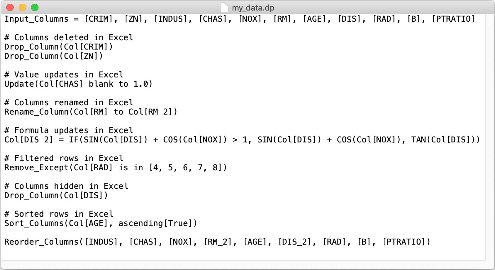

In this section we will look at some advanced functionality of Practicus AI. 

## Production Data Pipelines

Typically, an ML workflow will depend on several cycles of data preparation steps before the final ML training can be done. This is rarely a one time task, since your ML model might eventually start drifting as time goes by (not predicting accurately anymore). When this happens, the first thing to try is usually re-training with new, fresh data. Which means you have to reload data from raw data sources, and apply data preparation steps again.  Instead of preparing data manually every time you train, some teams create automated data pipelines. These pipelines usually run on a schedule, for instance daily, creating clean and ready-to-train-on data sets. 

You can easily build data pipelines with Practicus AI, and embed them into existing data integration platforms.  All you need is a platform that can run Python. Please see some performance tips below in the example code 

Achieving this is straightforward, you can simply "chain" data preparation steps using .dp files, and not necessarily the updated Excel files for performance reasons. 

Example data pipeline:

```python
import practicus
# 1) create a Python .py file for the data pipeline
# 2) place your data loading code as usual, from databases, S3 etc. 
df = load_data_as_usual()
# 3) excute changes in .dp files one after another
practicus.apply_changes(df, "data_prep_1.dp", inplace=True)
practicus.apply_changes(df, "data_prep_2.dp", inplace=True)
# ...
practicus.apply_changes(df, "data_prep_10.dp", inplace=True)
# pipeline is completed
save_to_final_dest_as_usual(df)

# Performance Tips: 
# 1) Pandas Data Frame will work faster with practicus, especially for very large datasets 
# 2) You can use "inplace=True" updates, to avoid creating new data frames 
# 3) you can delete sorting and column reordering commands in the .dp files, since your 
# ML model training will not care. Especially sorting is a relatively expensive operation.  
# column reordering with Pandas Data Frame will also trigger creating a new df. 
```

**Deployment**

Once the data pipeline Pyhton code (.py) is ready like the above, you can then "pip install practicus" in the data integration platform and run the .py file as usual. Please note that Practicus AI uses Java (>= v8.0) behind the scenes for some complex operations. Although it is unlikely, if there is no Java runtime (JRE) installed on the data integration platform, Practicus AI will download a local copy of the JRE, first time it runs. This local Java installation is purely a "file download" operation of a stripped down JRE, and will not need any root/admin privileges.  You can also manually trigger downloading the local JRE operation in advance by calling *practicus.install_jre()*, or install Java (>= v8.0) yourself. We recommend <a href="https://adoptopenjdk.net/" target="_blank">Open JDK</a>.  

## DP file structure

Practicus AI can detect changes made inside an Excel (.xlsx) file when you call detect_changes() or apply_changes()  functions. The recorded changes are then saved to a simple text file with the extension **.dp** (**d**ata **p**rep).

The .dp file is intended to be easily consumed by users that are **not** programmers or data scientists. The goal is to create a happy medium so that different user personas can view the changes detected in the .dp file and collaborate on a data science project.

The .dp file does not necessarily need to only include changes that are detected by Practicus AI. As you can read below, you can freely add your own changes or remove existing ones, and then finally ask Practicus AI to run these data prep steps on your data sets to complete data preparatation. 

The below is a simple .dp file example. 



### Input_Columns

```markdown
Input_Columns = [Column Name 1], [Column Name 2], ..
```

This is an *optional* section, but it is recommended to use for *data validation*. When Practicus AI starts analyzing an Excel (.xlsx) file, it will detect all of the visible column names and add them in the Input_Columns section.  When you execute apply_changes() with a new data set, Practicus AI will compare the column names of the inpot data set to Input_Columns and give you a warning if they are not the same. For example, let's assume you have a data set with Col_1, Col_2, Col_3 columns, export to .xlsx, make some changes and then run detect_changes(). You will see Input_Columns = [Col_1], [Col_2], [Col_3]. Let's assume you then go ahaed and delete  Col_2 in your data set, and apply the .dp file. You would get a warning that the input columns do not match with the input data set. 

Example: 

```markdown
Input_Columns = [CRIM], [ZN], [INDUS]
```

### Drop_Column 

```markdown
Drop_Column(Col[name of the column to delete])
```

Will delete a column from the data set.  Practicus AI will add a Drop_Column command for both deleted **and** hidden columns in an Excel (.xlsx) file. The only difference is that deleted columns will run early on in the .dp file and hidden columns will be deleted later since formulas or filters can depend on them. It is common that a user creates a new Excel column, uses a formula and then hides the old column that the formula uses. 

Example: 

```markdown
Drop_Column(Col[ZN])
```

### Update

```markdown
Update(Col[name of the column to update] from_value to to_value)
```

Updates **all** of the rows for a certain column from one value to another. For example, updating all missing values to 0. When a manual update of a cell is detected in the Excel file, an Update command is added to the .dp file. You do not need make the same update to all cells, just one ie enough to apply the change for that column. If the *same* value is updated to different values manually, only the first detected update will run. Other updates will be commented out. You can review these update commands and make changes on the .dp file as needed.

Examples:

```python
Update(Col[CHAS] blank to 1.0)
Update(Col[text field] "abc" to "def")
Update(Col[ZN] 5 to 10)
# The below Update command is commented out by mlxl automatically,
# since the same value (5) was updated to 10 in one Excel cell and to 11 in another
# Update(Col[ZN] 5 to 11)
```


### Rename_Column 

```markdown
Rename_Column(Col[current name] to Col[new name])
```

Will rename a column. Practicus AI will only analyze top n rows to detect potential renames and can miss some of them in complex cases. Please feel free to manually detect these and add them to the .dp file. 

Example: 

```markdown
Rename_Column(Col[petal_width] to Col[petal width])
```


### Functions and formulas

```
Col[name of the column] = EXCEL_FUNCTION( .. EMBEDDED_FUNCTIONS(..) .. ) + OPERATORS
```

Using functions to create formulas is probably one of the most powerful features of Excel. The same is true for Practicus AI data prep use case as well. Practicus AI currently interprets over **200+ Excel functions** and applies them with custom created Python code to your data set to perform the data transformation.  If Practicus AI ever encounters an Excel function that it doesn't understand, it will create a Python template for you to provide the missing functionality. Please read more about this in custom functions section below.   Practicus AI currently only supports functions and formulas to run on the same row.  For things like averages of all values for  a particular column, you can use seperate sheets or pivot tables to do yor analysis, and then finally perform the the data preparation steps on individual rows.  

Examples:

```python
# Operators
Col[A] = Col[A] + 1
Col[A] = (Col[A] + Col[B]) / 2
# Mathematical functions
Col[A] = SQRT(Col[A]) + POWER(Col[B], 2)
# Statistical
Col[A] = MAX(Col[B], Col[C], Col[D]) / AVERAGE(Col[B], Col[C], Col[D])
# Logical
Col[A] = IF(Col[B] > 1, "value greater than 1", "it is not")
Col[A] = IF( AND(Col[B] > 1, Col[C] > 1), "both values greater than 1", "not")
# Text
Col[first name] = UPPER(Col[first name]) 
# splitting text, i.e. John Brown to John in one column and Brown in another 
Col[first name] = LEFT(Col[full name], SEARCH(" ", Col[full name]) - 1) 
Col[last name] = RIGHT(Col[full name], LEN(Col[full name]) - SEARCH(" ", Col[full name])) 
```

Please note that columns with formulas are currently placed in the .dp file in order that they appear in Excel. If a formula column depends on another, but appears prior in Excel you can face execution order issues. For instance, let's assume we have A = B + 1 formula that appears in the 2nd Excel column. And B = [some existing column] + 1 appears in 3rd Excel column. In the .dp file you will see A = B + 1 first and it's evaluation will fail since B is not defined yet.  To resolve this kind of issue, you can 1) change the order of columns in Excel so that it matches the execution order of formulas, or 2) change the order in .dp file manually.

### Filtering with Remove_Except

```markdown
Remove_Except(Col[name of the column] criteria)
```

Removes (filters) all of the rows that do **not** match the criteria. Citeria can be "is in [values]", logical operators like >, <, >=, <=, = and != and correspondign value, "and", "or".

Examples:

```python
# remove all values on column RAD, and only keep 4, 5 and 6
Remove_Except(Col[RAD] is in [4, 5, 6])
# only keep values RAD > 5 and ZN < 10  
Remove_Except(Col[RAD] > 5 and Col[ZN] <10)
# remove all 5's   
Remove_Except(Col[RAD] != 5)
# keep only 5's   
Remove_Except(Col[RAD] = 5)
```


### Sort_Columns

```markdown
Sort_Columns(Col[name of first column to sort], .., ascending[True|False, ..])
```

Sorts values for column(s), ascending or descending. You can sort on as many columns as needed. 

Example: 

```
Sort_Columns(Col[AGE], Col[INDUS], ascending[True, False])
```

Sorts on column "AGE" from smallest to largest first, and then for the same AGE values sorts on column INDUS, largest to smallest.

### Reorder_Columns

```markdown
Reorder_Columns([column name], [another column name], ..)
```

All new columns are appended to the end of the data set by default.  Reorder_Columns command changes the order of the columns. Pelase note that since this command has to create a new data set internally, inplace=True updates for apply_changes() will not work. inplace=False is the default behaviour for apply_changes() function. 

Example:

```markdown
Reorder_Columns([CRIM], [CHAS], [NOX])
```


## Custom Functions (UDFs)

```markdown
Col[name of the column] = MY_UDF(..)
```

Practicus AI supports defining your own User Defined Functions (UDFs) in a .dp file. If Practicus AI.apply_changes() function encounters a function name that it doesn't know, it will create a placeholder Python .py file for you to be completed later. The same will also happen if Practicus AI encounters an Excel function it doesn't recognize. 

Practicus AI custom function names follow Excel syntax: capitol letters, "A-Z" and numbers  "0-9", with the exception of an underscore  "_". For example MY_FUNCTION_2(). MyFunction2() is not a valid Excel or Practicus AI function name.   

Example: 

Place the below line in "sample.dp" file

```markdown
...
Col[A] = MY_FUNCTION(Col[B], Col[C], 1, 2, 3)
...
```

and run 

```python
df2 = practicus.apply_changes(df, "sample.dp")
```

This will create "sample_dp.py" file, place the missing function and raise a NotImplemented error. 

```python
def practicus_my_function(row, *args):
  	# you can define your function and then delete the below line
    raise NotImplementedError('MY_FUNCTION')
    
    # 'row' is a Pandas Data Frame row that you can access *any* column
    result = row['B'] + row['C'] + args[2] + args[3] + args[4]
    # the below does the same, wihtout accessing row 
    result = args[0] + args[1] + args[2] + args[3] + args[4]

    return result
  
# please note that the above function template is simplified for documentation purposes
# what you get will have more lines, including proper exception handling
```

After you fill the missing function template, you can re-run practicus.apply_changes() in your notebook, and your UDF MY_FUNCTION() will execute for all the rows on the data frame, in combination with other commands. 

You can also mix and match different UDFs and Excel functions on the same line as you wish. 

Example:

```markdown
COL[A] = MY_FUNC( MY_FUNC2(Col[A]), SIN(Col[B]) )
```

The above will create UDF .py placeholders for MY_FUNC( ) and MY_FUNC2( ), and also use the standard Excel function SIN( ).  


