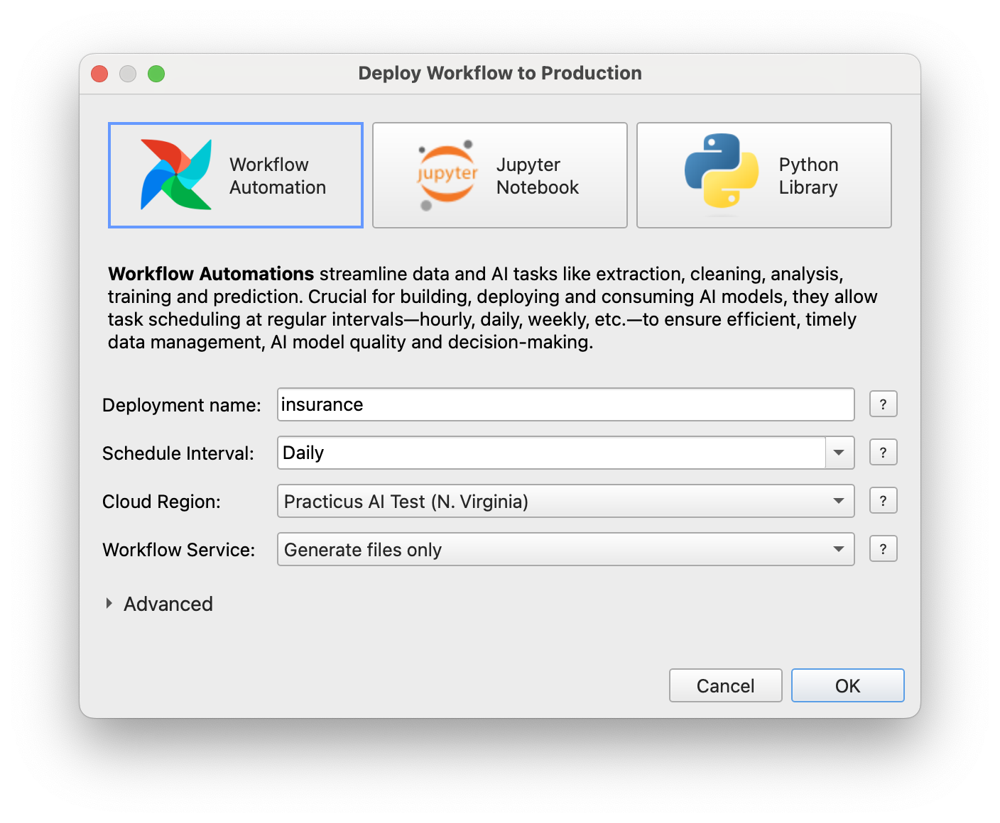
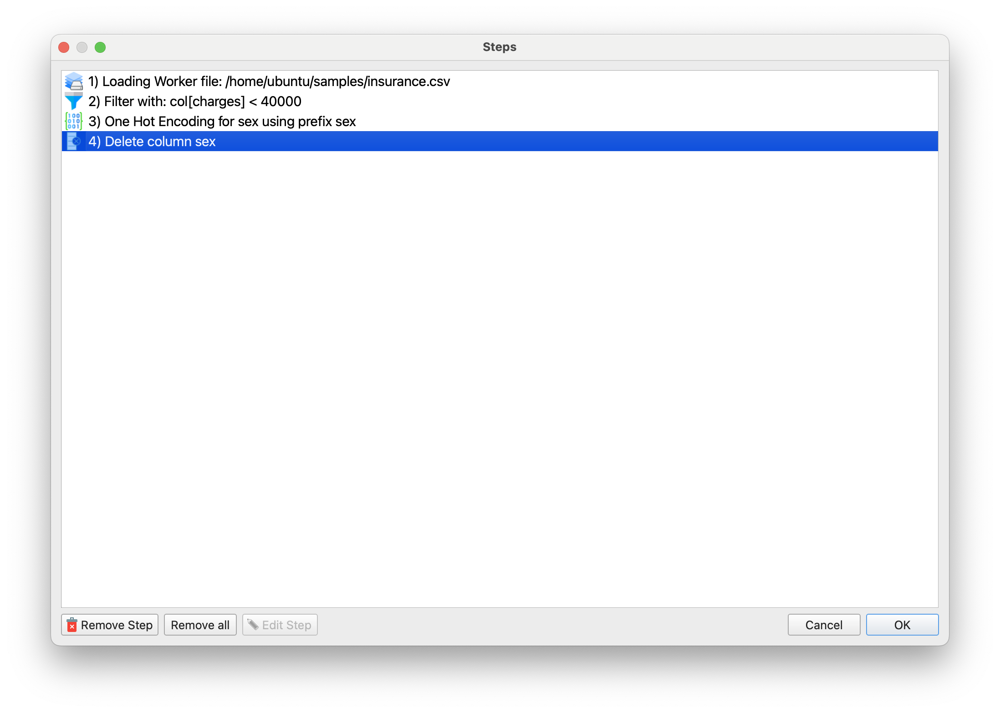
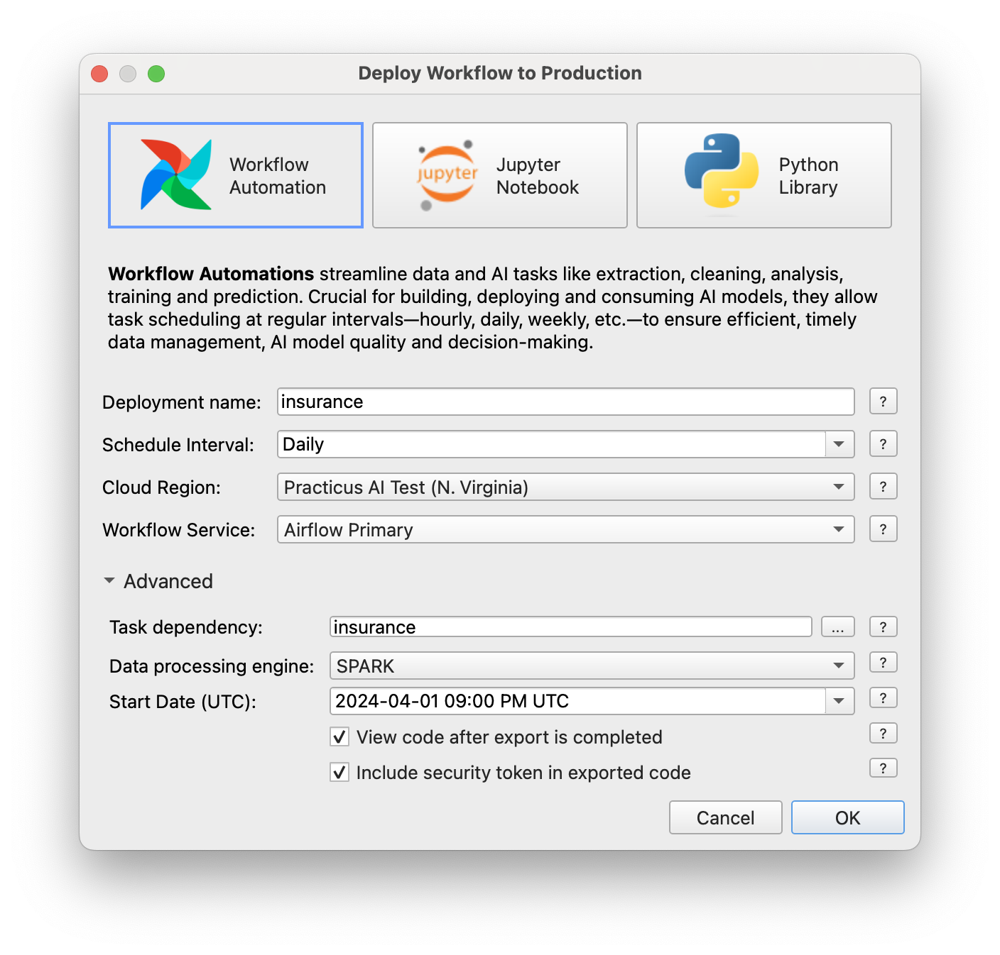
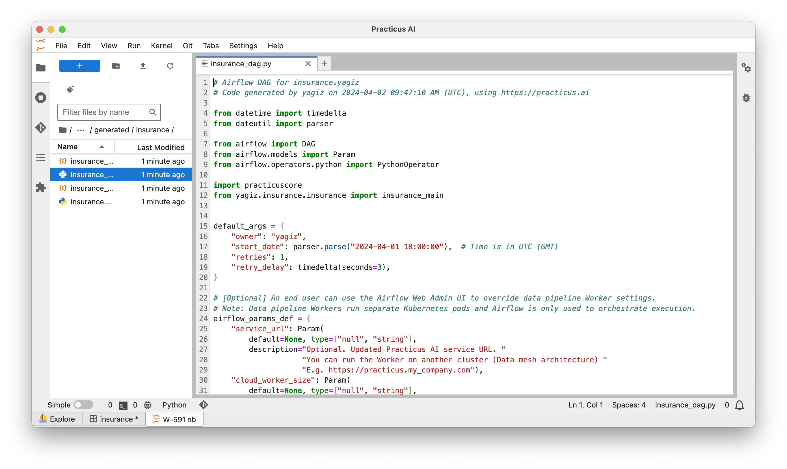
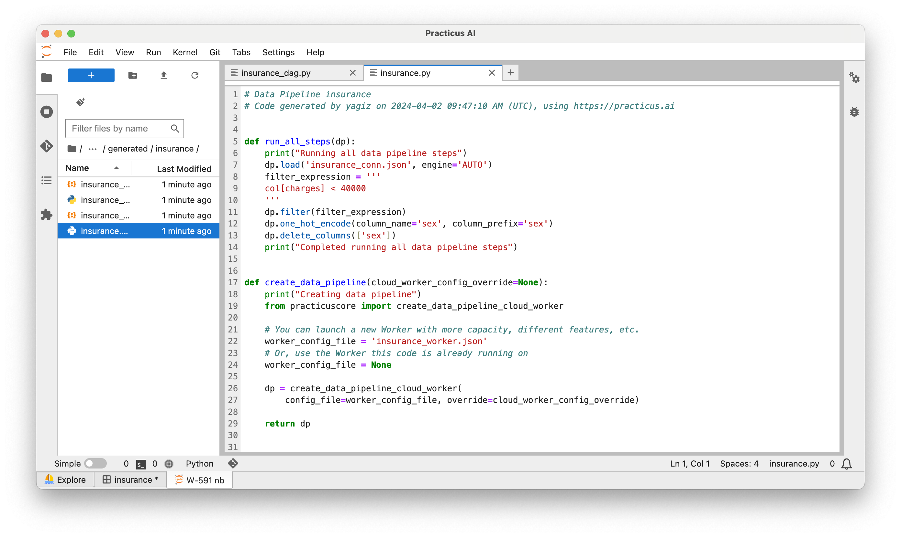
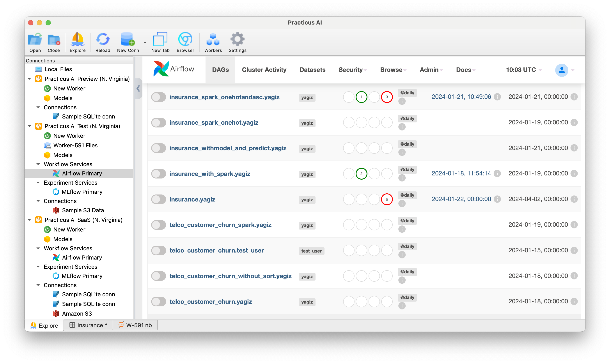
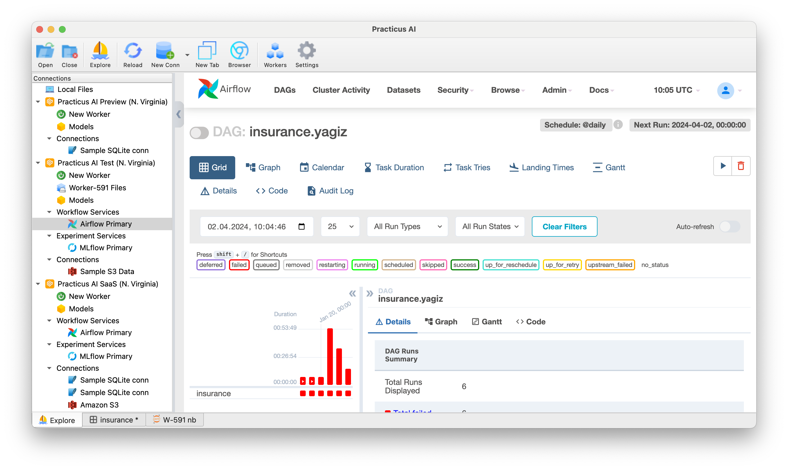
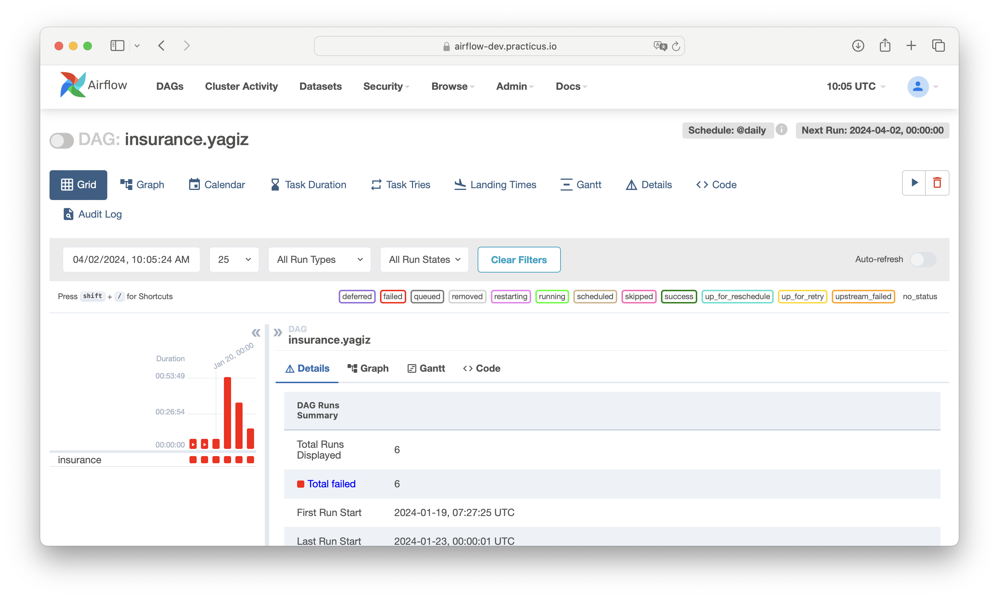
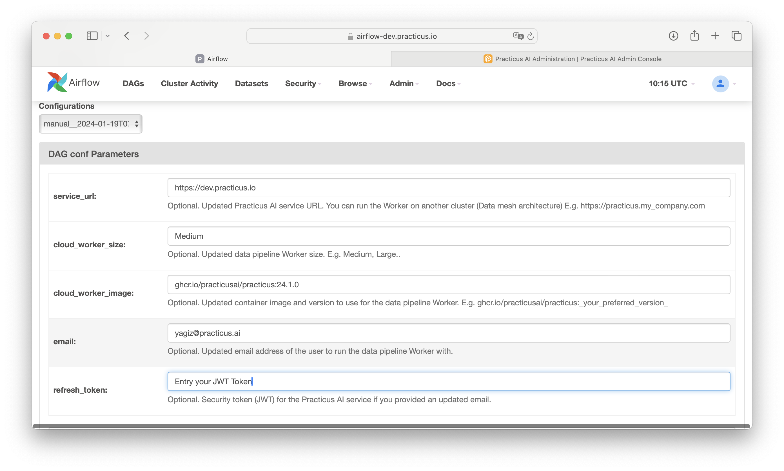
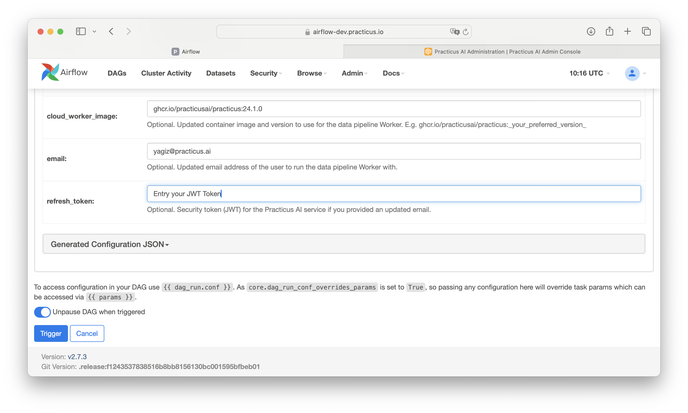

# Introduction to Workflow Automation

The Workflow tab is a feature in the Practicus AI platform that allows users to automate their workflow. 

This feature offers a wide range of functionality from code generation to execution of steps on the desired engine.

In the scenario we will consider, we will make simple preview steps in the interface and examine their transformation into workflows

Hint: From this tab we will only cover the use of Workflow Automation. For other options, you can check the Airflow tab.
### 1. Access to Workflow Tab

- Open _Explore_ tab
- Select _Cloud Worker Files_ and open the file below 
- Explore > samples > select and open any csv file
- You will see 3 different options for Deploy.

### 2. Workflow Creation

- Open _Explore_ tab
- Select _Cloud Worker Files_ and open the file below 
- Explore > samples > insurance.csv
- Click filter and set charges < Less than 40000 and add then click OK
- Then select sex and click *one hot* from the prepare tab.
- Then select sex and click *delete* from the prepare tab.
- Click Steps and see following steps:

- In a moment we will translate these steps into workflows
- Click Deploy and Select Workflow Automation

Hint: This step allows the created workflow to be automated and run on the specified engine. The "Deploy" option turns your workflow into a practical application and allows it to run automatically with the schedule and settings you specify.

You can set Deployment name, Schedule interval, Cloud Region, and Workflow Service

- Click Advanced and select Data processing engine as SPARK 

- Click OK

### 3. Generated codes

After deploying the workflow, the generated scripts are opened. In fact, these codes generated by Practicus IA are located in the user's git repository. 

- Here you can see that 2 .py files are generated. 
- One of them contains the Airflow DAG and the other one contains our preprocess steps. 
- After generating the code, users can play with the code and redeploy it.

### 4. Airflow UI on App and Browser

- Open Explore and choose Workflow Service
- See Airflow UI on app

- Then click your DAG

- Then click browser

- Then click your DAG and trigger
- Firstly you need to set configuration

- Then trigger your DAG and see status your dag

