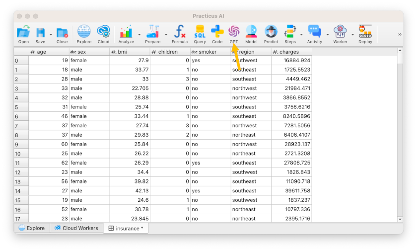
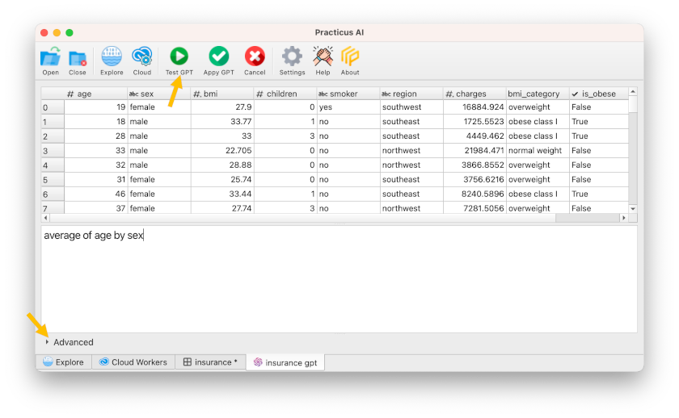
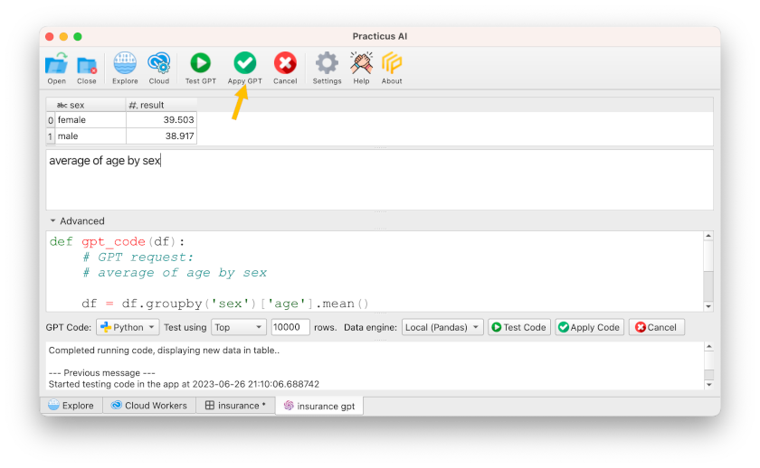
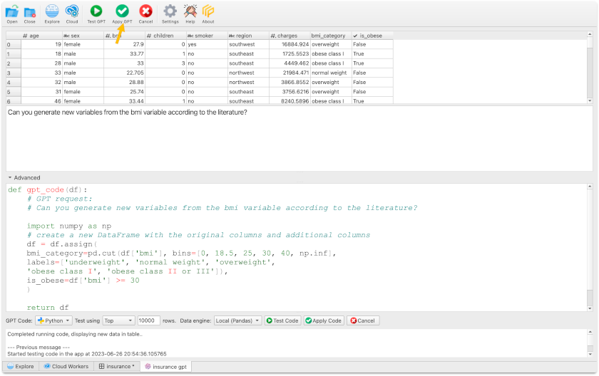

# Analyzing and preparing data with GPT

_This section requires a Practicus AI Cloud Worker. Please visit the [introduction to Cloud Workers](worker-node-intro.md) section of this tutorial to learn more._

## Loading Insurance dataset

- Open _Explore_ tab 
- Make sure a _Cloud Worker_ is selected (upper right)
- Select _Cloud Worker Files_ and open the file below 
- Home > samples > insurance.csv

## Using GPT to generate code

To generate code, you should provide GPT with a prompt that describes the code you want to generate. The prompt should be written in English and include the desired functionality of the code snippet. ChatGPT will then generate a code snippet that matches the description.

- When you select GPT, you will see the below dialog.
- Explain to the GPT what you want to do.

- If you want to see the code generated by GPT, you can click Advanced. In addition, you can set other options.

- Click Apply GPT and see the final dataset.

Let's create a slightly more advanced query with GPT.

- Click _Test GPT_ then click _Advanced_

- Please make specific comments in advanced queries so that GPT generates the code properly.

- Click _Apply GPT_ and see the final dataset with new variables.

## (Optional)How can I generate the optimal GPT query?

Prompt engineering is the process of crafting effective input prompts to elicit the desired output from large language models (LLMs). LLMs are trained on massive datasets of text and code, and can generate human-like text, translate languages, write different kinds of creative content, and answer your questions in an informative way. However, they need to be prompted correctly in order to produce the desired output.

Here is a brief overview of the steps involved in prompt engineering:

1) Identify the desired output.

2) Craft a prompt. 

- The prompt should be written in plain language that is easy to understand. It should also be as specific as possible, so that the LLMs knows what you want it to generate.

3) Test the prompt.

-  Once you have crafted a prompt, you need to test it to make sure that it works.

4) Refine the prompt. 

- If the LLMs does not generate the desired output, you need to refine the prompt. This may involve making the prompt more specific, or providing more examples.

[< Previous](sql.md) | [Next >](develop_ml_models.md)
