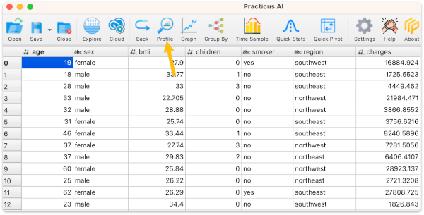
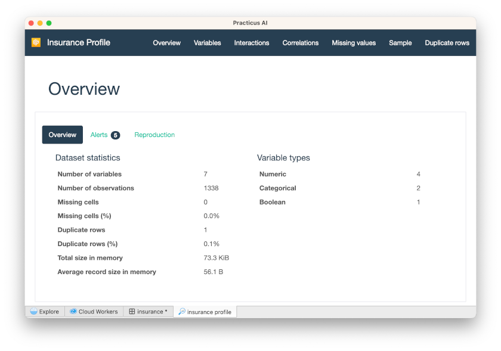
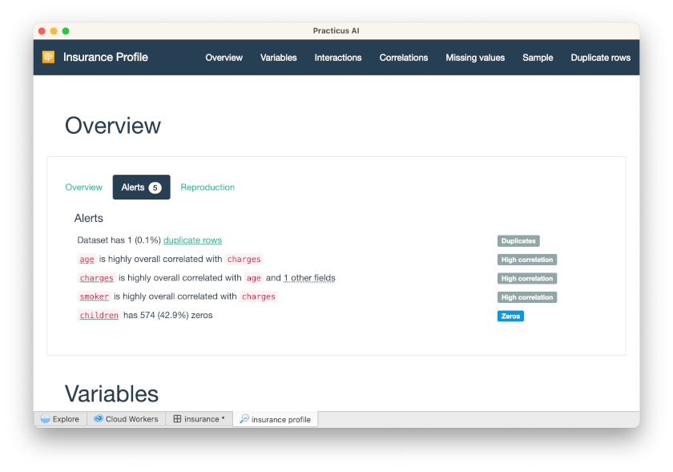
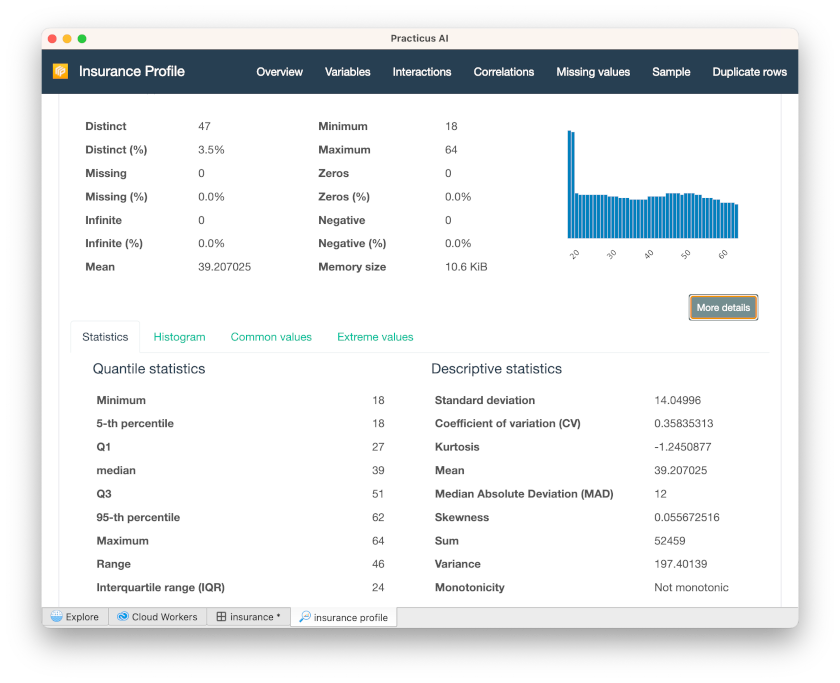
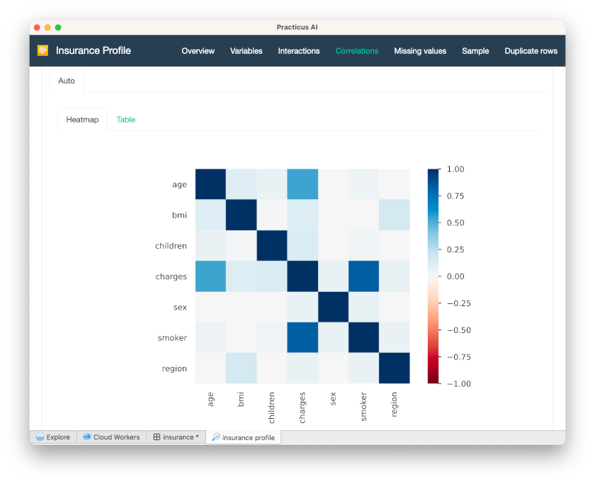
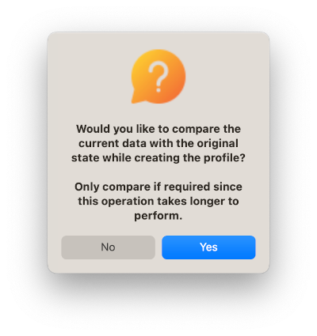
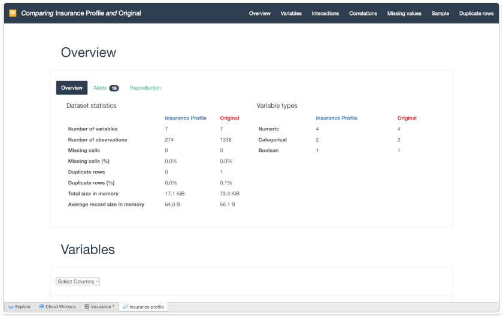
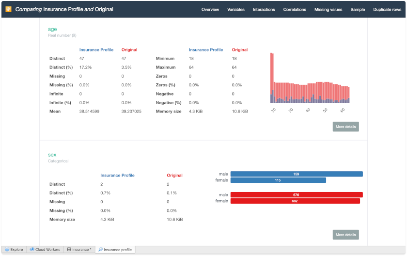

# Data Profiling 

_This section requires a Practicus AI Cloud Worker. Please visit the [introduction to Cloud Workers](worker-node-intro.md) section of this tutorial to learn more._

Profiling your data is an extremely powerful way to get a good understanding of your data distribution and correlations.

- Open _Explore_ tab 
- Make sure a _Cloud Worker_ is selected (upper right)
- Select _Cloud Worker Files_ and open the file below 
- Home > samples > insurance.csv
- Select Analyze > Profile 

After a few minutes, you will see the data profile completed.

You will see several statistical calculations about this data. 

When you click Alerts, you will see various alerts, such as high correlation.

Click Variables on the up-right tab, and Select Variables as _Age_

When you click Correlations on the up-right tab, you will see a correlation heatmap.

- If you want to see the correlation matrix, you can click Table.

 
In this example, all correlations are positive, so they are displayed with blue. Negative correlations are displayed in red. E.g. If we had a column about how fast someone can run, age column would probably have a negative correlation. I.e. if someone is younger, they would run faster.

## Profiling for difference

You can make changes to your data and then create a profile to compare with the original.

- Go back to the _insurance_ dataset 
- Under _smoker_ column click on a cell that has the _no_ value 
- Select _Filter to keep cell value_
- Select Analyze > Profile again
- You will be asked if you would like to compare with the original data set, select yes

You will now see all the statistics for the original and current data and can compare them side-by-side. 

Click Variables on the up-right tab, and Select Variables as _Age_

- See the descriptive statistics of the comparison of the old version of the age variable with the new version. 
- In addition, you can click More Details to see statistics, histograms, etc.
- 

[< Previous](explore.md) | [Next >](model.md)
