# Introduction to Data Visualization

_This section requires a Practicus AI Cloud Worker. Please visit the [introduction to Cloud Workers](worker-node-intro.md) section of this tutorial to learn more._

Plotting datasets visually aids in data exploration, revealing patterns, and relationships. Thus, it is very important for decision-making, storytelling and insight generation. For that _Practicus AI_ give you _Plot_ service which plots the data in worker as well as in app.

Let's have a look of _Plot_ basics by loading _salary.csv_.  We will ignore the meaning of this dataset since we will only use it to explain basics of plot.

- Open _Practicus AI_ app
- You will see the Explore tab, click on _New Worker_
- Select the worker which has been started
- Navigate to the samples directory and open _salary.csv_ :
- samples > _salary.csv_
- Click on the file and you will see a preview
- Click Load

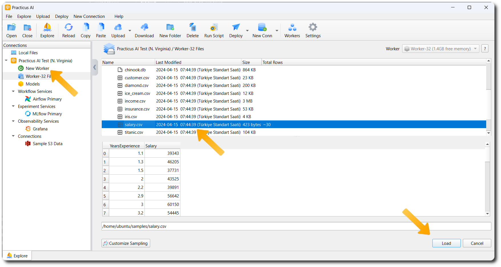

After loading the data set, click on _Plot_ button to start ploting service.

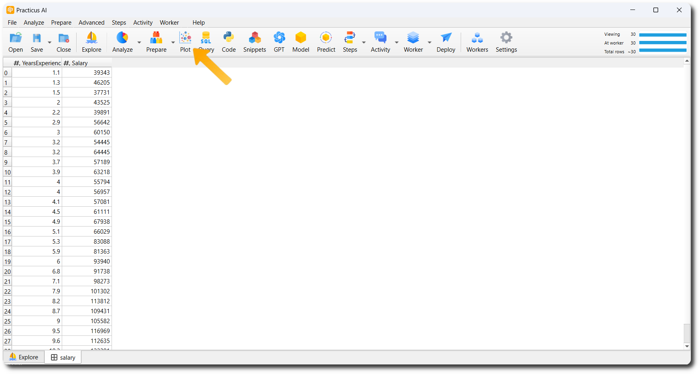

## Basics of _Plot_

The first thing we will see at _Plot_ tab is going to be _Data Source_, from this menu we can select the data sheet which we want to visualize.

- Click _Data Source_ drop down menu
- select _salary_

After choosing the data sheet then we could chose graphic from _Graphic_ drop down menu which we want use while working on visualizing.

- Click _Graphic_ drop down menu
- Select _Line_

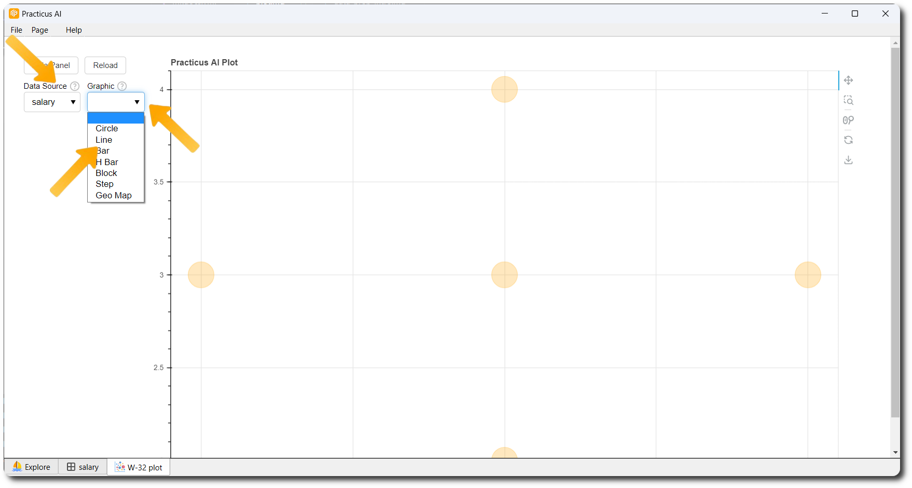

After choosing the graphic style we want to work with we will see the options listed down below:

- _Sampling_: This option refers to a subset of data set selected from a larger dataset to represent its characteristics. Smaller samples in large data sets can be plotted more quickly, enhancing the efficiency of exploratory data analysis.
- _X Coordinate_: This option refers to the horizontal axis of the plot, representing the column(s) of the data set. Within _Bar_ and _H Bar_ graphic styles axis could get string columns as well as numerical columns.
- _Y Cooridnate_: This option refers to the vertical axis of the plot, also representing column(s).
- _Color_: This option refers to color which will be the filling of shapes within selected graphic style.
- _Size_: This option refers to size of the shapes within selected graphic style,  with the exception of the _Bar_ and _H Bar_ graphic styles, where size refers to the spacing between bars.

Let's have a quick look to these options with a simple examle.

- Click to  _X Coordinate_ drop down menu and select _YearsExperience_
- Click to  _Y Coordinate_ drop down menu and select _Salary_
- Click to _Add Layer_

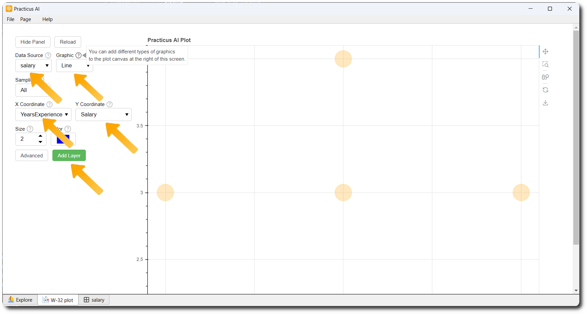

In the end we will have the plot down below:

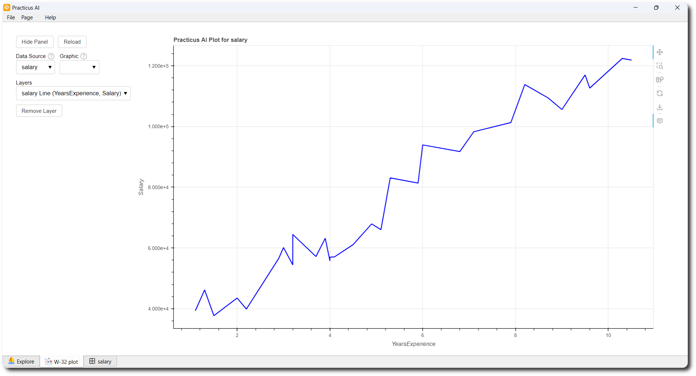

## Advanced Techniques in _Plot_

In this section we will try to have look to more advance techniques we can use in _Plot_ such as adding multiple layer of visualizing, dynamic size and color, transparency, tooltip and usage of _Geo Map_ graphic style.

### Dynamic Size & Color

One of the most illustrative datasets for demonstrating dynamic size and color options is the Titanic dataset. Let's load it into one of our worker environments.

- Open _Practicus AI_ app
- You will see the Explore tab, click on _New Worker_
- Select the worker which has been started
- Navigate to the _samples_ directory and open _titanic.csv_ :
- _samples_ > _titanic.csv_
- Click on the file and you will see a preview
- Click Load

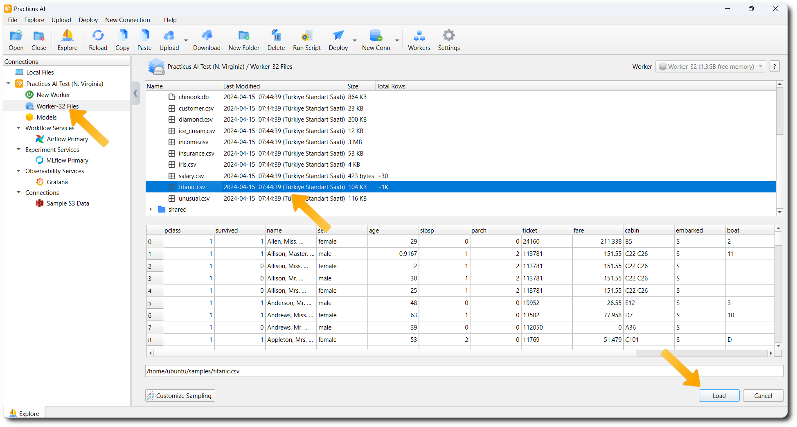

The Titanic dataset is a popular dataset used in machine learning and data analysis. It contains information about passengers aboard the RMS Titanic, including whether they survived or not. Within this data set we will use _Circle_ graphic style from _Plot_ and columns of _pclass_, _fare_, _age_ and _survived_. Let's describe what these columns means for better understanding.

- Pclass: Ticket class (1 = 1st, 2 = 2nd, 3 = 3rd).
- Fare: Passenger fare.
- Age: Passenger's age in years.
- Survived: Indicates whether the passenger survived or not (0 = No, 1 = Yes).

Let's start our plotting journey,

- Click on _Plot_
- Click _Data Source_ drop down menu
- Select _titanic_
- Click _Graphic_ drop down menu
- Select _Circle_
- Click to Advanced

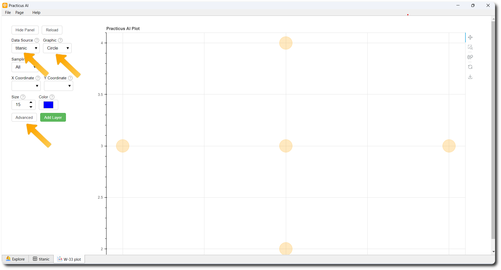

After open up advanced section you will see the options of _Dynamic Size_ and _Dynamic Color_. Dynamic size and color in a circle plot refer to adjusting the size and color of circles based on additional variables, beyond the x and y coordinates. Let's have look with the example of titanic data set.

- Click to  _X Coordinate_ drop down menu and select _age_
- Click to  _Y Coordinate_ drop down menu and select _fare_
- Click to _Dynamic size_ drop down menu and select _pclass_
- Click to _Dynamic color_ drop down menu and select _survive_
- Click to _Add Layer_

We can deduce from the analysis that passengers with smaller data points (indicating lower values of "Pclass") paid higher fares and had a better chance of survival. Moreover, it's evident that passengers with lower ages (on the X-axis) had a higher likelihood of surviving.

### Analyze over multiple layer

One of the most illustrative datasets for demonstrating multiple layer anlyze is the Iris dataset. Let's load it into one of our worker environments.

- Open _Practicus AI_ app
- You will see the Explore tab, click on _New Worker_
- Select the worker which has been started
- Navigate to the _samples_ directory and open _iris.csv_ :
- _samples_ > _iris.csv_
- Click on the file and you will see a preview
- Click Load

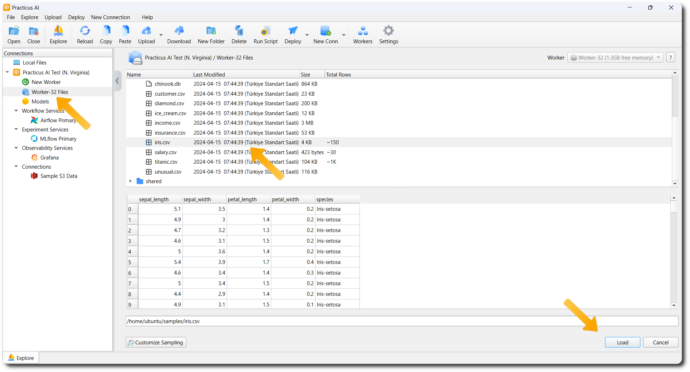

The Iris dataset is a popular dataset in machine learning and statistics, often used for classification tasks. It consists of 150 samples of iris flowers, each belonging to one of three species: Setosa, Versicolor, or Virginica. Within this data set we will use both _Bar_ and _Circle_ graphic style from _Plot_. The dataset comprises four features, each representing measurements of the length and width of both the petals and sepals of flowers.

Before start let's use label encode and group by on the _species_ and for better visualisation:

- Click _Snippets_
- Click _Advanced_
- Locate and select _Label encoder_
- Select _species_ from _Text columns_ drop down menu
- Click _+_
- Click _OK_

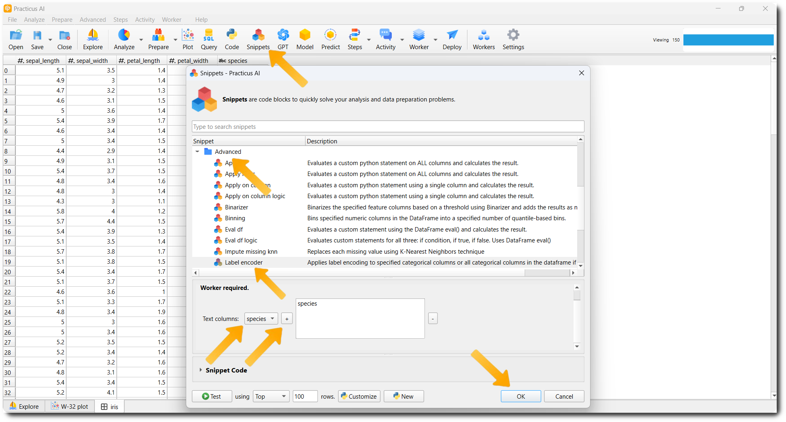

- Click _Prepare_
- Click _Group By_
- Select _species_ from _Group by_ drop down menu
- Select _sepal_length_ and _Mean (Average)_ from _Summarize_ drop down menus
- Select _sepal_windth_ and _Mean (Average)_ from _Summarize_ drop down menus
- Select _petal_length_ and _Mean (Average)_ from _Summarize_ drop down menus
- Select _petal_windth_ and _Mean (Average)_ from _Summarize_ drop down menus
- Click _OK_

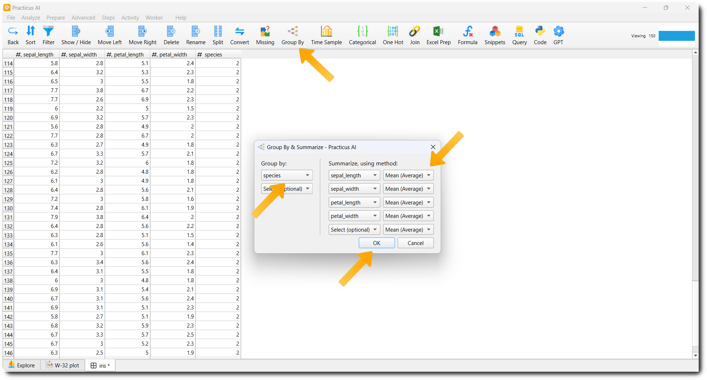

In the end we should have the table down below:

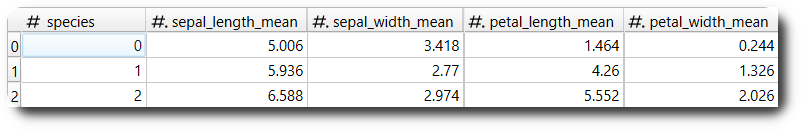

Let's start plotting for multiple layer analyze,

- Click on _Plot_
- Click _Data Source_ drop down menu
- Select _iris_

For first layer:

- Click _Graphic_ drop down menu
- Select _Bars_
- Click to  _X Coordinate_ drop down menu and select _species_
- Click to  _Y Coordinate_ drop down menu and select _sepal_length_mean_
- Click to _Advanced_
- Select greenish color from _Color_ drop down menu
- Enter a value of 50 for the _Transparency %_ input
- Click to _Add Layer_

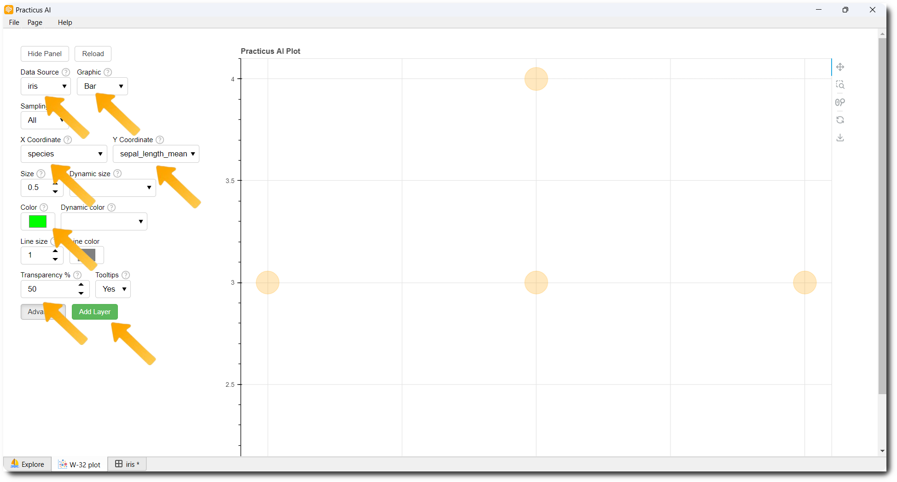

For second layer:

- Click _Graphic_ drop down menu
- Select _Line_
- Click to  _X Coordinate_ drop down menu and select _species_
- Click to  _Y Coordinate_ drop down menu and select _sepal_windth_mean_
- Click to _Advanced_
- Select a darker greenish color from _Color_ drop down menu
- Click to _Add Layer_

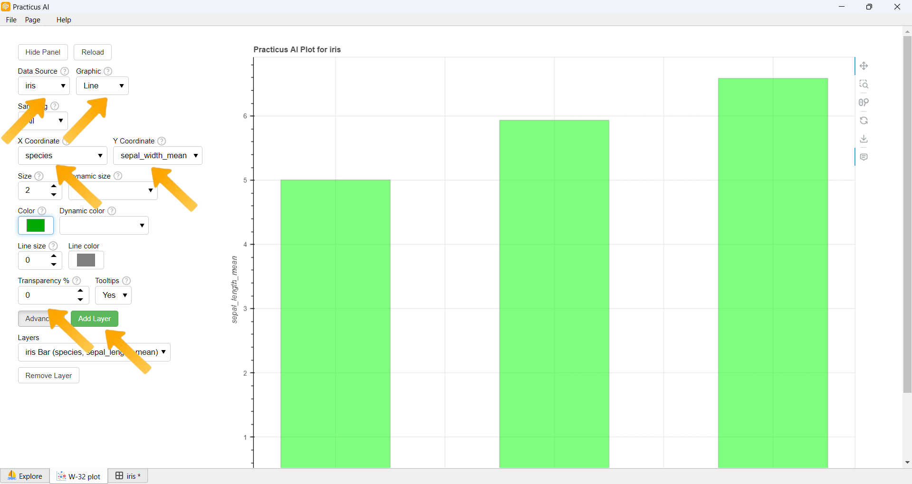

For third layer:

- Click _Graphic_ drop down menu
- Select _Bars_
- Click to  _X Coordinate_ drop down menu and select _species_
- Click to  _Y Coordinate_ drop down menu and select _petal_length_mean_
- Click to _Advanced_
- Select blueish color from _Color_ drop down menu
- Ênter a value of 50 for the _Transparency %_ input
- Click to _Add Layer_

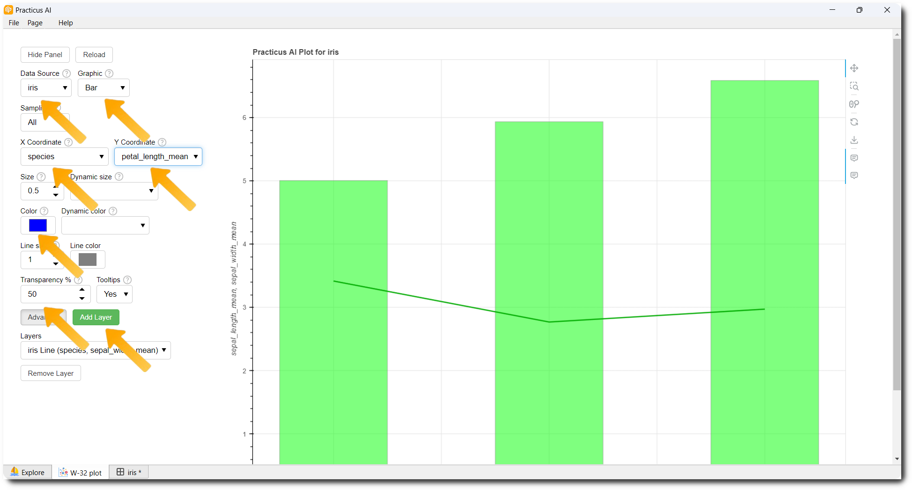

For fourth layer:

- Click _Graphic_ drop down menu
- Select _Line_
- Click to  _X Coordinate_ drop down menu and select _species_
- Click to  _Y Coordinate_ drop down menu and select _petal_windth_mean_
- Click to _Advanced_
- Select a darker blueish color from _Color_ drop down menu
- Click to _Add Layer_

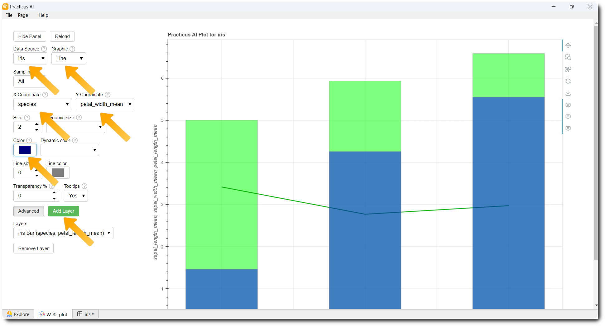

In the end we sould have a plot like down below:

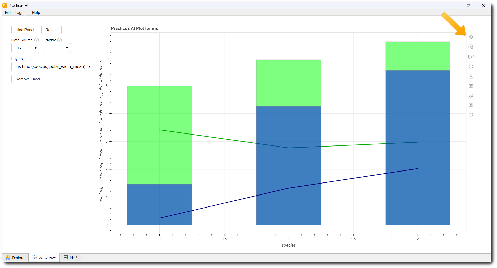

As we hover over the bars and lines, data point values will be displayed. Additionally, on the right side of plot, there are options available for zooming in, zooming out, and saving the plot.

Observing this multi-layer graph, it becomes evident that both sepal length and petal length play a crucial role in distinguishing between classes. Similarly, the same differentiation can be observed for petal width.

### Geo-map Tutorial

To use the Geo-map feature of _Plot_, the initial requirement is to define the Google Maps API either through the admin console or within the application itself. If you don't know how to retrieve a Google Maps API key you can check [Google's documentetion.](https://developers.google.com/maps/documentation/javascript/get-api-key?hl=tr)

Defining a Google Maps API over admin console:

- Open _Admin Console_ of __Practicus AI__
- Expand (Click) _Definitions_ from left menu
- Click _Cluster Definitions_
- Click _GOOGLE_MAPS_API_KEY_ from table

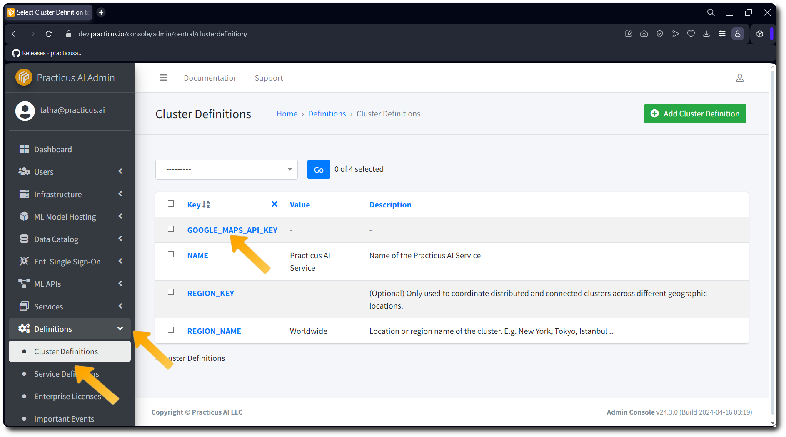

- Enter your key to _Value_ input
- (Optional) Enter a description to _Description_ input
- Click _Save_

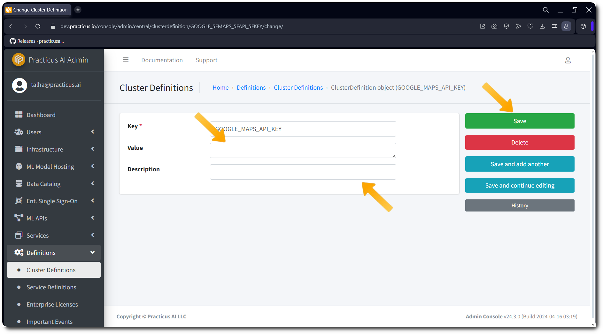

Defining a Google Maps API within application:

- Click _Settings_ frop top menu
- Click _Other_ tab from opened window
- Enter your Google Maps API to _Personal API Key_ at down below
- Click _Save_

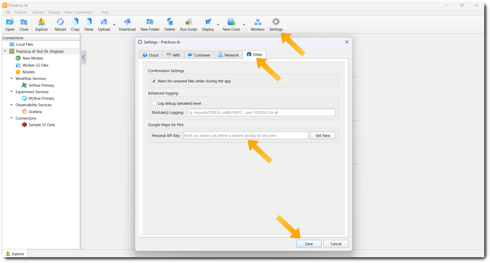

After assigning the Google Map API we could have a look to Geo-Map by using _car_insurance_ dataset. This dataset contains information about the insurance company's past customers who have purchased health insurance.  The objective is to use this dataset to train a predictive model that can determine whether these past customers would also be interested in purchasing vehicle insurance from the same company.

The features can be listed as:

id: A unique identifier assigned to each customer.
Gender: The gender of the customer.
Age: The age of the customer.
Driving_License: Indicates whether the customer possesses a driving license.
Region_Code: A distinct code assigned to denote the region of the customer.
Previously_Insured: Indicates whether the customer already holds vehicle insurance.
Vehicle_Age: The age of the vehicle.
Vehicle_Damage: Indicates whether the customer's vehicle has been damaged in the past.
Annual_Premium: The yearly premium amount that the customer is required to pay.
Policy_Sales_Channel: An anonymized code representing the outreach channel used to contact the customer, including different agents, mail, phone, and in-person visits.
Vintage: The duration, in days, for which the customer has been associated with the company.
Response: Indicates customer interest. 1 indicates interest, while 0 signifies no interest.

Let's load the dataset to our worker:

- Open _Practicus AI_ app
- You will see the Explore tab, click on _New Worker_
- Select the worker which has been started
- Navigate to the _samples_ directory and open _airports.csv_ :
- _samples_ > _car_insurance.csv_
- Click on the file and you will see a preview
- Click Load

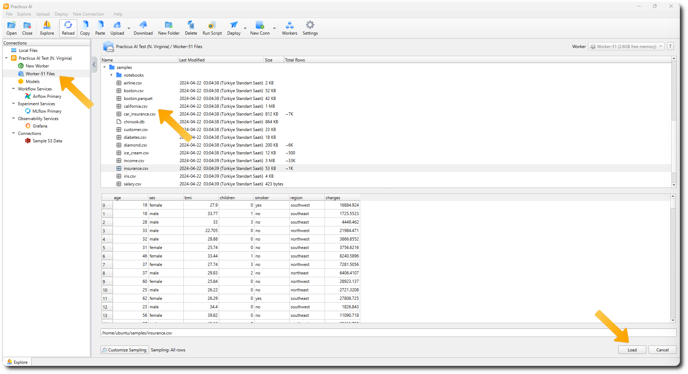

Before start let's group the data on the _Regeion_Code_ column for better visualisation:

- Click _Prepare_
- Click _Group By_
- Select _Regeion_Code_ from _Group by_ drop down menu
- Select _Response_ and _sum_ from _Summarize_ drop down menus
- Select _Previously_Insured_ and _sum_ from _Summarize_ drop down menus
- Select _Lat_ and _max_ from _Summarize_ drop down menus
- Select _Lon_ and _max_ from _Summarize_ drop down menus
- Click _OK_

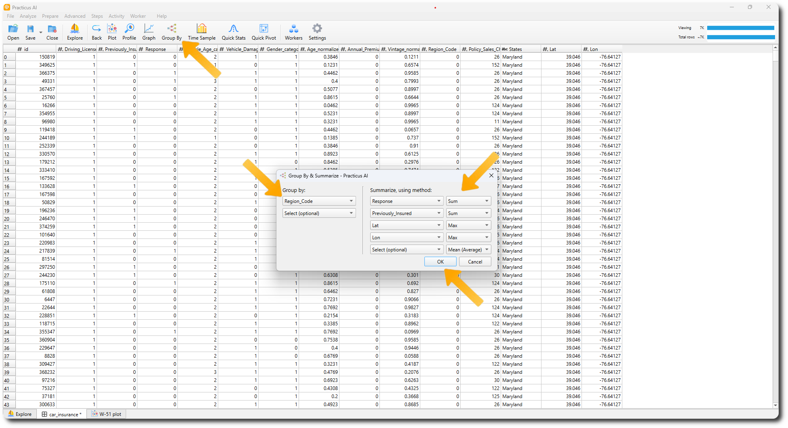

Let's start our plotting journey,

- Click on _Plot_
- Click _Data Source_ drop down menu
- Select _car_insurance_
- Click _Graphic_ drop down menu
- Select _Geo Map_

After selecting the "Geo Map" graphic style, we observe four distinct options that set it apart from other graphic styles:

- _Latitude_: Indicates distance north or south of the Equator.
- _Longitude_: Specifies distance east or west of the Prime Meridian.
- _Map Type_: Indicates Google Maps styles.
- _Zoom_: Provides an approximation of the number of miles/kilometers that fit into the area represented by the plot.

Let's try to visualize the relation between _Response_ and _Previously_Insured_ on Google Maps by plotting data from the _car_insurance_ dataset:

- Select _Lon_max_ from _Longitude_ drop down menu
- Select _Lat_max_ from _Latitude_ drop down menu
- Enter _1500_ to _Zoom_ input
- Click _Advanced_
- Select _Response_sum_ from _Dynamic Size_ drop down menu
- Select _Previously_Insured_sum_ from _Dynamic Color_ drop down menu
- Click _Add Layer_

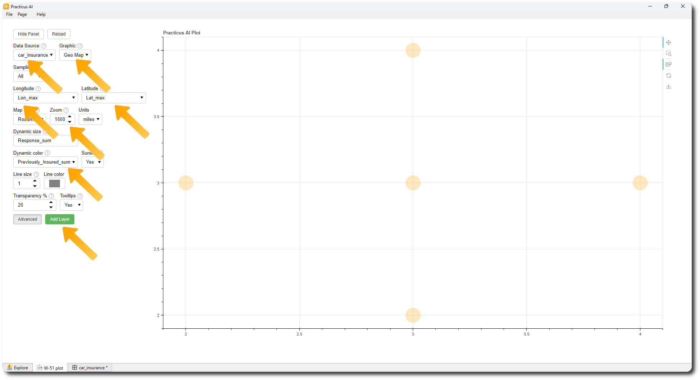

Let's say we want to email this plot to someone:

- Click on Save from menu at right side
- Select a file name. e.g. us_flight.png

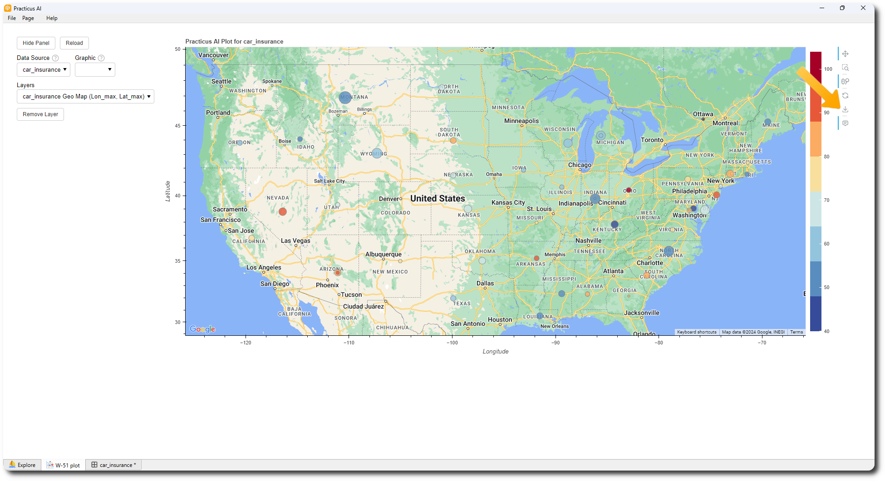

You will get a graphic file saved on your computer.
