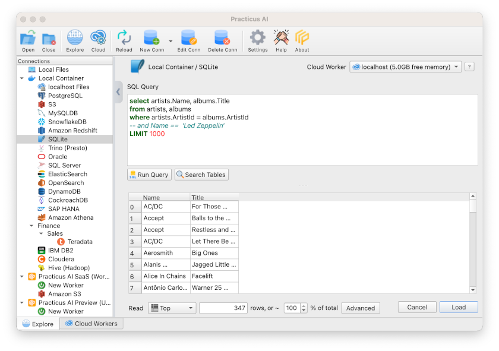
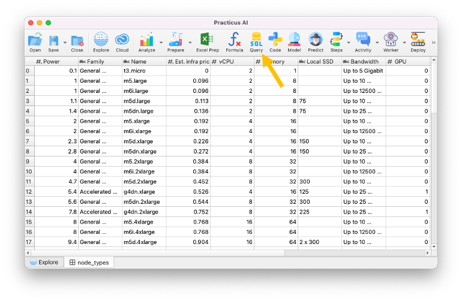
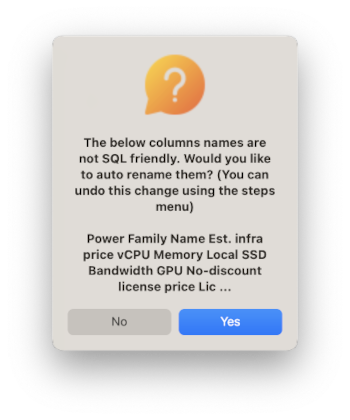
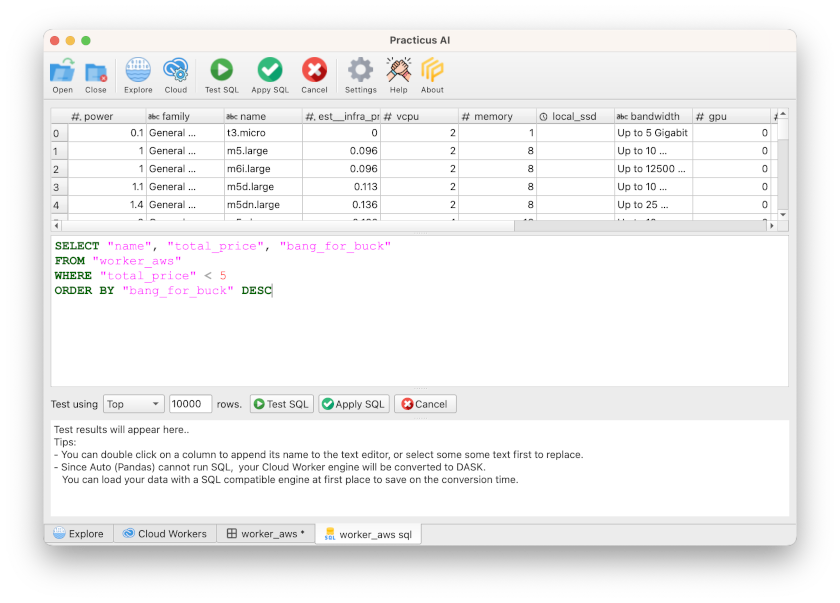
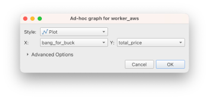

# Working with SQL 

_This section requires a Practicus AI Cloud Worker. Please visit the [introduction to Cloud Workers](worker-node-intro.md) section of this tutorial to learn more._

## Using SQL with a SQL database 

This is quite straightforward, if the database you connect to support SQL, you can simply _start_ by authoring a SQL statement. 

Practicus AI Cloud Workers come with a simple music artists database.

- Open _Explore_ tab
- Select a _Cloud Worker_ upper right of screen (start new or reuse existing)
- Select _SQLite_ on the left menu 
- Click _Run Query_

You will see the result of a sample SQL, feel free to experiment and rerun the SQL



As you will see later in this tutorial, Practicus AI also allows you to run SQL on the result of your previous SQL, as many times as you need. On a SQL database you would need to use temporary tables to do so, which is a relatively advanced topic.

## Using SQL on any data

Practicus AI allows you to use SQL _without_ a SQL database. Let's demonstrate using an Excel file. You can do the same on other non-SQL data, such as S3. 

- Open _Explore_ tab
- Select _Local Files_
- Load Home > practicus > samples > data > worker_aws.xlsx


- Click on _SQL Query_ button



- After click on the Query tab, the dialog will open. Select Yes.




Since SQL is an advanced feature, it will require a Cloud Worker to run. You will be asked if you would like to quickly upload to a Cloud Worker. Click Yes, select a Cloud Worker, and now your Excel file will be on the cloud. 

Click on _SQL Query_ button again. This time the SQL query editor will be displayed.

- Type the below SQL 

```sql
SELECT "name", "total_price", "bang_for_buck" 
FROM "node_types" 
WHERE "total_price" < 5
ORDER BY "bang_for_buck" DESC
```




Tip: double-clicking on a column name adds its name to the query editor, so you can write SQL faster. If you select some text before double-clicking, your selected text is replaced with the column name.

- Click on _Test SQL_ button

Note: Your first SQL on a particular Cloud Worker (cold run) will take a little longer to run. Subsequent SQL queries will run instantly. 


- (Optional) Experiment further with the SQL, click
- When ready, click _Apply SQL_ button

You will get the result of the SQL back in the worksheet.  

## (Optional) Visualize SQL result

- Click Analyze > Graph
- Select _bang_for_buck_ for X and _total_price_ for Y
- Click ok



You will see the **estimated** total cost (Practicus AI license cost + Cloud infrastructure cost), and how much cloud capacity **value** you would expect to get (bang for buck) visualized. 


Note: If you have Practicus AI Enterprise license, your software is already paid for. So this graph would not make any sense.  This is only meaningful for the professional pay-as-you-go license type.

[< Previous](predict.md) | [Next >](chatgpt.md)