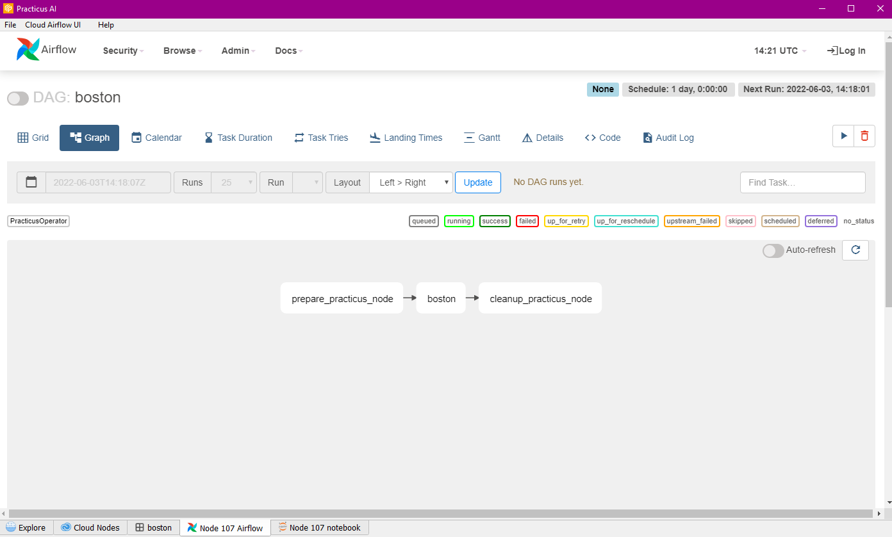
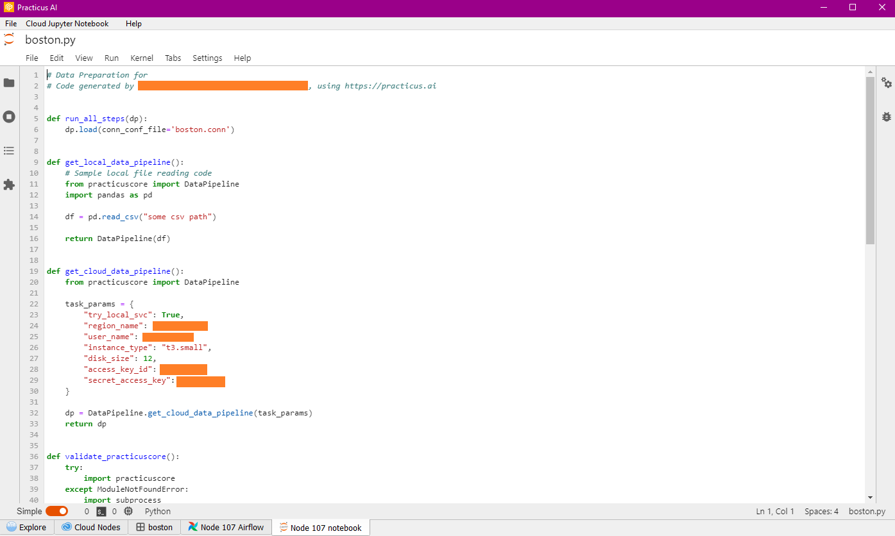

Create production ready data processing code with one-click, embed into Airflow or other orchestration engines. 
Choose your preferred data processing engine including Pandas, DASK, RAPIDS (GPU), RAPIDS + DASK (multi-GPU) and SPARK.

After Airflow Code export is completed, you can see, run and stop the DAGs created with the Airflow tab. You can also run and schedule more than one task sequentially.

You can see and edit your Airflow code exported with Jupyter Notebook and continue your operations programmatically.You can also work on the data pipelines you have created.

Please view the [Modern Data Pipelines](modern-data-pipelines.md) section to learn more about out how Practicus AI data pipelines work by default.