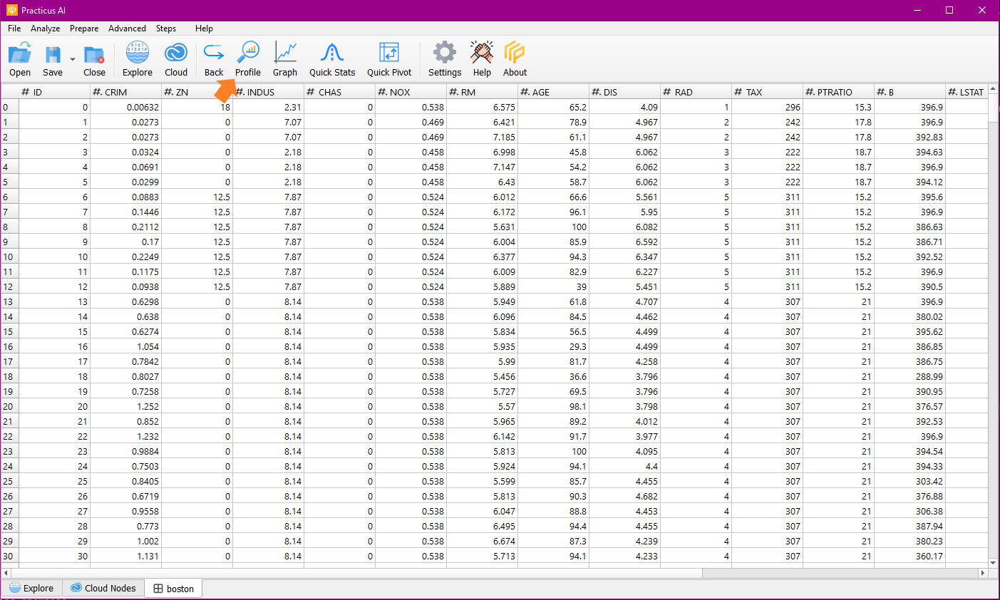
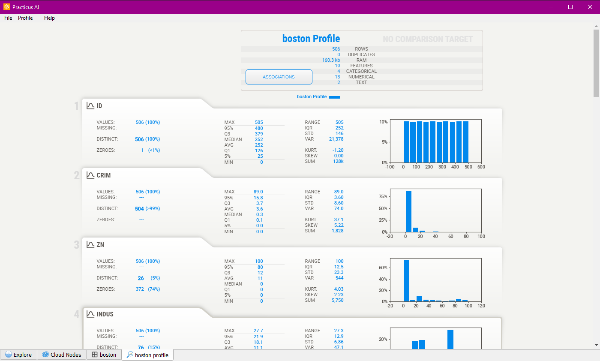
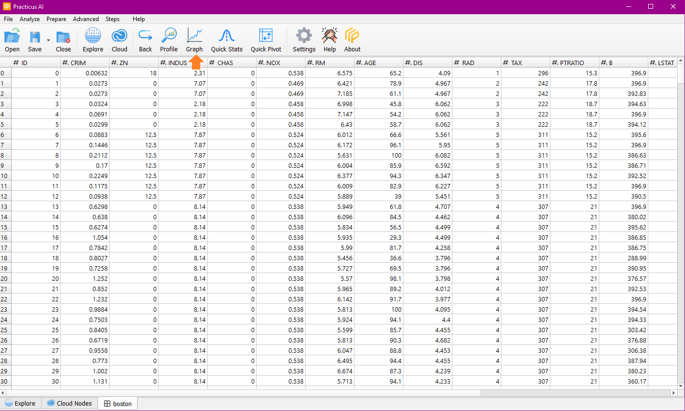
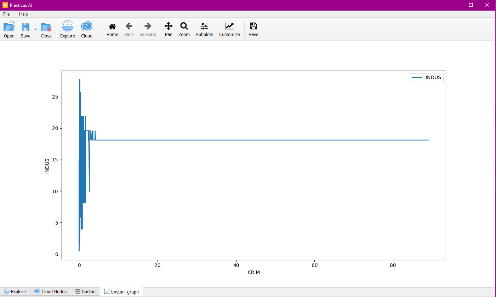
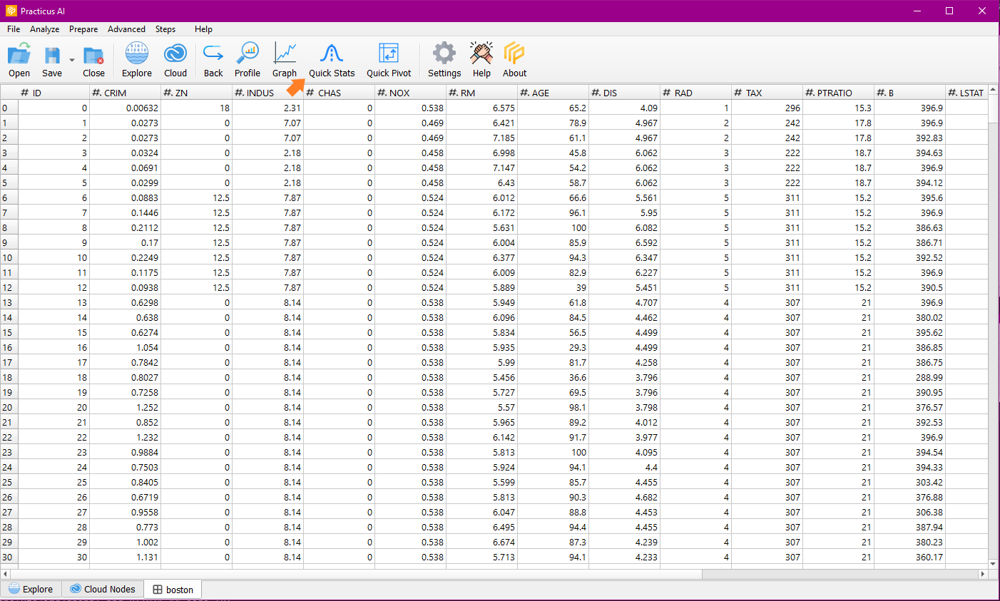
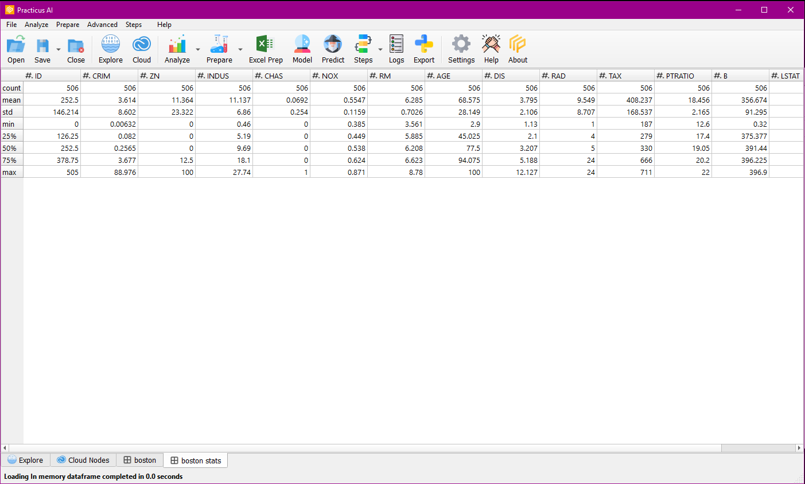
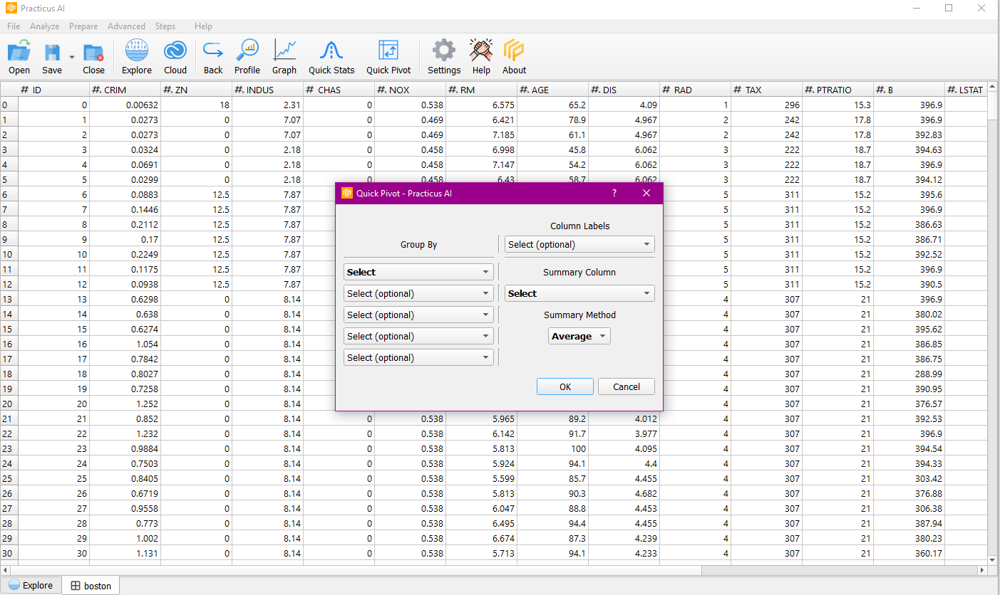

Easily create charts and profile your data with one click. 
Quickly understand how your data is distributed and identify hard to find correlations.

## Profile
Generate the profile of the data you use with the profile feature in the analyze section.

## Graph
Let's use the graph feature in the analysis section.

You can choose the graph style(Plot, Bar, Horizontal Bar, Histogram, Scatter Plot) you want to create from the dialog. Then enter the x and y columns of the graph you want to create.

You can perform operations on the chart with the features in the menu bar, and you can save the chart if you want.

## Quick Stats
You can see quick statistics of the columns on data.

It gives you statistical data about the columns such as count, mean, std, min, 25%, 50%, 75% and max.

## Quick Pivot
Quick pivot allows you to quickly summarize large amounts of data in an interactive way.
You can choose Sum, Median, Min, Max, Std. Dev., Variance, Product as Summary Method.

