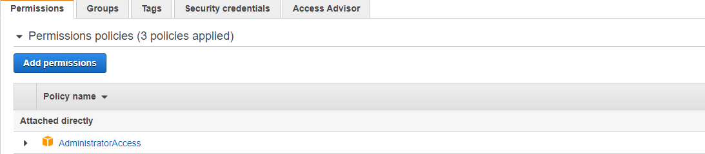
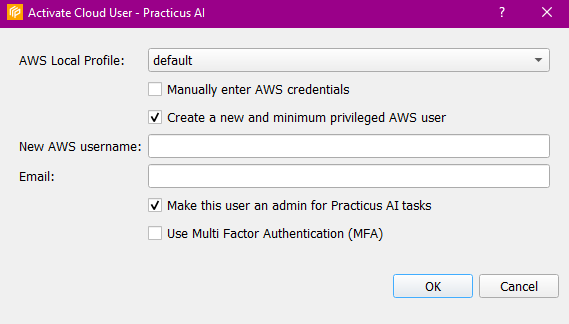
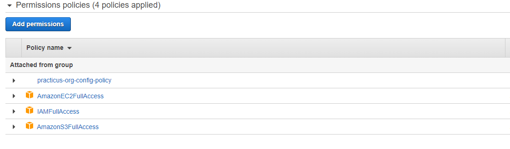

Create cloud IAM policies that apply to all of our users to create audit trails for data access and processing.

## Administrator Access

User can attach AdministratorAccess policy to their users via AWS IAM. Practicus can be used easily if the user with AdministratorAccess policy is added in the Settings/AWS Cloud User section of the application.

## Minimum Privileged AWS User

You can create a minimum privileged AWS User from the Settings / Create new cloud user section through the application. When the user is created, the policies to be used for Practicus on AWS are attached to the user.

