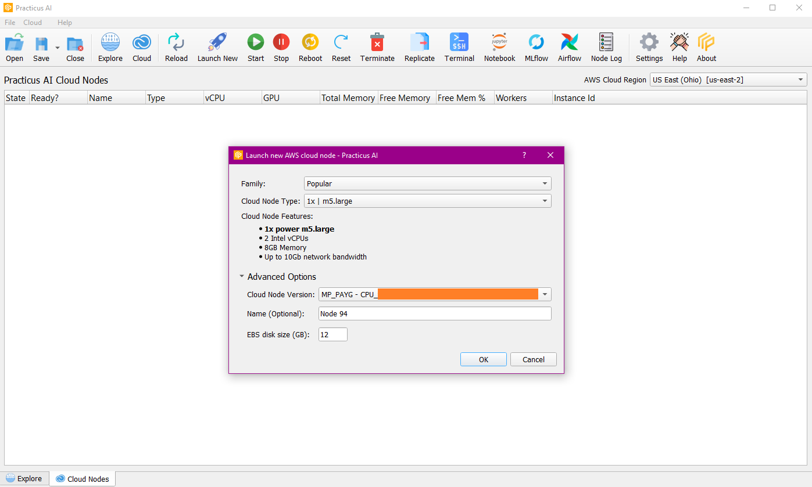
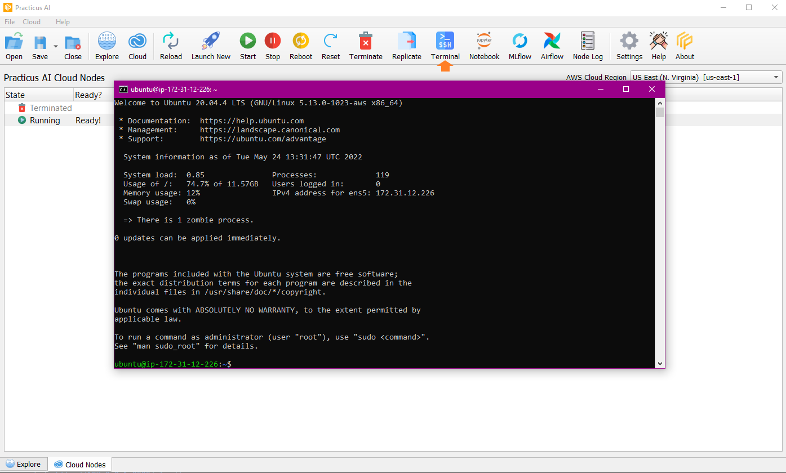
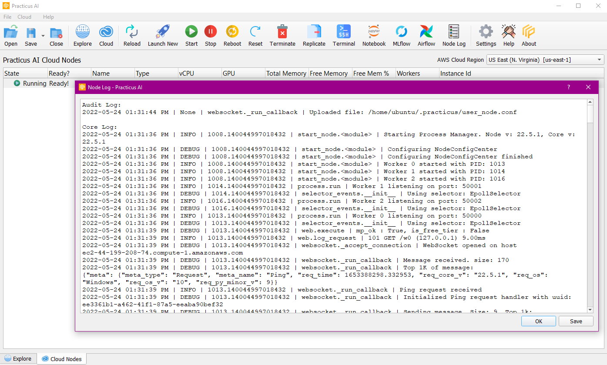

A cloud node is like your computer in the cloud. Various configurations of CPU, memory, storage, and networking capacity for your instances, known as instance types.
There are many instance types with different features. You can choose different instance types according to your usage area. You can keep your data on Cloud Node and work on big data quickly.

## Launch New Node

You create a new node by choosing the type of instance you want to use, the EBS disk size,Name and the Cloud Node Version.

You can stop, start, reset, reboot, replicate and terminate the created node.

## Terminal Node

Quickly SSH to the node using the terminal feature.

## Node Log

It accesses the logs on the node, it can be saved.

## Jupyter Notebook, MLFlow, Airflow

Provides Jupyter Notebook, MLFlow and Airflow connections with the selected node.

Jupyter Notebook allows you to code and see the files in the node.

MLFlow allows you to see the registered models and predict using these models.

Airflow allows you to create and schedule a new DAG.