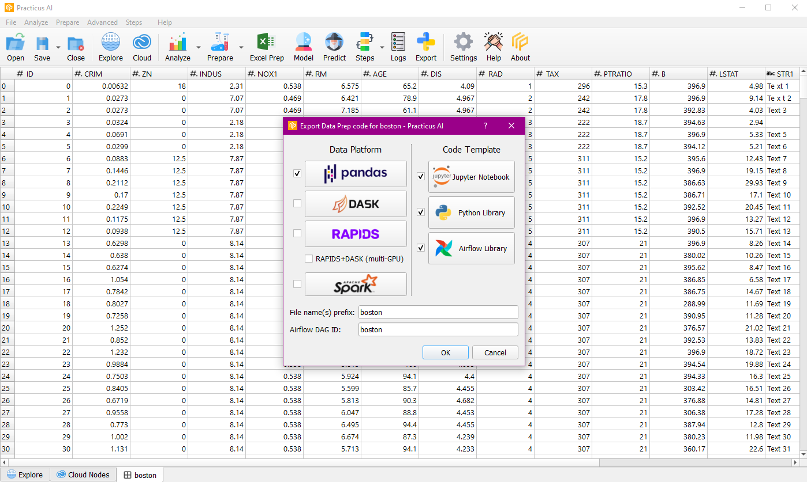
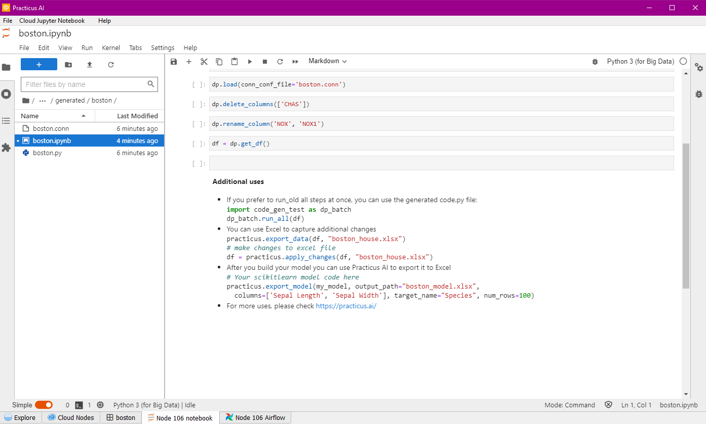

Create production ready data processing code with one-click, embed into Airflow or other orchestration engines. 
Choose your preferred data processing engine including Pandas, DASK, RAPIDS (GPU), RAPIDS + DASK (multi-GPU) and SPARK. 

## Export Code

You can export the operations performed when we do data preparation on the data to the code. If you wish, you can continue your operations over the exported code.

You can choose Pandas, DASK, RAPIDS, multi-GPU, Spark as data platform, and you can choose Jupyter Notebook, Python Library and Airflow Library as Code Template.

Note : You need a ready cloud node for this operation.

When the process is complete, you can navigate through the files, continue with the exported code and review the code.

