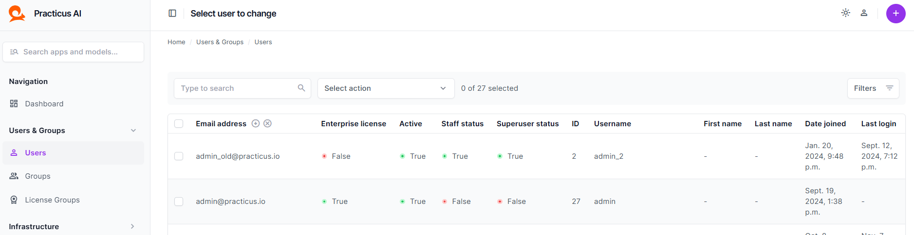
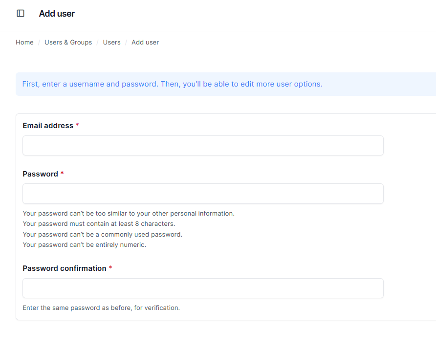
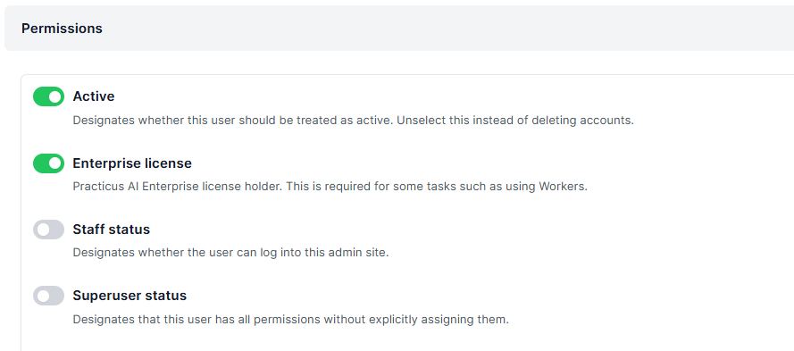
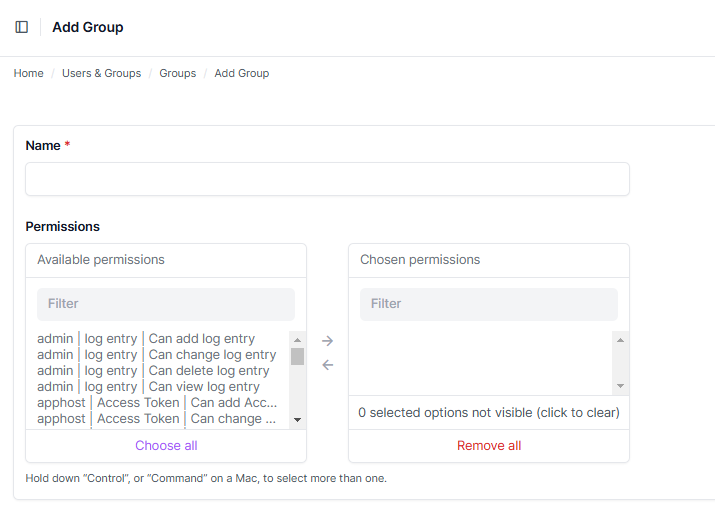

---

# Managing Users and Groups in Practicus AI Console

_This section requires access to the Practicus AI Admin Console. Please ensure you have the necessary permissions to manage users and groups._

---

## Creating a User (Create User)

### Adding a New User

1. Open the **Users** tab under **Users & Groups** in the left-hand navigation menu.  
2. Click the **+ (Add User)** button in the top-right corner.  

   

3. Fill out the following details in the form:  

 

   

4. Click **Save** to create the user.

---

### Assigning Permissions (Optional)

After creating the user, you may need to assign roles or permissions:

1. Locate the newly created user in the **Users** list and click on their name.  
2. Use the **Permissions** section to assign groups or specific roles:  

   

3. Click **Save** after making changes.

---

### Tips for Managing Users

- **Group Assignments:** Assign users to groups for role-based access control.  
- **Permission Updates:** Regularly review permissions to ensure compliance with organizational policies.

By following these steps, you can effectively manage user creation and permissions in the Practicus AI Admin Console.

---

## Adding a Group (Create Group)

### Adding a New Group

1. Open the **Groups** tab under **Users & Groups** in the left-hand navigation menu.  

2. Click the **+ (Add Group)** button in the top-right corner.  

3. In the **Add Group** form, provide the following details:  
   - **Name:** Enter a unique name for the group (e.g., "Default", "Developers").  
   - **Permissions:** Use the selector to assign available permissions to the group:  
     - Select desired permissions from the **Available permissions** list.  
     - Use the arrow button to move selected permissions to the **Chosen permissions** list.  

      

4. Click **Save** to create the group.

[Next >](add_image.md)
