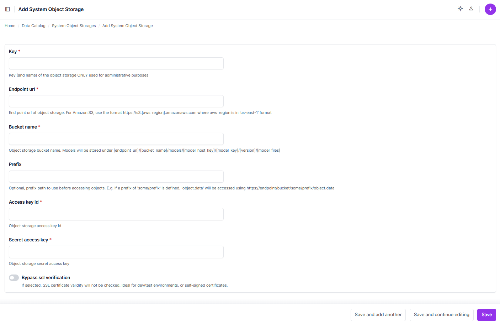

# Object Storage

This document outlines the configuration process for adding and managing system object storages within Practicus AI.

---

## Overview

The **System Object Storages** section enables you to integrate external object storage services (e.g., AWS S3) for managing and accessing data objects, such as model files and other resources.

---

### Adding a New Object Storage

To add a new object storage, click the **Add System Object Storage** button and fill in the following fields:

- **Key**: (Required) A unique name for the object storage used for administrative purposes.
- **Endpoint URL**: (Required) The URL of the object storage service. For AWS S3, use the format `https://s3.{aws_region}.amazonaws.com` where `{aws_region}` is the region (e.g., `us-east-1`).
- **Bucket Name**: (Required) The name of the object storage bucket where data will be stored. Models will be stored under the path `[endpoint_url]/[bucket_name]/models/[model_host_key]/[model_key]/[version]/[model_files]`.
- **Prefix**: (Optional) A prefix path to use before accessing objects. For example, if the prefix is `some/prefix`, objects will be accessed using `https://[endpoint]/[bucket]/some/prefix/object.data`.
- **Access Key ID**: (Required) The access key for the object storage service.
- **Secret Access Key**: (Required) The secret key for the object storage service.

    

---

### Actions

- **Save**: Saves the new object storage configuration.
- **Save and Add Another**: Saves the configuration and opens a new form to add another object storage.
- **Save and Continue Editing**: Saves the configuration but keeps the form open for further adjustments.

---

[< Previous](git-config.md) | [Next >](add-on-services.md)
