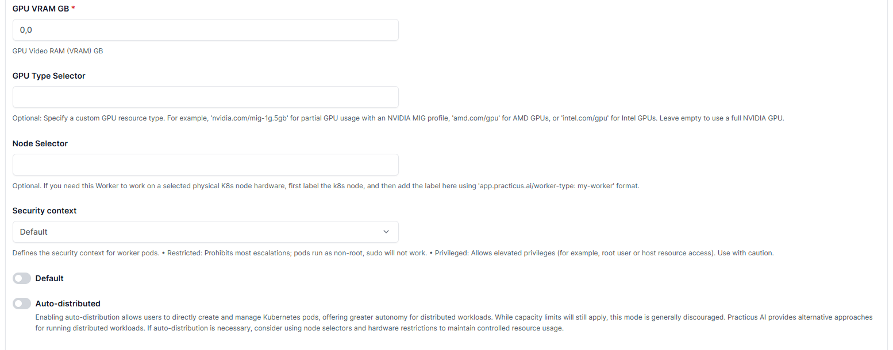
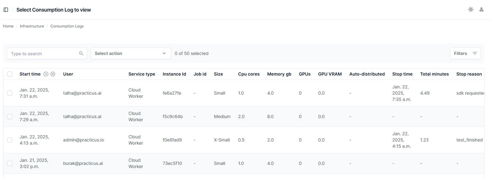
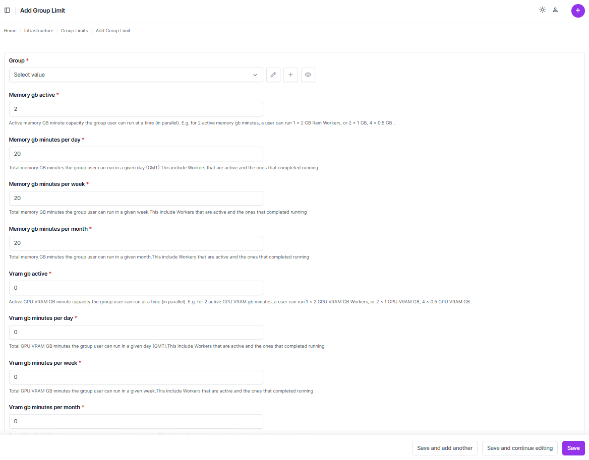

---

# Resource Management in Practicus AI Console

_This section focuses on managing worker sizes, consumption logs, group limits, and user limits to optimize resource utilization in the Practicus AI platform._

---

## Worker Sizes

The **Worker Sizes** section allows you to configure and view the available compute resources for tasks. You can define worker sizes with specific configurations, such as CPU cores, memory, GPU availability, and security contexts.

### Adding a Worker Size

1. Navigate to **Infrastructure > Worker Sizes** in the left-hand navigation menu.  
2. Click the **+ (Add Worker Size)** button in the top-right corner.  
3. Fill out the required fields in the form, such as:
   - **Name:** Unique identifier for the worker size.
   - **CPU cores and memory:** Specify resource allocation.
   - **GPU and VRAM:** Assign GPU resources if applicable.
4. Click **Save** to add the worker size.  

   
   

---

## Consumption Logs

The **Consumption Logs** section provides an overview of resource usage, including detailed logs of worker activities.  
- **Fields Available:**  
  - **User:** Indicates the user utilizing the resource.  
  - **Instance ID:** Unique ID of the running worker.  
  - **Size:** Worker size (e.g., Small, Medium).  
  - **CPU cores, memory, GPUs:** Resource allocation.  
  - **Stop Time and Duration:** Logs the completion time and total runtime.  

Use this section to monitor resource consumption and analyze trends.

  

---

## Consumption Summary

The **Consumption Summary** provides an aggregated view of resource usage by users over specific periods (daily, weekly, monthly).  
- **Key Metrics:**  
  - **Memory and VRAM usage:** Tracks active and total consumption for CPU and GPU resources.  
  - **User-based usage:** Detailed summary per user.

This feature helps identify heavy resource consumers and optimize allocations.

---

## Group Limits

The **Group Limits** section allows you to set resource usage caps for groups.  
- **Steps to Add Group Limits:**
  1. Navigate to **Infrastructure > Group Limits**.  
  2. Click the **+ (Add Group Limit)** button.  
  3. Specify the following fields:
     - **Group:** Select the group to configure.  
     - **Memory GB active:** Define the active memory capacity for the group.  
     - **Daily, weekly, and monthly limits:** Set resource caps.  
     - **VRAM limits:** Allocate GPU-specific resources if needed.  
  4. Save the changes to apply the limits.  

  

---

## User Limits

The **User Limits** section allows you to define individual resource usage caps per user.  
- **Steps to Add User Limits:**  
  1. Navigate to **Infrastructure > User Limits**.  
  2. Click the **+ (Add User Limit)** button.  
  3. Configure the following:
     - **User:** Select the target user.  
     - **Memory and VRAM limits:** Define active and total usage thresholds.  
     - **Daily, weekly, and monthly limits:** Set specific caps for resources.  
  4. Save the changes to enforce the user limit.

---

[< Previous](add-on-services.md) | [Next >](storage.md)