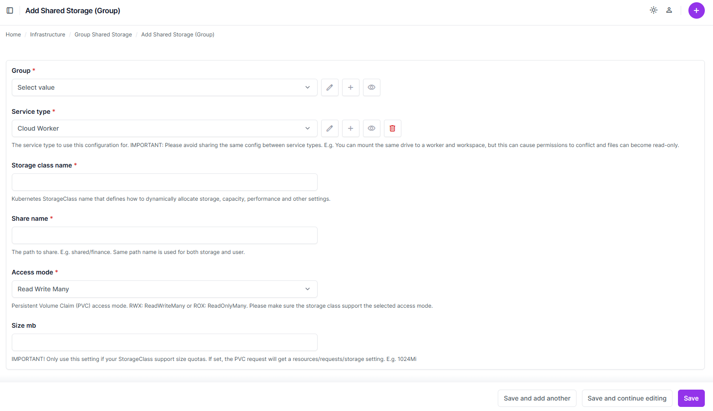

# Storage (My/Shared Folders)

_This section outlines how to manage personal and shared storage configurations in the Practicus AI platform. You can configure storage for individual users or groups, ensuring proper allocation and permissions._

---

## Group Storage

### Viewing Group Storage
1. Navigate to **Infrastructure > Group Storage** in the left-hand navigation menu.
2. View existing group storage configurations:
   - **Storage Class Name:** Defines the type of storage being used.
   - **Access Mode:** Specifies the level of access (e.g., Read Write Many).
   - **Storage Prefix:** Indicates the directory path assigned to the group (e.g., `users/`).

### Adding Group Storage
1. Click **+ (Add Personal Storage)** in the top-right corner.
2. Configure the following fields:
   - **Group:** Select the group for which the storage is being configured.
   - **Storage Class Name:** Define the Kubernetes storage class.
   - **Access Mode:** Choose access level (e.g., Read Write Many).
   - **Storage Prefix:** Specify the path prefix for the storage.
   - **Priority:** Set the priority for the group (higher values take precedence).
   - **Size (MB):** Optionally set a size limit for the storage.
3. Click **Save** to apply changes.

   

---

## Group Shared Storage

### Viewing Group Shared Storage
1. Navigate to **Infrastructure > Group Shared Storage** in the left-hand navigation menu.
2. View shared storage configurations for groups:
   - **Group:** Indicates the group using the shared storage.
   - **Service Type:** Shows whether storage is for Cloud Worker or Workspace.
   - **Storage Class Name:** Defines the storage class.
   - **Share Name:** Path of the shared directory (e.g., `shared/partner`).
   - **Access Mode:** Specifies access permissions (e.g., Read Write Many).

### Adding Shared Storage for Groups
1. Click **+ (Add Shared Storage)** in the top-right corner.
2. Fill in the following details:
   - **Group:** Select the group to configure shared storage for.
   - **Service Type:** Choose the service type (e.g., Cloud Worker).
   - **Storage Class Name:** Specify the Kubernetes storage class.
   - **Share Name:** Define the directory name for shared storage.
   - **Access Mode:** Set the access level (e.g., Read Write Many).
   - **Size (MB):** Optionally limit the size of the shared storage.
3. Click **Save** to finalize the configuration.

   

---

[< Previous](resources-management.md) | [Next >](model_depl.md)