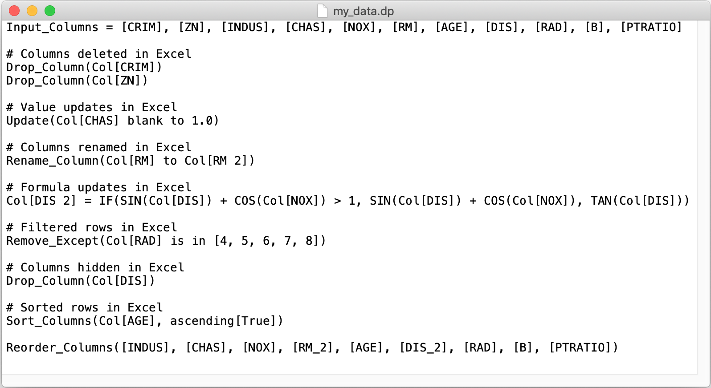

There are two main use cases for Practicus AI. Data Preparation and model sharing. You can take a look at the below sections to get an idea and then download the <a href="https://practicusai.github.io/samples/" target="_blank">sample notebooks</a> to quickly get started. 

Data preparation for ML consumes an estimated 80% to 90% of the time for a Data Scientist today. Practicus AI aims to help data preparation for ML by **closing the gap between Excel and Python code**. Both data scientists and other supporting personas like business analysts can take advantage of the below functionality, and work together to prepare the data for ML training. 

**Basic data preparation use case**

1) Export a Pandas DataFrame, NumPy array or a Python list to Excel

```python
import practicus
# export data to an Excel file
practicus.export_data(my_df, "my_data.xlsx")
```


2) Open the file in Excel, Google Sheets, LibreOffice or any other Spreadsheet platform to analyze and make changes as usual. 


3) After you are finished updating your data in Excel, you can apply all changes made to create a new data set. 

```python
# import back from Excel, detect all the changes made, and apply to the Data Frame  
my_df2 = practicus.apply_changes(my_df, "my_data.xlsx") 

# practicus auto-generates Python code for you, and applies the updates..

# display the result, which will be the same as what you see in Excel
display(my_df2)
```


4) **(Optional)** Practicus AI will automatically create a **d**ata **p**rep (.dp) file containing all detected changes, before generating Python code. You can review this file, remove changes you don't like, or add new ones manually as you wish. Once done, you can apply the updates directly from the .dp file. 



```python
# apply changes, but this time directly from the .dp file that you reviewed / updated
my_df2 = practicus.apply_changes(my_df, "my_data.dp")
```


5) **(Optional)** Rinse and repeat... You can continue the above steps, also working with others in a collaborative environment, to keep generating new versions of Excel files and auto-generated data sets. The detected changes (.dp files) can be updated and archived as needed. Outside of Jupyter notebooks, you can also chain multiple .dp files to create complex data preparation / ML pipelines and later embed these data pipelines to a data engineering platform for production purposes.  Any production grade data integration platform that can run Python code will easily run Practicus AI detected changes at scale.   

