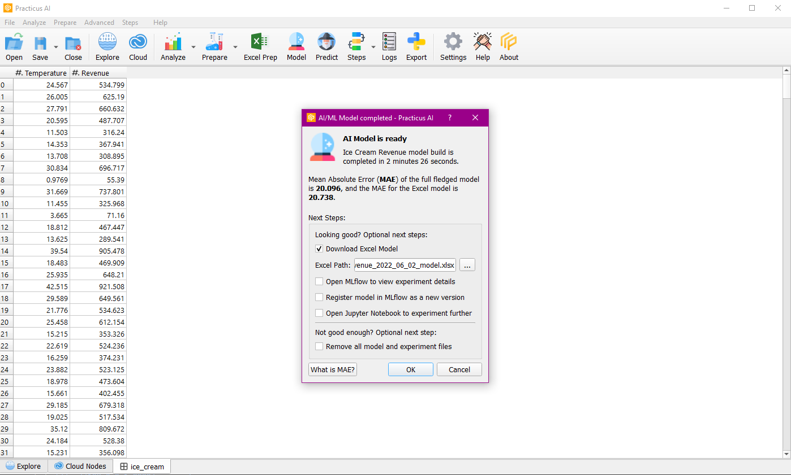
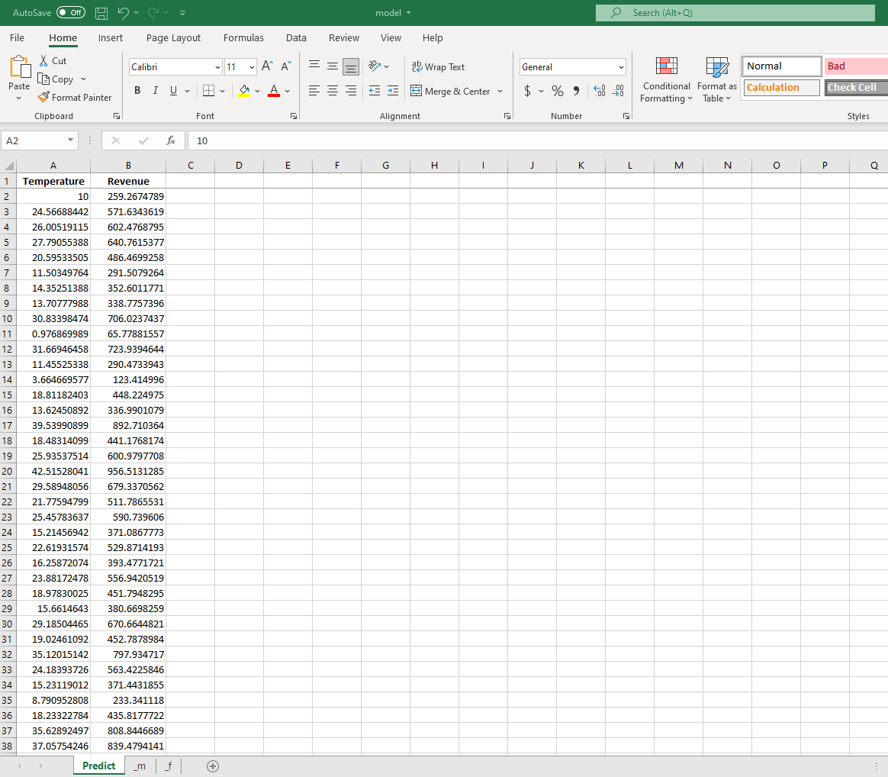

You can also use pure-Excel for prediction! (only at Practicus AI). Export and embed your AI models into Excel or Google 
Sheets, attach to an email and allow your users to make predictions completely offline with no app / plugin / macro  
required. You can use the AutoML models, or export your own custom models. Currently supporting Linear Regression, 
Logistic Regression, SVM and Decision Trees.

## Prediction

After the model is created with the build excel model option, you select the location where you will save the excel model from the dialog that appears.

You open the saved excel model and make predictions for the column you want. In this example, the target column was revenue and when we filled the temperature column with different values, the revenue column was filled with the predicted values.

