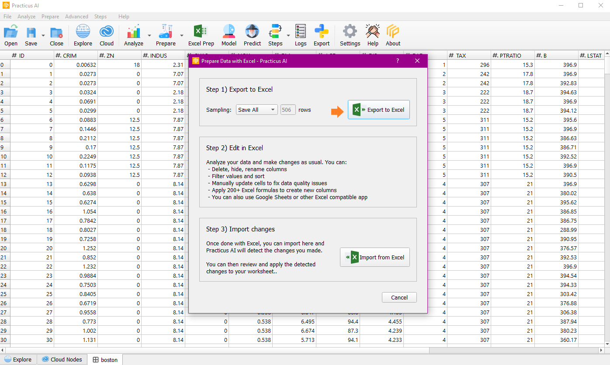
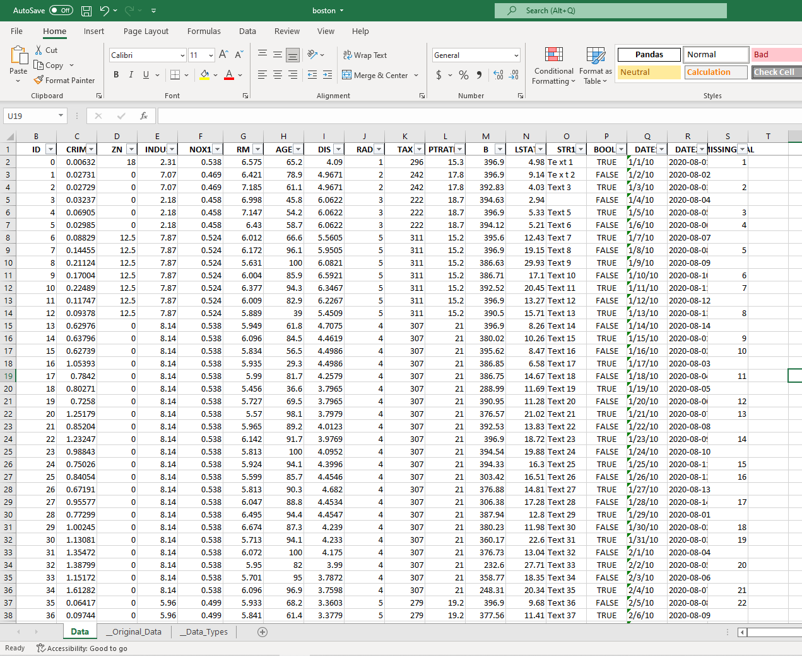
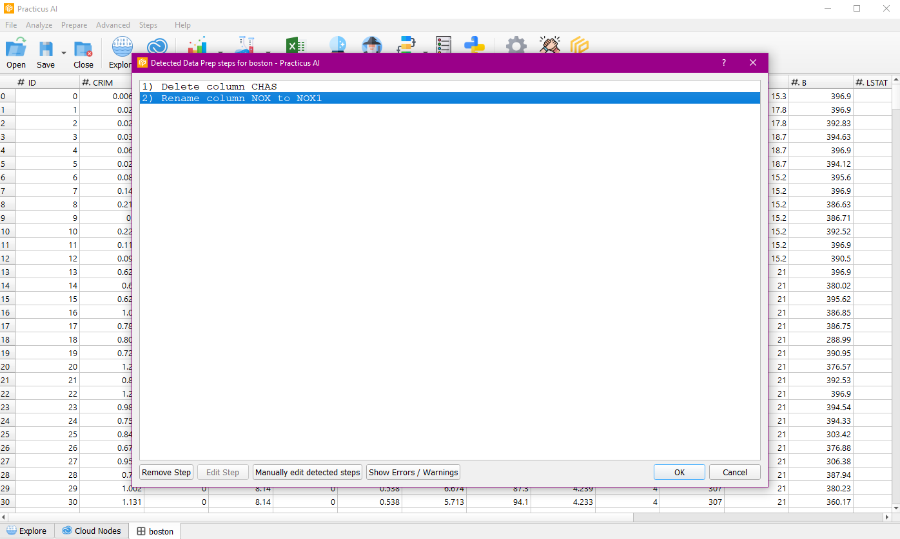
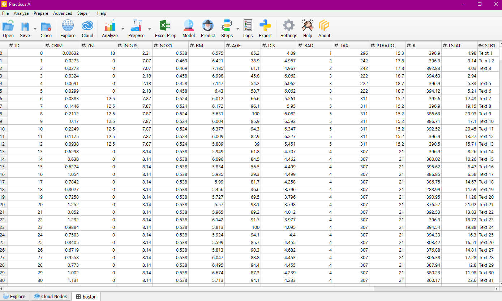

You can also use Excel for data preparation! (only at Practicus AI).  Share pure Excel or Google Sheets with others, 
so they can analyze the data and make changes, and send it back to you. Practicus AI can then capture those 
changes, so you can apply to any data locally or in the cloud, or export to Python code. Please watch the demo for more! 

## Export to Excel

With Export to Excel, you can save your data on which you have done preparation operations as excel anywhere on your local computer.

Note : You need ready cloud node for this operation.

## Edit in Excel

You can delete columns, change their names, perform sort and filter operations on the exported excel, apply excel formulas and perform other data preparation operations. In this example, the CHAS column has been deleted and the name of the NOX column has been changed.

## Import from Excel

After saving your excel file on which you perform operations, you can import it to the application with Import from Excel.

The changes we made on the data with Excel were noticed. You can delete and edit them if you wish.

Thus, we have imported our data on Excel into the application with the changes we have made.