Up to 100+ times faster sampling. Random sample 1 billion+ rows down to 1 million in only a few seconds. 
Switch between data engines if you need (Pandas, DASK, Spark, GPUs with RAPIDS). 
Use S3 like a local drive on your laptop by simple copy/paste operations. Query Databases using SQL.

## Local Files

You can browse local files in the Explore tab and preview the data you want to work with easily.

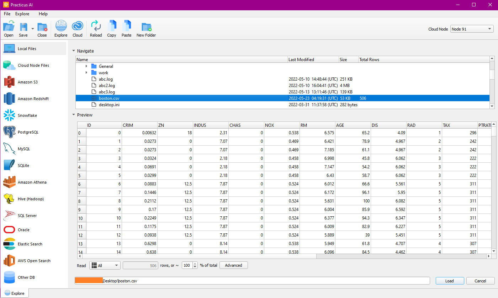

You can create a new file, copy and paste the files on Cloud Worker or S3

## Cloud Worker Files

Firstly you have to launch a new Cloud Worker from the Cloud Tab. Then you can navigate the Cloud Worker content. You can preview the file by clicking on it.

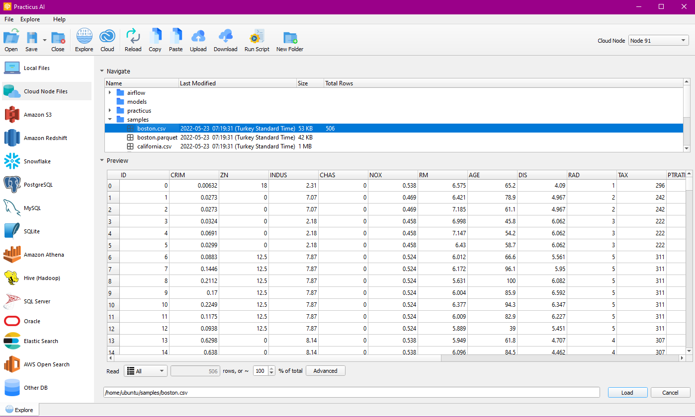

### Create Folder
Let's create a new folder.

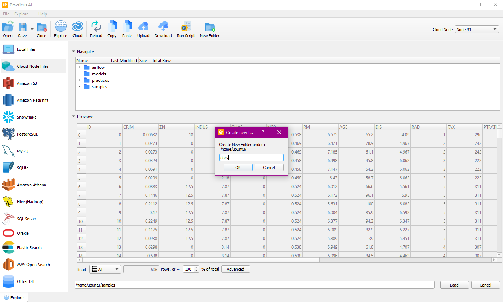

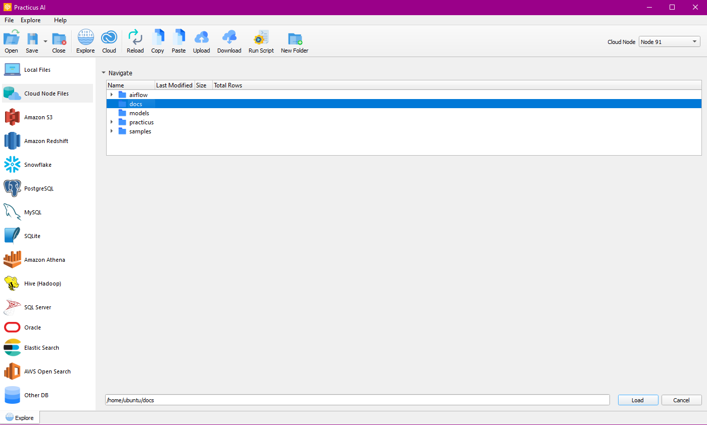

A new folder has been created.

You can also download and upload files on Cloud Worker and run the necessary scripts for databases.

### Upload
A directory is selected for the upload process.

You can select the file you want to upload from the file dialog.

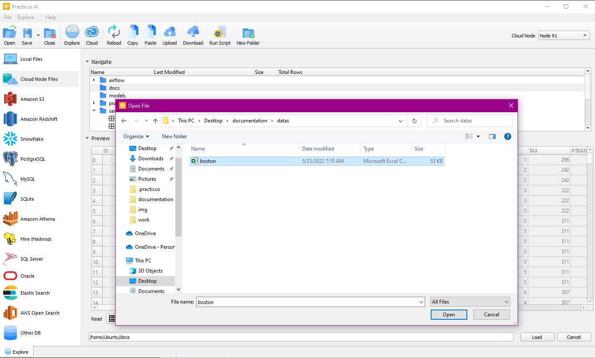

After making your selection, you will be directed to the file transfer tab.

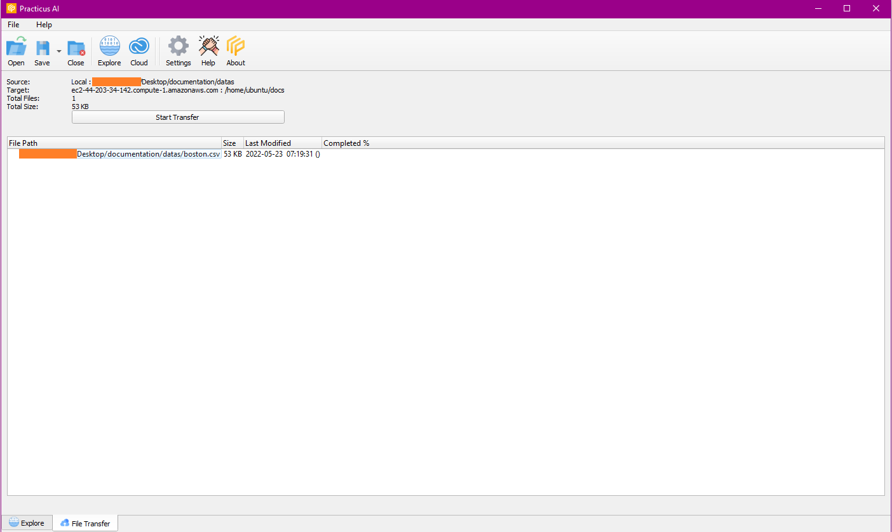

It starts the process with start transfer and you can close the tab when the process is finished.

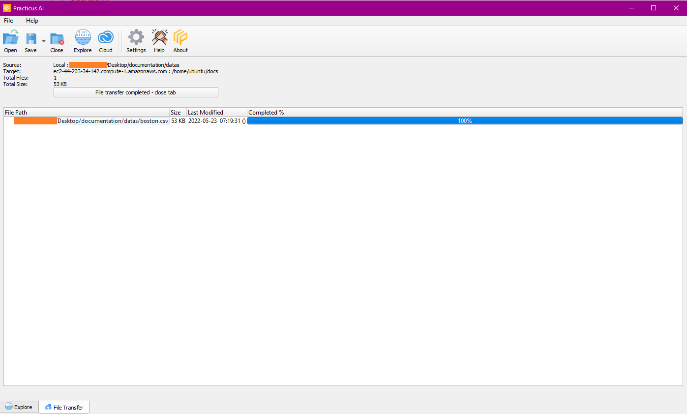

You can see the uploaded file by navigating on Cloud Worker.

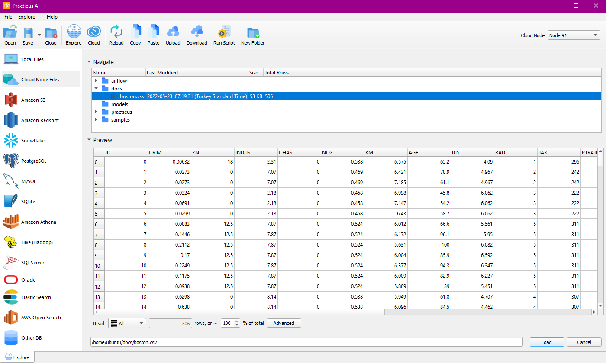

### Download

Select the files and start the download process.

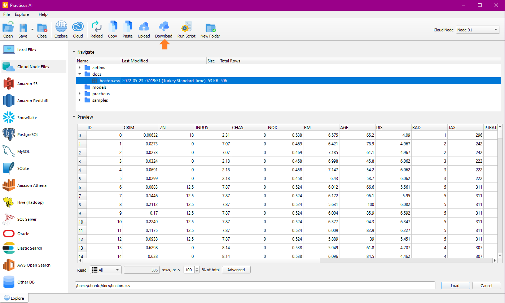

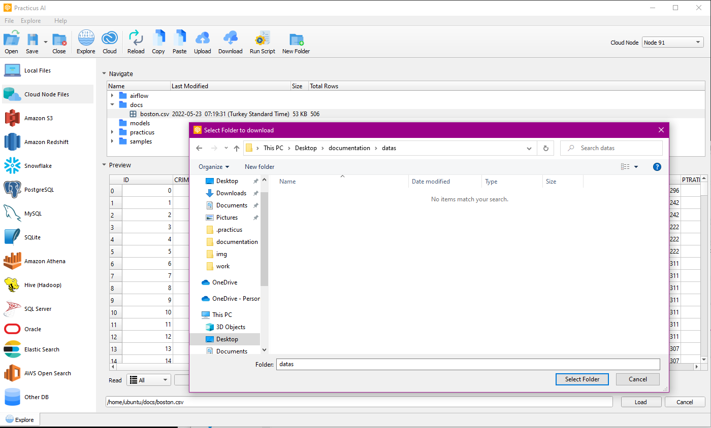

After completing the download via the file transfer tab, you can navigate to local files and find the file.

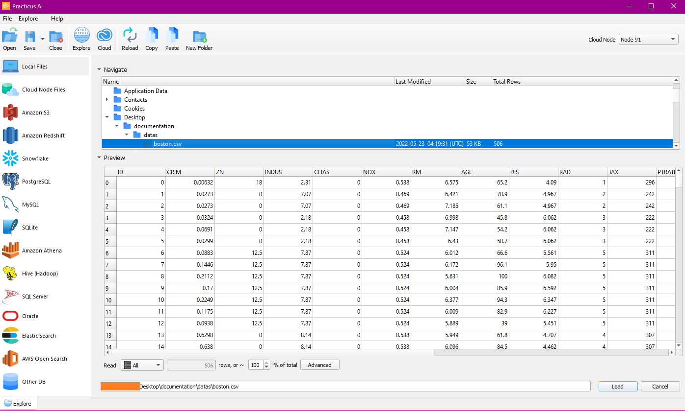

## Amazon S3

After the required Cloud Config setup process is completed, you can load the buckets with Amazon S3, then select the bucket and navigate the files.
Note : For this operation you need ready Cloud Worker.

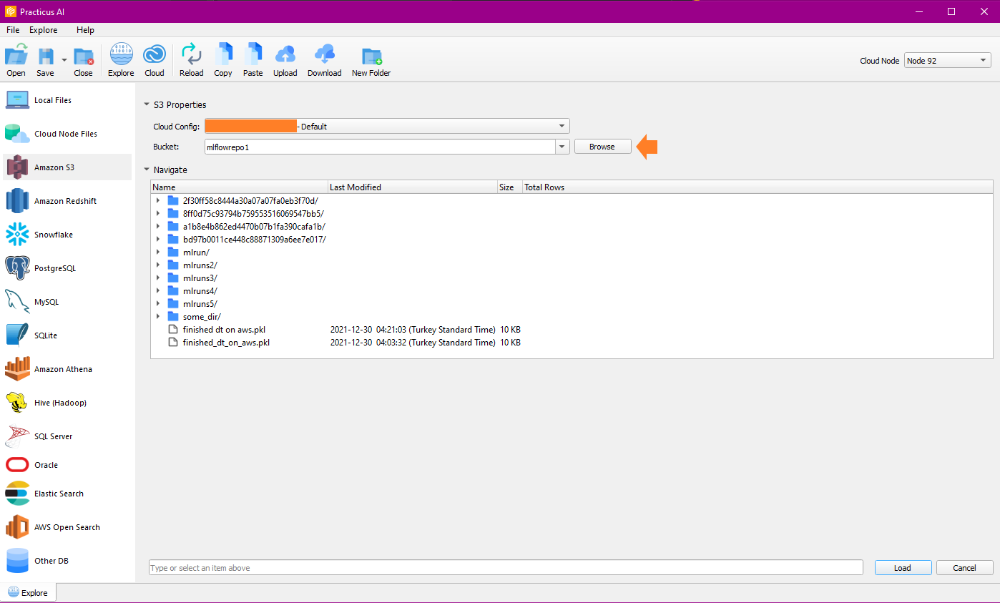

You can also perform the features (copy, paste, upload, download, new folder) in the menu bar.

## Relational Databases

You can connect to the database using relational databases, run SQL queries, and continue your operations on the data.
Amazon Redshift, Snowflake, PostgreSQL, MySQL, SQLite, Amazon Athena, Hive(Hadoop), SQLServer, Oracle, ElasticSearch, AWSOpenSearch, OtherDB connections are supported.
Amazon Athena, Hive(Hadoop), SQLServer, Oracle, ElasticSearch, AWSOpenSearch databases need driver installation.

Note: You need a ready Cloud Worker to access Relational Databases.

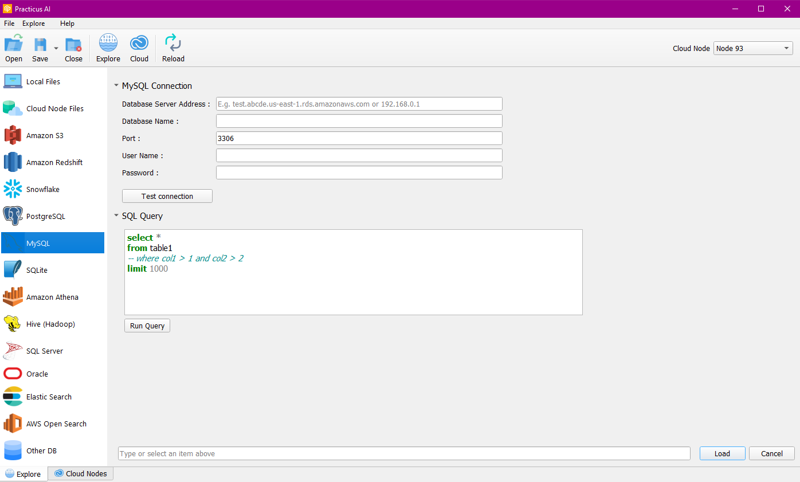

