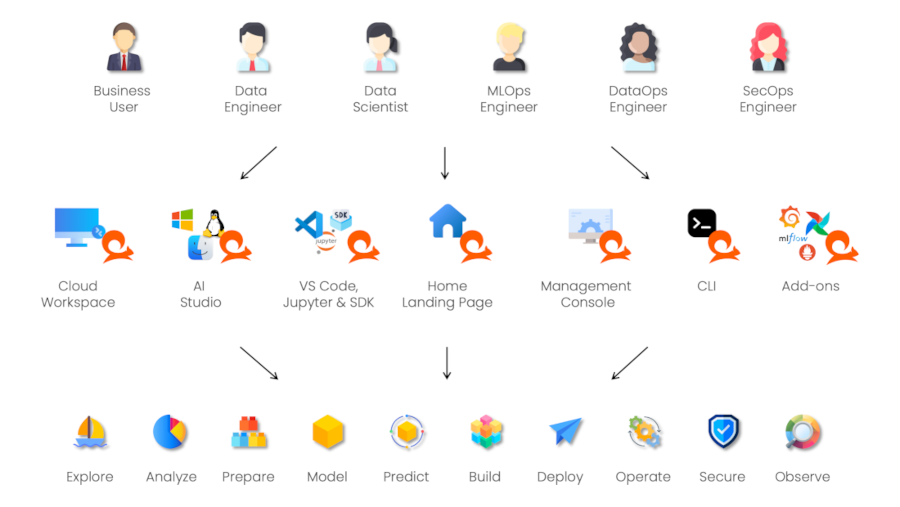

# Getting Started with Practicus AI

The Practicus AI platform offers multiple tools for working with AI and data intelligence. Regardless of your role, experience level, or objectives, you can choose an entry point that fits your needs.

## Personas, Practicus AI Tools & Tasks

The diagram below illustrates various user roles, the tools available to them, and the tasks they support:

## Finding the Right Tool for the Job

Your choice of tool depends on your goals, role, and technical skill level:

### Where to Start

Most users begin at **Practicus AI Home**, typically accessed at an address like `https://practicus.your-company.com`. If you do not have access, consult your system administrator. If you are not an existing enterprise user, you can experiment offline with the free [Practicus AI Studio](https://practicus.ai/download/), or contact your IT team for enterprise installation options.

Next, decide whether you prefer to work with code or not.

### If You Code

1. **Create a Worker:**  
   From Practicus AI Home, create one or more Workers—isolated Kubernetes pods configured with the container image, CPU/RAM, GPU, and other resources you need.

2. **Use Jupyter Lab or VS Code:**  
   After selecting a Worker, launch Jupyter Lab or VS Code. You can write code, train and deploy ML models, and interact with data. Sample jupyter notebooks are provided in each Worker's home directory for quick exploration.

### If You Do Not Code

1. **Access Practicus AI Studio or Workspaces:**  
   From Practicus AI Home, open a browser-based Workspace or [download AI Studio](https://practicus.ai/download/), for a no-code/low-code experience. If local installation isn’t possible, online Workspaces already include Practicus AI Studio, office productivity tools, and other useful applications.

2. **Explore & Build with No-Code Tools:**  
   Use visual interfaces and guided workflows to analyze data, generate insights, and create AI solutions—no programming required.

---

**Previous**: [Welcome](index.md) | **Next**: [Tutorials](tutorials.md)
