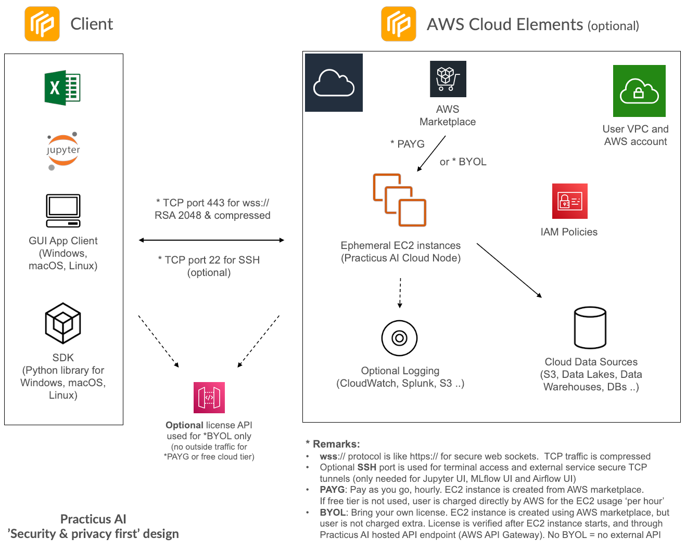

<a href="https://practicus.ai/" target="_blank">Practicus AI</a> is a platform to make AI/ML for tabular data
easier to use for both technical and non-technical users. The user experience is designed after Spreadsheets.

Certain functionality can be used directly from Spreadsheets such as Excel and Google Sheets. 

## Big Picture

## Architecture

## What does Practicus AI do?

<a href="https://practicus.ai/" target="_blank">Practicus AI</a> has 4 major elements. 

1) **GUI (visual) app:** Free and available for Windows, macOS and Linux. The app is the center of most 
functionality such as EDA (Explorator Data Analysis), Data Preparation, AutoML, Prediction etc.  

2) **SDK:** Free Python library (3.6 - 3.10) providing programmatic access to most of the GUI app features. 

3) **Spreadsheets:** Certain Data Preparation and Prediction functionality can be embedded inside any spreadsheet system

4) **Cloud Node:** Running on AWS, optional cloud node offers advanced functionality. 

## How can Practicus AI help me?

Different user personas will benefit from <a href="https://practicus.ai/" target="_blank">Practicus AI</a> differently.

The common benefit will be allowing better collaboration between both technical and non-technical users.    

### Data Scientists
- **Data preparation/transformation:** The most time-consuming part for most data science projects. 
- **Improved model discoverability:** Another key issue. [Practicus AI](https://practicus.ai/) allows any user to easily 
search and discover models from the GUI.   
- **Point & click model inference:** [Practicus AI](https://practicus.ai/) allows to immediately predict 
without the need for model hosting. 
- **Export simpler models to pure spreadsheets:** Unique to [Practicus AI](https://practicus.ai/), data scientists can export
relatively simple models to Excel, Google Sheets and others.

### Data Engineers
- **Easier and faster ETL:** Spreadsheet interface makes data transformation faster and more intuitive.
- **Data engine freedom:** You can easily switch between Spark, Pandas, DASK, RAPIDS, RAPIDS+DASK (multi GPU)
- **Code Export:** You can export processing steps into pure Python with the Airflow embedding code with one-click. 
This allows you to take data processing code as-is or with minimal change and immediately go to production.  

### Business Professionals
- **Explore** various data sources to analyze raw or structured data
- **Build AI models** with one-click and predict the future
- **Easily join technical experts** for complex AI projects, where your expertise is needed the most

