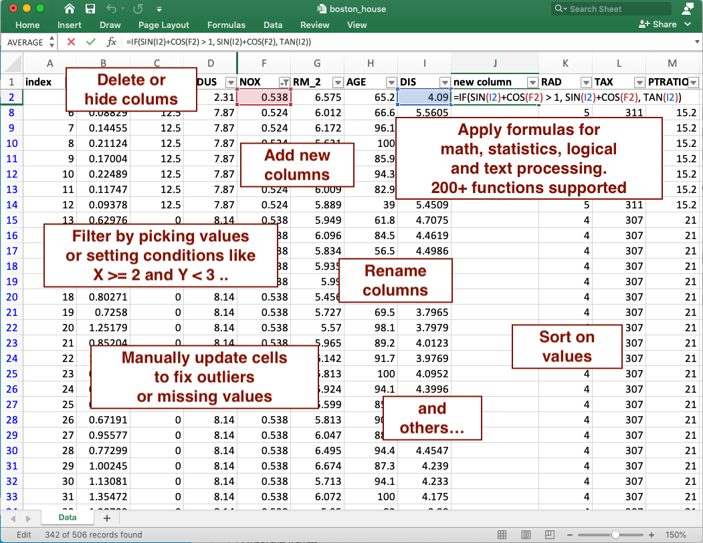
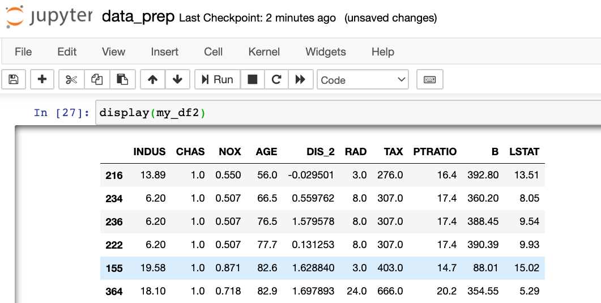
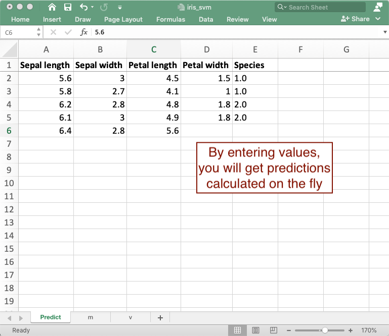
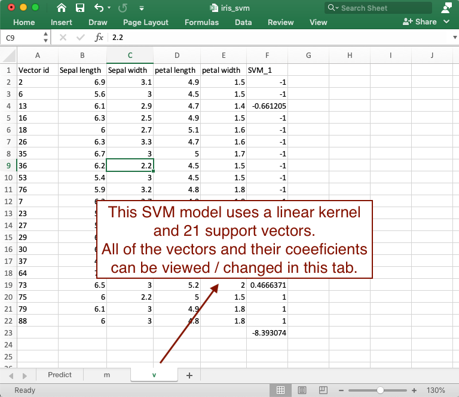

**Practicus AI** is a free platform that allows **ML data preparation**, zero dependency **ML model deployment**, **model debugging** and **model explainability**. 

**Data Scientists** can use Practicus AI to make their own lives easier, and also to **collaborate** with **Data Analysts**, **Business Analysts** and more. There are an estimated **1 billion+** Excel, Google Sheets, LibreOffice or similar Spreadsheet users in the World. Practicus AI aims to bridge the gap between Data Scientist / Python world and the billion+ Business / Excel users.  

There are two main use cases for Practicus AI. Data Preparation and model sharing. You can take a look at the below sections to get an idea and then download the <a href="https://practicusai.github.io/samples/" target="_blank">sample notebooks</a> to quickly get started. 

Data preparation for ML consumes an estimated 80% to 90% of the time for a Data Scientist today. Practicus AI aims to help data preparation for ML by **closing the gap between Excel and Python code**. Both data scientists and other supporting personas like business analysts can take advantage of the below functionality, and work together to prepare the data for ML training. 

**Basic data preparation use case**

1) Export a Pandas DataFrame, NumPy array or a Python list to Excel

```python
import practicus
# export data to an Excel file
practicus.export_data(my_df, "my_data.xlsx")
```


2) Open the file in Excel, Google Sheets, LibreOffice or any other Spreadsheet platform to analyze and make changes as usual. 




3) After you are finished updating your data in Excel, you can apply all changes made to create a new data set. 

```python
# import back from Excel, detect all the changes made, and apply to the Data Frame  
my_df2 = practicus.apply_changes(my_df, "my_data.xlsx") 

# practicus auto-generates Python code for you, and applies the updates..

# display the result, which will be the same as what you see in Excel
display(my_df2)
```




4) **(Optional)** Practicus AI will automatically create a **d**ata **p**rep (.dp) file containing all detected changes, before generating Python code. You can review this file, remove changes you don't like, or add new ones manually as you wish. Once done, you can apply the updates directly from the .dp file. 


```python
# apply changes, but this time directly from the .dp file that you reviewed / updated
my_df2 = practicus.apply_changes(my_df, "my_data.dp")
```


5) **(Optional)** Rinse and repeat... You can continue the above steps, also working with others in a collaborative environment, to keep generating new versions of Excel files and auto-generated data sets. The detected changes (.dp files) can be updated and archived as needed. Outside of Jupyter notebooks, you can also chain multiple .dp files to create complex data preparation / ML pipelines and later embed these data pipelines to a data engineering platform for production purposes.  Any production grade data integration platform that can run Python code will easily run Practicus AI detected changes at scale.   


## AI/ML Model Sharing

Beyond data preparation, Practicus AI can also be used to export ML models to Excel, which can be used for different purposes. Below you can find some use cases to export your models to Excel. 

- Practicus AI exported models can help with ML **deployment** and **testing** and increase your chances of getting them to production to be used by masses.   

- The exported models have **zero dependency**, meaning they only use core Excel functionality and do not depend on 3rd party libraries, products, services, REST APIs etc. You can attach the exported ML model to an email, and the recipient would be able to predict / infer offline without any issues. 

- You can use the exported Excel file to **debug** your models, since the model representation will be in a very simple form. 

- **Model Explainability** can be a key blocker for getting ML models to production. Often times, data analysts, business analysts and other business leaders will not allow moving an ML model to production, simply because they do not understand how the model works. Practicus AI exported models in Excel will be significantly easier to consume and understand.

**Basic model sharing use case**

1) Build your ML model as usual. 

```Python
# sample Support Vector Machine model
...
my_svm_model.fit(X, Y)
```


2) Export to Excel 

```Python
import practicus    
practicus.export_model(my_svm_model, output_path="iris_svm.xlsx",
      columns=iris.feature_names, target_name="Species")
```


3) Open the file in Excel, Google Sheets, LibreOffice or others to make predictions, analyze how the model works and make changes as well.








4) (**Optional**) You can use pre-processing pipelines as well. Necessary calculations prior to model prediction will also be exported to Excel as pre-processing steps.   

```python
# create a pipeline with StandardScaler and LogisticRegression
my_pipeline = make_pipeline(
   StandardScaler(),
   LogisticRegression())

# train
my_pipeline.fit(X, y)

# Export the pre-processing and model calculation to Excel
practicus.export_model(my_pipeline, output_path="model_with_pre_processing.xlsx",
                   columns=iris.feature_names, target_name="Species")
```

5) (**Optional**) You can also export models with Practicus AI using PMML. If you are using R, KNIME, Alteryx or any other ML platform, you can export your models to a .pmml file first (optionally including pre-processing steps as well) and then use the .pmml file with Practicus AI in Python to export it to Excel. The final Excel file will not have any dependencies to your ML platform. 

```python
practicus.export_model("my_model_developed_on_R.pmml", output_path="R_model.xlsx",
                   columns=['petal length', 'petal width'], target_name="Species")
```


------

## Sample notebooks

You can download sample Jupyter notebooks from the below link. 

<a href="https://practicusai.github.io/samples/" target="_blank">https://practicusai.github.io/samples</a>

------
