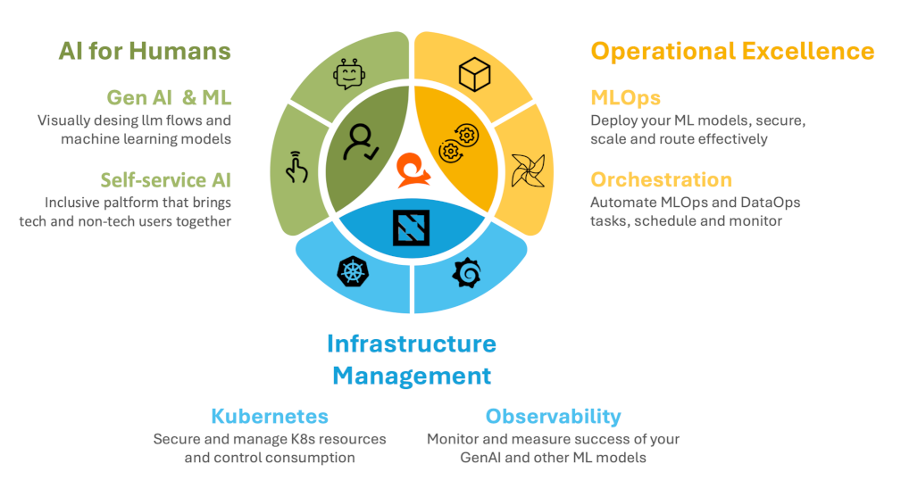

# Welcome to Practicus AI Documentation

## About Practicus AI

[Practicus AI](https://practicus.ai) is a **unified platform for Generative AI and Data Intelligence**. It helps you move from initial concepts to **production-grade AI and Data solutions**. Whether you are an experienced engineer or new to Data and AI, the platform is designed to be both **reliable and easy to navigate**.

## Select Benefits

Practicus AI brings together Generative AI, self-service AI and Data tools, MLOps, Orchestration, Kubernetes infrastructure management, and Observability into a single platform. This **integrated, but flexible** approach simplifies the process of working with **AI and Data at scale**.

## Platform Components

The Practicus AI Platform is built on an **enterprise-grade core, with optional add-ons** to extend functionality. This structure supports consistent deployment, governance, and scalability. It also provides a unified environment for managing applications, runtimes, and advanced analytics tools.

## Core Platform

The core platform **establishes the foundation for a secure, scalable, and versatile AI environment.** It consists of four layers: Applications, Mesh, Runtime, and Infrastructure. Each layer offers distinct capabilities—such as creating and sharing GenAI applications, hosting advanced models and microservices, managing service meshes for reliability, and ensuring efficient use of GPUs and other resources.

## Add-Ons

In addition to the core platform, Practicus AI offer a variety of add-ons that can be selectively incorporated into your environment. These add-ons are **protected by enterprise single sign-on** and **integrate smoothly with core platform and other add-on components**. As we continue to expand the add-on library, you’ll have access to a growing range of tools and features, ensuring that your platform remains both adaptable and secure as your AI initiatives evolve.

## Practicus AI's Core Principles

While the core platform and its add-ons define what you can accomplish with Practicus AI, a set of **guiding principles** ensures that every feature, integration, and improvement remains aligned with our core values of security, flexibility, and usability.

### 7 Core Principles of the Practicus AI Platform

1. **Security & Compliance First:**  
   The platform must maintain enterprise-level security and compliance at all times, enforcing measures such as SSO with MFA/OTP and strict data governance to safeguard sensitive information.

2. **Cloud-Native & Vendor-Agnostic:**  
   The platform must remain cloud-native and adhere to open-source and CNCF standards, ensuring it can be deployed in any environment—on-premises, in the cloud, or within air-gapped configurations—without creating vendor lock-in.

3. **Ease of Use & Extensibility:**  
   The platform must provide a unified interface that simplifies setup, enables rapid deployment, and supports extensibility, adapting smoothly to evolving requirements.

4. **Operational Simplicity for Technical Teams:**  
   The platform must reduce operational complexity, allowing technical users to focus on designing and refining AI solutions rather than managing infrastructure overhead.

5. **Real-Time Observability & Scalability:**  
   The platform must offer continuous insights into performance and health, alongside automatic scaling and optimized GPU utilization, ensuring efficiency as workloads grow.

6. **Accessibility for Non-Technical Users:**  
   The platform must deliver interfaces and tools that are easy to navigate, allowing non-technical users to engage in data exploration, analysis, and insight generation without requiring advanced expertise.

7. **Comprehensive Analytics & Generative AI:**  
   The platform must integrate a full spectrum of analytics capabilities, from traditional to advanced and generative AI, supporting informed decision-making and fostering innovation across diverse use cases.

## Next Steps

As you continue through this documentation, you will find sections tailored to different types of users. Technical teams can explore detailed operational information, while those new to AI can learn the fundamentals. Consider this the starting point for understanding how Practicus AI supports your AI and data initiatives.

---

**Next**: [Getting Started](getting-started.md)

Practicus AI docs for v25.5.4 (Built on 2025-12-08 21:03)
