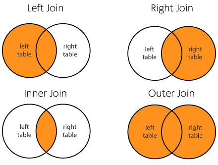

You can use Practicus AI to join data from very different data sources and even physical locations all around the world. This is not something most traditional databases or data warehouses can do. 

### How does it work?

1) Load data normally. We will call this left worksheet 
   
2) (Optional) Make changes to the left worksheet as usual.

3) Load data to join with. We will call this the right worksheet

4) Join left worksheet to right using a single key column. If you need to use multiple columns to join, you can first concatenate them into a single column i.e. 123-abc-456 

### Changes to the right worksheet

If you need to make changes to the right worksheet right before the join, you need to export your data to some destination first. If you do not export, the original data will be used. 

A typical join with changes to the right worksheet could work like this: 

1) Load the left worksheet, i.e. from Redshift, make changes if you need to

2) Load the right worksheet, i.e. from Snowflake

3) Make your changes to the right worksheet as usual

4) Export the right worksheet data, most likely to an intermediary destination i.e. to your data lake on S3

5) Join left worksheet to the right, and the cloud node will use the exported data to read it from the intermediary S3 location. The original source on Snowflake will **not** be used. 

If you skip the export step #4, the cloud node would ignore your changes, and read original data directly from Snowflake. 

To learn more about why Practicus AI joins works like the above, please check the below

[Modern Data Pipelines](modern-data-pipelines.md) 

section, where we explain atomicity, idempotency and big data scalability concepts of Practicus AI.

### Join Styles
Practicus AI uses traditional join styles: 

Note: Unless you have a very good reason to do so, please do not use Cartesian join since it will result in left worksheet x right worksheet number of rows. 