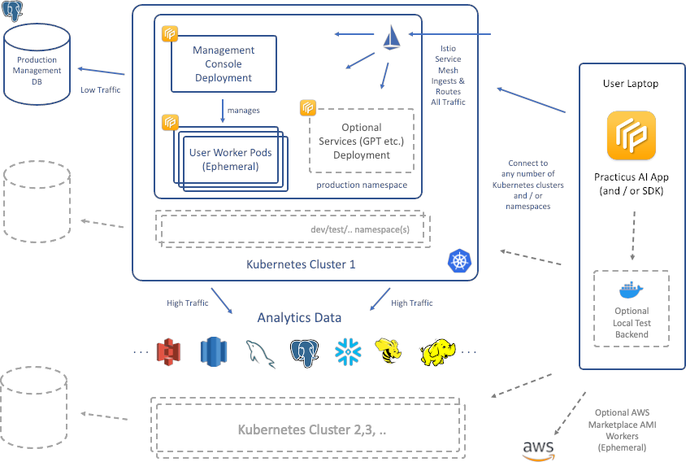
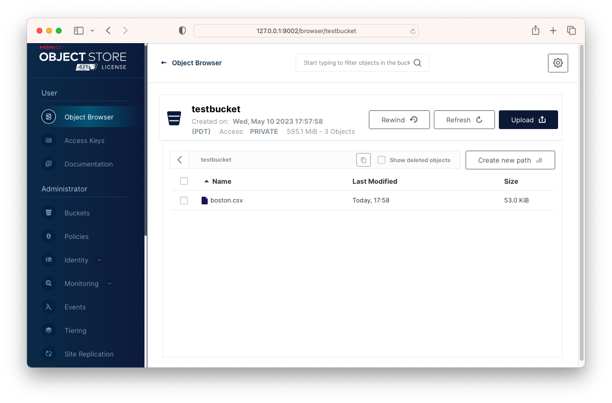
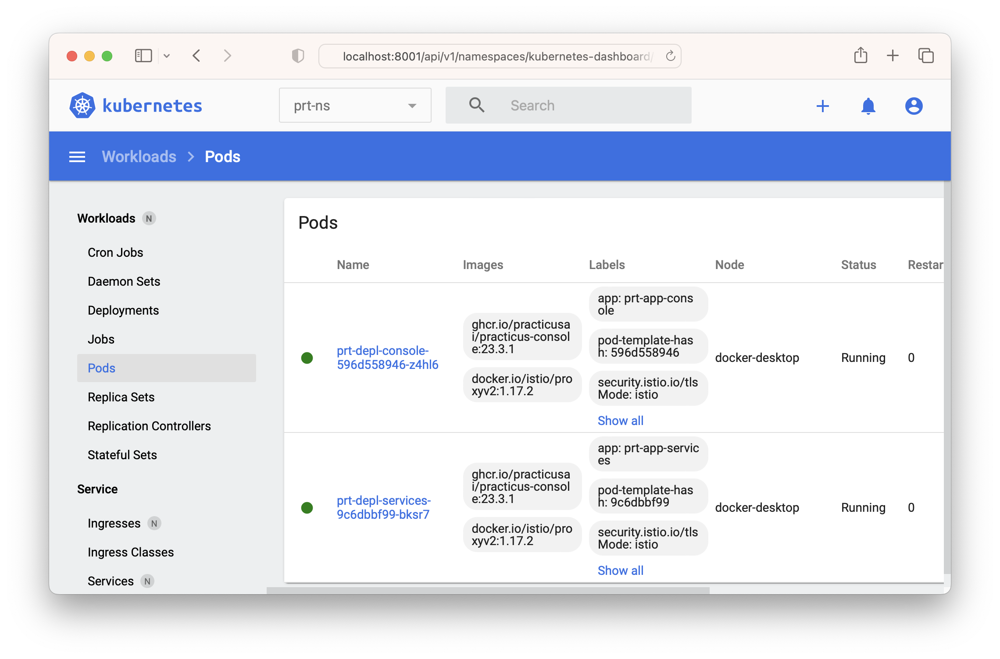
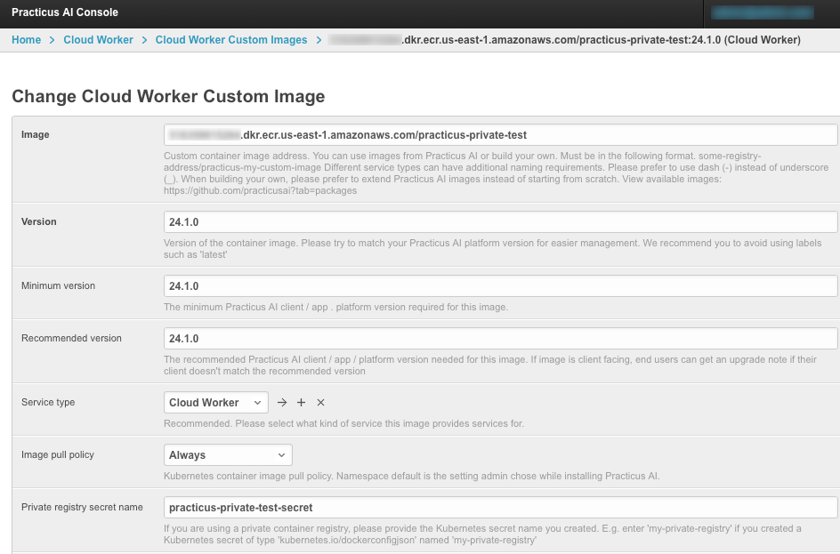
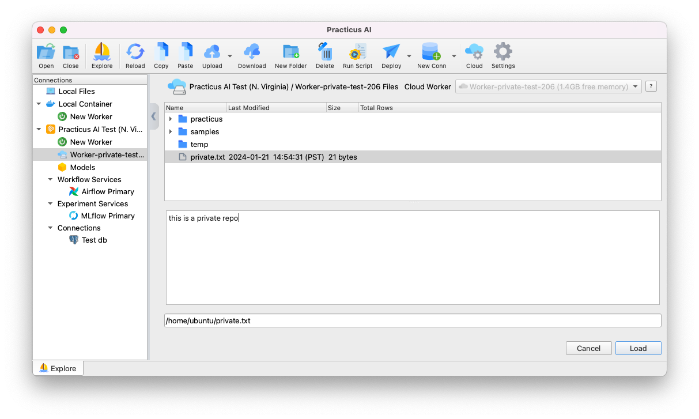

## Download Helper files (Recommended)

Before you get started, please feel free to download the [practicus_setup.zip](https://practicusai.github.io/helm/practicus_setup.zip) file that includes sample configuration (.yaml) files for various cloud, on-prem, or local development environments, and helper scripts to accelerate your setup.    

## Overview

This document will guide you to install Practicus AI Enterprise Cloud Kubernetes backend. 

There are multiple backend options and Kubernetes is one of them. Please [view the detailed comparison table](https://practicus.ai/cloud/#compare) to learn more. 

Practicus AI Kubernetes backend have some mandatory and optional components.

### Mandatory components

* **Kubernetes cluster**: Cloud (e.g. AWS), on-prem (e.g. OpenShift) or Local (e.g. Docker Desktop)  
* **Kubernetes namespace**: Usually named **prt-ns**
* **Management database**: Low traffic database that holds users, connections, and other management components. Can be inside or outside the Kubernetes cluster.
* **Console Deployment**: Management console and APIs that the Practicus AI App or SDK communicates with.
* **Istio Service Mesh**: Secures, routes and load balances network traffic. You can think of it as an open source and modern NGINX Plus.   

### Optional components

* **Optional Services Deployment**: Only required if you would like to enable OpenAI GPT and similar AI services.   
* **Additional Kubernetes clusters**: You can use multiple clusters in different geos to build a flexible data mesh architecture.
* **Additional namespaces**: You can also deploy a test environment, usually named prt-ns2 or more.  

### Dynamic components

* **Cloud worker pods**: These are ephemeral (temporary) pods created and disposed by the management console service. E.g. When a user wants to process large data, perform AutoML etc., the management console creates worker pod(s) on the fly, and disposes after the user is done. The dynamic capacity offered to end users is governed by system admins.      

### Big Picture



## Prerequisites

Before installing Practicus AI admin console, please make sure you complete the below prerequisite steps. 

Installation scripts assume you use macOS, Linux or WSL on Windows.  

### Create or reuse a Kubernetes Cluster

Please create a new Kubernetes cluster if you do not already have one. For this document, we will use a new Kubernetes cluster inside Docker Desktop. Min 8GB RAM for Docker engine is recommended. Installation steps are similar for other Kubernetes environments, including cloud ones such as AWS EKS.

[View Docker Desktop memory settings](https://docs.docker.com/config/containers/resource_constraints/)

[View Docker Desktop Kubernetes setup guide](https://docs.docker.com/desktop/kubernetes/)

### Install kubectl 

Install kubectl CLI tool to manage Kubernetes clusters 

```shell title="Install kubectl for macOS"
curl -LO "https://dl.k8s.io/release/v1.27.7/bin/darwin/amd64/kubectl"
chmod +x ./kubectl
sudo mv ./kubectl /usr/local/bin/kubectl
sudo chown root: /usr/local/bin/kubectl
```

### Install Helm

Practicus AI installation is easiest using helm charts. 

```shell title="Install Helm"
curl -fsSL -o get_helm.sh \
  https://raw.githubusercontent.com/helm/helm/main/scripts/get-helm-3
chmod 700 get_helm.sh
./get_helm.sh
rm get_helm.sh
```

### Verify current kubectl context

Make sure kubectl is pointing to the correct Kubernetes cluster

```shell
kubectl config current-context

# Switch context to Docker Desktop if required 
kubectl config use-context docker-desktop
```

### Install Istio service mesh

Practicus AI uses Istio to ingest, route traffic, secure and manage the modern data mesh microservices architecture.

Istio can be installed on any Kubernetes cluster and designed to run side by side with any number of other production workloads. Istio will not interfere with a namespace unless you ask Istio to do so.

[Learn more about Istio](https://istio.io/latest/about/service-mesh/) 

**Note:** Some Kubernetes systems come with Istio 'forks' pre-installed, such as Red Hat OpenShift Service Mesh. Practicus AI is designed and tested to work with the original istio only. Istio is designed to be installed and run side-by-side with the forked projects, so you can safely install it on any Kubernetes cluster.  

The below script downloads the latest istoctl version, e.g. 1.18. 

Please update the "mv istio-... istio" section below to a newer version if required.   

```shell title="Install Istio"
cd ~ || exit

echo "Downloading Istio"
rm -rf istio
curl -L https://istio.io/downloadIstio | sh -
mv istio-1.20.3 istio || \
  echo "*** Istio version is wrong in this script. \
        Please update to the version you just downloaded to your home dir ***"
cd ~/istio || exit
export PATH=$PWD/bin:$PATH

echo "Analyzing Kubernetes for Istio compatibility"
istioctl x precheck 

echo "Install istio to your kubernetes cluster"
istioctl install --set profile=default -y

echo "Recommended: Add istioctl to path"
# Add the below line to .zshrc or alike
# export PATH=~/istio/bin:$PATH
```

## Preparing a Kubernetes namespace

Practicus AI Kubernetes backend is designed to run in a namespace and side-by-side with other production workloads. 

We strongly suggest you use namespaces, even for testing purposes.

### Create namespace

You can use multiple namespaces for Practicus AI ,and we will use the name convention: prt-ns (e.g. for production), prt-ns2 (for testing) etc.

In this document we will only use one namespace, prt-ns.  

```shell
echo "Creating a Kubernetes namespace"
kubectl create namespace prt-ns
```

## Add practicusai helm repository

Practicus AI helm repository will make installing Practicus AI console backend easier.

```shell title="Add practicusai helm repo"
helm repo add practicusai https://practicusai.github.io/helm
helm repo update
echo "Viewing charts in practicusai repo"
helm search repo practicusai
```

## Create or reuse PostgreSQL Database

Practicus AI management console uses **PostgreSQL** database to store some configuration info such user credentials, database connections and more.

This is a management database with low transaction requirements even for production purposes.    

### Creating a production database

You can reuse an existing PostgreSQL Server or create a new one using one of the cloud vendors.

Please make sure your kubernetes cluster will have access network access to the server.

Once the PostgreSQL Server is ready, you can create a new database using a tool such as **PgAdmin** following the below steps:

- Login to PostgreSQL Server 
- Crate a new database, E.g. **console**
- Create a new login, E.g. **console_user** and note its password
- Right-click the database (console) and go to properties > Security > Privileges > hit + and add the login (e.g. console_user) as Grantee, "All" as Privileges.
- Expand the database items, go to Schemas > public > right click > properties > Security > hit + and add the login (e.g. console_user) as Grantee, "All" as privileges. 

### (Optional) Creating a sample test database  

For testing or PoC purposes, you can create a sample PostgreSQL database in your Kubernetes cluster. 

**Important**: _The sample database should not be used for production purposes._ 

```shell
echo "Creating sample database"
helm install practicus-sampledb practicusai/practicus-sampledb \
  --namespace prt-ns
```
In order to connect to this database **inside the kubernetes cluster** you can use the below address: 

* prt-svc-sampledb.prt-ns.svc.cluster.local

Please note that if you installed the sample database with the above defaults, the rest of the installation will already have the sample database address and credentials set as the default for easier testing.    

#### Connecting to the sample database from your laptop

If you ever need to connect the sample database from your laptop using a tool such as **PgAdmin**, you can open a temporary connection tunnel using kubectl. 

```shell
# Get sample db pod name 
SAMPLEDB_POD_NAME=$(kubectl -n prt-ns get pod -l \
  app=postgresdb -o jsonpath="{.items[0].metadata.name}")
echo "Sample db pod name is: $SAMPLEDB_POD_NAME"

echo "Starting temporary connection tunnel"
kubectl -n prt-ns port-forward "$SAMPLEDB_POD_NAME" 5432:5432
```

## Deploying Management Console 

### Helm chart values.yaml

Practicus AI helm chart's come with many default values that you can leave as-is, especially for local dev/test configurations. 

For all other settings, we suggest you to use values.yaml file

```shell
mkdir ~/practicus 
mkdir ~/practicus/helm
cd ~/practicus/helm
touch values.yaml
```

```yaml title="Sample values.yaml file contents for a local test environment"
migrate:
  superUserEmail: "your_email@your_company.com"
  superUserPassword: "first super admin password"

enterpriseLicense:
  email: "your_email@your_company.com"
  key: "__add_your_key_here__"
  
database:
  engine: POSTGRESQL
  host: host.docker.internal
  name: console
  user: console
  password: console

advanced:
  debugMode: true
  logLevel: DEBUG

notification:
  api_auth_token: "(optional) _your_email_notification_api_key_"
```

```yaml title="Sample values.yaml file contents for a production environment on AWS, GCE, Azure, OpenShift etc."
main:
  # Dns accessible by app
  host: practicus.your_company.com
  # try ssl: false to troubleshoot issues
  ssl: true

migrate:
  superUserEmail: "your_email@your_company.com"
  superUserPassword: "first super admin password"

enterpriseLicense:
  email: "your_email@your_company.com"
  key: "__add_your_key_here__"

database:
  engine: POSTGRESQL
  host: "ip address or dns of db"
  name: "db_name"
  user: "db_user"
  password: "db_password"

jwt:
  # API JWT token issuer, can be any value 
  issuer: iss.my_company.com

notification:
  api_auth_token: "(optional) _your_email_notification_api_key_"
```

### Ingress for AWS EKS

This step is not required for a local test setup. 

For AWS, our helm charts automatically configure Application Load Balancer and SSL certificates. 

You can simply add the below to values.yaml file.

```yaml title="Ingress for AWS EKS"
aws:
  albIngress: true
  # AWS Certificate Manager (ACM) certificate ARN for your desired host address
  certificateArn: "arn:aws:acm:__aws_region__:__acct_id___:certificate/___cert_id___"

istio:
  # In order to use ALB, Istio gateway host must be "*"
  gatewayHosts:
  - "*"
```

### Ingress and other settings for various Kubernetes systems

Please check the below documentation to configure Istio and Istio gateway depending on your Kubernetes infrastructure. 

* [Azure](https://istio.io/latest/docs/setup/platform-setup/azure/)
* [Google Cloud](https://istio.io/latest/docs/setup/platform-setup/gke/)
* [OpenShift](https://istio.io/latest/docs/setup/platform-setup/openshift/)
* [Oracle Cloud](https://istio.io/latest/docs/setup/platform-setup/oci/)
* [IBM Cloud](https://istio.io/latest/docs/setup/platform-setup/ibm/)
* [MicroK8s](https://istio.io/latest/docs/setup/platform-setup/microk8s/)

### Configuring management database

Since the management console will immediately try to connect to its database, it makes sense to prepare the database first. 

The below steps will create a temporary pod that will create or update the necessary tables and populate initial data.

```shell
cd ~/practicus/helm

# Confirm you are using the correct Kubernetes environment
kubectl config current-context

# Step 1) Create a temporary pod that will create (or update) the database

helm install prt-migrate-console-db practicusai/practicus-migrate-console-db \
  --namespace prt-ns \
  --set advanced.imagePullPolicy=Always \
  --values ./values.yaml

# Step 2) View the db migration pod status and logs. 
#   Run it multiple times if pulling the container takes some time.  

echo "DB migration pod status"
echo "-----------------------"
kubectl get pod -n prt-ns | grep prt-pod-migrate-db
echo ""
echo "Pod logs"
echo "--------"
kubectl logs --follow prt-pod-migrate-db -n prt-ns
```

Once the database migration is completed, you will see success log messages such as the below: 

```
Running migrations:
  Applying contenttypes.0001_initial... OK
  Applying contenttypes.0002_remove_content_type_name... OK
  Applying auth.0001_initial... OK
  Applying auth.0002_alter_permission_name_max_length... OK
  Applying auth.0003_alter_user_email_max_length... OK
  Applying auth.0004_alter_user_username_opts... OK
...
```

```shell
# Step 3) (Recommended) After you confirm that the tables are created,
#   you can safely terminate the database migration pod using helm.
#   If you do not, the pod will self-terminate after 10 minutes. 

helm uninstall prt-migrate-console-db --namespace prt-ns 
```

You can repeat the above 1-3 steps as many times as you need, and for each new version of the management console. 

If there are no updates to the database schema, the pod will not make any changes.   

### Installing management console

Practicus AI management console will be the central place for several administrative tasks. 

```shell title="Install management console"
cd ~/practicus/helm
helm repo update 

helm install practicus-console practicusai/practicus-console \
  --namespace prt-ns \
  --values values.yaml
```

### Logging in to management console

You should be able to log in to Practicus AI management console using [http://local.practicus.io/console/admin](http://local.practicus.io/console/admin) or https://practicus.your_company.com/console/admin

Note: local.practicus.io DNS entry points to localhost ip address (127.0.0.1) 

Your super admin username / password was defined at the top of your values.yaml file. (superUserEmail, superUserPassword)

### Troubleshooting

```shell
# Find the pod name(s)
kubectl -n prt-ns get pod | grep prt-depl-console-

# View status
kubectl -n prt-ns describe pod prt-depl-console-...

# View logs
kubectl -n prt-ns logs --follow prt-depl-console-...

# Analyze using the interactive terminal
kubectl -n prt-ns exec -it prt-depl-console-... -- /bin/bash  
```

### Upgrading management console to a newer version

```shell
cd ~/practicus/helm
helm repo update

helm upgrade practicus-console practicusai/practicus-console \
  --namespace prt-ns \
  --values values.yaml
```

### Uninstalling management console 

```shell
helm uninstall practicus-console --namespace=prt-ns
```

### (Recommended) Start a new Cloud Worker using Practicus AI App

* Open Practicus AI App
* Go to settings > click login
* Enter service address e.g. for local test http://local.practicus.io or https://practicus.your_company.com
* You can use your super admin user / password
* Click on either Explore or Cloud at the top bar
* For Explore: You should see a new "Practicus AI Service" (can be renamed later)
* Click on "New Worker", select a size (if on your laptop, select 1 or 2 GB RAM)
* For Cloud: Select the newly added region (upper right)
* Click "Start New", select a size (if on your laptop, select 1 or 2 GB RAM)

This will start pulling the Cloud Worker image on first use, which can take a while since the Cloud Worker image is ~ 9GB in size. 

During this time the app will show the Cloud Worker (pod) status as pending. Once the pull is completed the app will notify you. Go to Explore tab, click on "Worker-x Files" (x is the counter) and view the local disk content of the pod. This verifies everything is deployed correctly. 

### Troubleshooting Cloud Workers 

```shell
# Find the pod name(s)
kubectl -n prt-ns get pod | grep prt-pod-wn-

# View status
kubectl -n prt-ns describe pod prt-pod-wn-...

# View logs
kubectl -n prt-ns logs --follow prt-pod-wn-...

# Analyze using the interactive terminal
kubectl -n prt-ns exec -it prt-pod-wn-... -- /bin/bash  
```

**Tip:** You can view the status of Cloud Workers for any user and terminate them if needed using the management console. Simply open http://local.practicus.io/console/admin > scroll to Cloud Worker Admin > click on Cloud Worker Consumption Logs. You will see all the active and terminated Cloud Workers. If you click on a log, you will see the Kubernetes pod conditions. 


### OpenAI GPT services additional settings 

Some optional services such as OpenAI GPT require additional setup.

Sample setup:

* Open management console e.g. http://local.practicus.io/console/admin
* Go to "Machine Learning Services" > "API Configurations" page
* Click "Add API Configuration"
* Select OpenAI GPT
* Enter your API key that you obtained from OpenAI E.g. "sk-abc123..." [View your key](https://platform.openai.com/account/)
* In optional settings section add the below 

```
OpenAI-Organization=your_openai_organization_id
model=gpt-4
max_tokens=350
```

* **OpenAI-Organization** You can find this id on [OpanAI account page]((https://platform.openai.com/account/)) 
* **model** You can choose between gpt-3.5-turbo, gpt-4 etc. [View available models](https://platform.openai.com/docs/models/overview) 
* **max_tokens** This is a cost control measure preventing high OpenAI costs. The system logs tokens used by your users, so you can adjust this number later.

### Management console settings

There are several settings on the management console that you can easily change using the admin console page.

These changes are stored in the management database, so we strongly suggest you to regularly back up your database.

* **Groups**: We strongly suggest you to create groups before granting rights. E.g.: power users, data scientists, data engineers, citizen data scientists. 
* **Users**: You can create users and give fine-grained access to admin console elements. Staff users can log in to admin console. Most users should not need this level access, and only use Practicus AI App.
* **Central Configuration**: Please view "Cluster Definitions" to change your service name and location. E.g. to "Practicus AI Service" located in "Seattle". When end users login using the App, this is the information they will see while exploring data sources. This information is cached for future use, so the earlier you change the better. 
* **Cloud Worker Admin**: It is crucial you visit every page on this section and adjust Cloud Worker (pod) capacity settings. You can adjust which group/user should have access to what kind of capacity.  
* **Connection Admin**: Users can only use analytical database connections that they add to the system AND the connections you make visible to certain groups / users. 
* **SaaS Admin**: This section is only used if you activate self-service SaaS through a 3rd party payment gateway. We suggest only the super admin has access to it, and you make this section invisible to all other admin or staff users.


### Advanced settings

Practicus AI helm charts values.yaml files include many advanced settings and explanations as inline comments. Please navigate and alter these settings, upgrade your deployments and validate the state as you see fit.

Please see below a sample values.yaml file where you can adjust replica count of a deployment: 
```yaml
...
capacity:
  # Console API service replica
  replicas: 1
...
```

### (Recommended) Install persistent volume support

Practicus AI Cloud Workers support 2 types of persistent volumes, personal and shared between users.

#### Personal drives

If enabled, every Cloud Worker gets a drive mounted under **~/my**. With the personal drive, a user can persist their files under ~/my folder, so the files are not lost after a Cloud Worker is terminated. This can have some benefits, e.g. persisting jupyter notebooks on Cloud Workers.

By default, the personal drive is shared between Cloud Workers using Kubernetes ReadWrite**Many** (RWX) mode.

Please be aware that if you enable personal drives **and** force ReadWrite**Once** (RWO), a user can only use one Cloud Worker at a time and this is **not** recommended.

#### Shared drives between users

If enabled, every Cloud Worker gets the shared folder(s) mounted in user home dir e.g. ~/shared/folder/..  

You can control which group or individual user has access to which shared folder and the share name.

#### Kubernetes StorageClass

In order to dynamically create persistent volumes and to avoid administrative burden, Practicus AI uses Kubernetes storage classes. Please prefer StorageClass **read / write many** mode. 

Please be aware that only some Kubernetes storage types, such as NFS, support read / write many mode. Common storage classes such as AWS EBS only allow one Kubernetes pod to mount a drive at a time (read / write once), which is not suitable for sharing use cases.

If your storage class does not allow read / write many, you cannot implement shared drives between users. And for personal drives, implementing read / write once will cause users to be able to use one Cloud Worker at a time, which is **not** recommended.

To summarize, please prefer to use **NFS** or similar style storage systems for Practicus AI persistent volumes.

#### Supported NFS implementations 

You can use any NFS system, inside or outside your Kubernetes cluster. You can also use NFS as a service, such as AWS EFS with Practicus AI. 

#### Sample NFS server for your local computer

Please find below a simple implementation to install a NFS pod on your computer to test it with Practicus AI.

```yaml title="Sample NFS server configuration"
kind: Service
apiVersion: v1
metadata:
  name: nfs-service
spec:
  selector:
    role: nfs
  ports:
    # Open the ports required by the NFS server
    # Port 2049 for TCP
    - name: tcp-2049
      port: 2049
      protocol: TCP
    # Port 111 for UDP
    - name: udp-111
      port: 111
      protocol: UDP
---
kind: Pod
apiVersion: v1
metadata:
  name: nfs-server-pod
  labels:
    role: nfs
spec:
  containers:
    - name: nfs-server-container
      image: cpuguy83/nfs-server
      securityContext:
        privileged: true
      args:
        - /exports
```

You can save the above to nfs-server.yaml and run

```shell
kubectl apply -f nfs-server.yaml

# To delete 
kubectl delete -f nfs-server.yaml
```

After you create the NFS pod named nfs-server-pod, please run the below to get its IP address, e.g. 10.0.0.1. you will need this IP address in the below section.

```shell
kubectl get pod -o wide
```

 Please note that after you restart your computer, the NFS server IP address might change, and in this case you would have to re-install (or upgrade) the below helm chart to update the IP address.  

#### Using NFS inside Kubernetes 

The below will create a provisioner pod and a storage class named prt-sc-primary. You can create as many provisioners and storage classes. These can point to the same or different NFS systems. 

```shell
helm repo add nfs-subdir-external-provisioner \
  https://Kubernetes-sigs.github.io/nfs-subdir-external-provisioner/
helm repo update

export NFS_DNS_NAME="add NFS server DNS or IP address here"

helm install nfs-subdir-external-provisioner \
  nfs-subdir-external-provisioner/nfs-subdir-external-provisioner \
  --set nfs.server="$NFS_DNS_NAME" \
  --set nfs.path="/" \
  --set storageClass.accessModes="ReadWriteMany" \
  --set storageClass.pathPattern="practicus" \
  --set storageClass.onDelete="retain" \
  --set storageClass.name="prt-sc-primary"
  
# To uninstall
helm uninstall nfs-subdir-external-provisioner
```

To learn more and customize the helm chart, please visit [provisioner GitHub page](https://github.com/Kubernetes-sigs/nfs-subdir-external-provisioner).

By using the above helm chart and granting user access, NFS server will have directories such as /practicus/users/john-acme.com that gets mounted to ~/my for a user with email john@acme.com. Only John will have access to this folder.

You can also define several shared folders between users E.g. shared/finance which would map to /practicus/shared/finance on the NFS server and gets mounted to ~/shared/finance on Cloud Workers.  

The above path structure is an example and be customized flexibly through the NFS system itself, StorageClass provisioner setup, or simply by using the Practicus AI Management Console.

Please view Cloud Worker Admin section to customize user or group based persistent drives.       

#### Using AWS EFS

If you are using AWS EFS, you can use the above provisioner, or as an **alternative**, you can also use a CSI specific for AWS EKS and AWS EFS. Please view the [AWS EFS CSI documentation](https://docs.aws.amazon.com/eks/latest/userguide/efs-csi.html) to learn more. Tip: Even if you decide to use the generic NFS provisioner with AWS EKS, you can still review the CSI page to learn more about security group settings, availability zone optimization etc.

## (Optional) Creating sample object storage 

Although it is optional, using object storage systems such as Amazon S3 or compatible for Machine Learning is very common. If you are testing Practicus AI and do not have access to S3 or a compatible store, you can simply use MinIO. 

### Sample Object Storage with MinIO

You can install MinIO inside your Kubernetes cluster. For demo purposes, we will use a simple Docker container. We will also avoid using the default MinIO S3 port 9000, in case you are also using Practicus AI standalone docker deployment (not K8s). This type of test deployment already uses port 9000.   

```shell
echo "Creating sample object storage"
helm install practicus-sampleobj practicusai/practicus-sampleobj \
  --namespace prt-ns 
```

After the minio object storage is created, you can connect to minio management console to create buckets, access credentials etc. For these, you need to create a temporary connection tunnel to minio service.   

```shell
SAMPLEOBJ_POD_NAME=$(kubectl -n prt-ns get pod -l \
  app=minio -o jsonpath="{.items[0].metadata.name}")
echo "Sample object store pod name is: $SAMPLEOBJ_POD_NAME"

echo "Starting temporary connection tunnel"
kubectl -n prt-ns port-forward "$SAMPLEOBJ_POD_NAME" 9090:9090
```

- Login to MinIO Console using http://127.0.0.1:9090 and credentials:
- User: minioadmin password: minioadmin
- Click Buckets > Create bucket and create **testbucket**
- Click Identity > Users > Create User > select **readwrite** policy
- Click Access Keys > Create > Note your access and secret keys 
- Click Object Browser > testbucket > upload a .csv file

You should now see a .csv file in testbucket and created a user, access/secret keys. 



[View MinIO installation document](https://charts.min.io)

To test MinIO or other S3 compatible storage with the Practicus AI app:

- Open App > Explore tab > Click on New Connection > Amazon S3
- Enter your access / secret keys
- Enter sample object storage endpoint url http://prt-svc-sampleobj.prt-ns.svc.cluster.local
- Select the bucket you created: testbucket

You can now connect to this object storage to upload/download objects using the Practicus AI app. You will **not** need to create a connection tunnel to the minio management console to test with the app. 

## (Optional) Install Kubernetes dashboard

You can visualize and troubleshoot Kubernetes clusters using the dashboard. Please follow the below steps to install and view Kubernetes dashboard on your **local development** environment. Production setup and viewing will require some additional changes, which are beyond the scope of this document.  

```shell
echo "Installing Kubernetes Dashboard"
kubectl apply -f \
  https://raw.githubusercontent.com/kubernetes/dashboard/v2.7.0/aio/deploy/recommended.yaml

echo "Setting dashboard permissions"
kubectl apply -f - <<EOF
apiVersion: v1
kind: ServiceAccount
metadata:
  name: dashboard-admin-user
  namespace: kubernetes-dashboard
---
apiVersion: rbac.authorization.k8s.io/v1
kind: ClusterRoleBinding
metadata:
  name: dashboard-admin-user
roleRef:
  apiGroup: rbac.authorization.k8s.io
  kind: ClusterRole
  name: cluster-admin
subjects:
- kind: ServiceAccount
  name: dashboard-admin-user
  namespace: kubernetes-dashboard
EOF
```

After the dashboard is installed you can open it using the below commands. 

Please do not forget to run **kubectl proxy** in a separate terminal window first, so the web interface is accessible from your browser. 

```shell
echo "Generating a dashboard access token for 90 days and copying to clipboard"
kubectl -n kubernetes-dashboard create token dashboard-admin-user \
  --duration=2160h > dashboard-token.txt

echo "Generated token:"
echo ""
cat dashboard-token.txt
echo ""
echo ""
pbcopy < dashboard-token.txt
rm dashboard-token.txt

echo "Opening dashboard at:"
echo "http://localhost:8001/api/v1/namespaces/kubernetes-dashboard/services/https:kubernetes-dashboard:/proxy/"

echo ""
open "http://localhost:8001/api/v1/namespaces/kubernetes-dashboard/services/https:kubernetes-dashboard:/proxy/"
echo "Paste the access token at login page."

echo "No login page? Make sure you ran kubectl proxy first"
```



Please note that the above steps installed Practicus AI elements to **prt-ns** namespace. You will have to switch the namespace in the dashboard

## (Optional) Using a private image registry

All Practicus AI container images are customizable, and you can use a private image registry to host your custom images. 
In this case, your Kubernetes cluster needs to be able to access the private registry.
The below is a step-by-step example for AWS ECR private registry. 

- Create a practicus-private-test private registry repository 


- Create your Dockerfile.

**Important**: We strongly recommend you to use virtual environments for your custom python packages and avoid updating global packages.  

```dockerfile
FROM ghcr.io/practicusai/practicus:24.1.0

RUN echo "this is a private repo" > /home/ubuntu/private.txt

RUN echo "**** Creating Virtual Env ****" && \
    python3 -m venv /home/ubuntu/.venv/practicus_test --system-site-packages && \
    echo "**** Installing packages ****" && \
    /home/ubuntu/.venv/practicus_test/bin/python3 -m pip install some-package && \
    echo "**** Installing Jupyter Kernel ****" && \
    python3 -m ipykernel install --user --name practicus_test --display-name "My virtual environment"
```

- Build and push the image to private repository

```shell
aws ecr get-login-password --region us-east-1 | docker login \
  --username AWS --password-stdin _your_account_id_.dkr.ecr.us-east-1.amazonaws.com

docker build -t practicus-private-test:24.1.0 .

docker tag practicus-private-test:24.1.0 \
  _your_account_id_.dkr.ecr.us-east-1.amazonaws.com/practicus-private-test:24.1.0

docker push _your_account_id_.dkr.ecr.us-east-1.amazonaws.com/practicus-private-test:24.1.0
```

After this step, you should see the image in the AWS ECR console. 

- Create an access token for the repository, and add as a Kubernetes secret

```shell
TOKEN=`aws ecr get-login-password --region us-east-1 | cut -d' ' -f6`
NAMESPACE=prt-ns

kubectl create secret docker-registry practicus-private-test-secret \
  --docker-server=_your_account_id_.dkr.ecr.us-east-1.amazonaws.com/practicus-private-test \
  --docker-username=AWS \
  --docker-password=$TOKEN \
  -n $NAMESPACE
```

**Note**: Some private registry tokens have short lifespans. E.g. AWS ECR default is 12 hours. 


- Open Practicus AI management console, create a new custom image and add the private registry secret.



- The end users that you gave permission to the custom image will be able to launch workers from it.



**Note**: You can also define custom images for other workloads such as model hosting, workspaces, etc. 

## (Optional) Forwarding DNS for local installations

If you are deploying Practicus AI using a local DNS such as local.practicus.io (points to 127.0.0.1) traffic inside the Kubernetes cluster might work since each pod would search for the service locally. This might not be a problem for traffic outside Kubernetes since the local cluster such as Docker Desktop would be listening on 127.0.0.1

To solve this problem, we can edit Kubernetes coreDNS setup, so that a local DNS queries would forward to the Istio load balancer. 

_Tip_: You can use Kubernetes dashboard UI for the below steps 1-3. 

1) Locate Istio ingress gateway cluster ip address. E.g. 10.106.28.249 by running the below.

```shell
kubectl get svc istio-ingressgateway -n istio-system
```

2) Edit coredns configmap to add the ip address.

```shell
kubectl edit configmap coredns -n kube-system
```

Sample coredns configmap forwarding local.practicus.io to an istio ingress gateway ip address
```
kind: ConfigMap
apiVersion: v1
metadata:
  name: coredns
... 
data:
  Corefile: |
    .:53 {
        ...
    }

    local.practicus.io {
      hosts {
        10.106.28.249 local.practicus.io
      }
    }
```

3) Restart coredns for new changes to be active. 

```shell
kubectl rollout restart deployment/coredns -n kube-system
```

4) Test. Start a Practicus AI worker, open a jupyter notebook and run the below code. You should get the istio gateway id address.

```python
import socket
print(socket.gethostbyname("local.practicus.io"))
```

## Troubleshooting issues

Please follow the below steps to troubleshoot some common issues with Kubernetes Dashboard, or equivalent kubectl commands if you do not use the dashboard.

- Did the prt-depl-console-... pod start? (Green) If not, view its details.
- If the pod started, but is not accessible using http://local.practicus.io/console/admin view the pod logs. Click on the pod name > View Logs (upper right)
- If the logs do not show any errors, Istio sidecar proxy might not be running. Click on the pod name, scroll down to containers and verify there are 2 containers running, prt-cnt-console and istio-proxy.
- Analyze istio to see if there are any proxy issues detected **istioctl analyze -n prt-ns**

### No enterprise key?

This step is mandatory if you do not have your Enterprise license key. 

By installing Practicus AI app you will be able to test connectivity to your newly created Kubernetes cluster. You will also have access to your Enterprise license key.
 
* [Install the app](https://practicus.ai/get-started/)
* Go to settings > container section
* Enter your email to activate your enterprise license 
* [View Practicus AI local docker setup guide](trial-ent.md) if you need any help

Once your enterprise license is activated, please open ~/.practicus/core.conf file on your computer, locate the **license** section, and copy **license_key** info.

Sample license_key inside ~/.practicus/core.conf : 
```
[license]
email = your_email@your_company.com
license_key = abc12345-1234-1234-12ab-123456789012
valid_until = Wed, 01 Jan 2022 00:00:00 GMT
```

### No Connectivity?

Most connectivity issues will be a result of mis-configured Istio. 
To solve these issues we recommend you to create test namespace e.g. istio-test and install the sample Istio app using the below help page.

[https://istio.io/latest/docs/setup/getting-started/](https://istio.io/latest/docs/setup/getting-started/)

Once you pass this step, deploying Practicus AI will be very similar.    

## Support 

Need help? Please visit [https://helpdesk.practicus.io/](https://helpdesk.practicus.io/) to open a support ticket.

Thank you!
