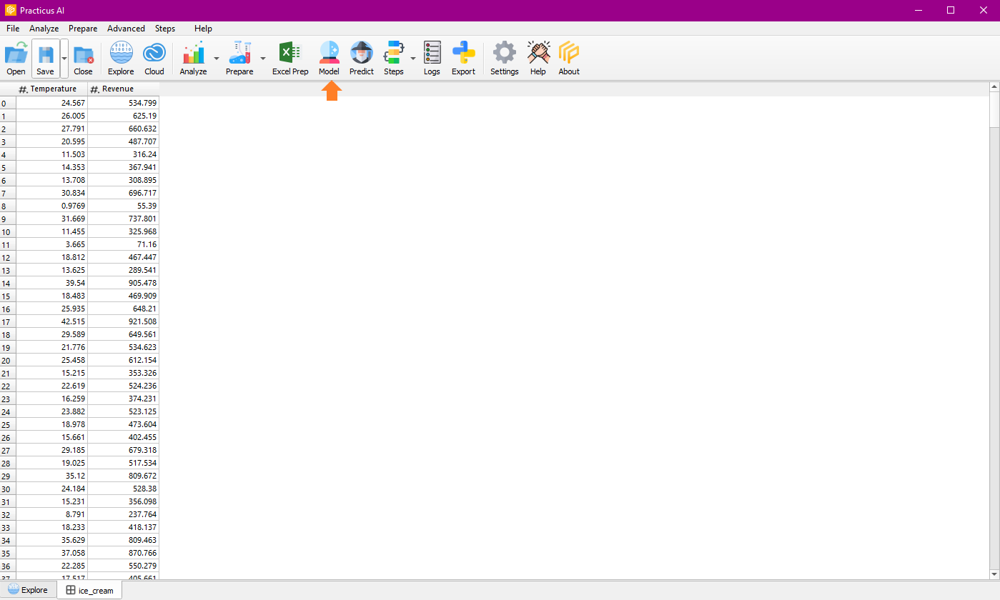
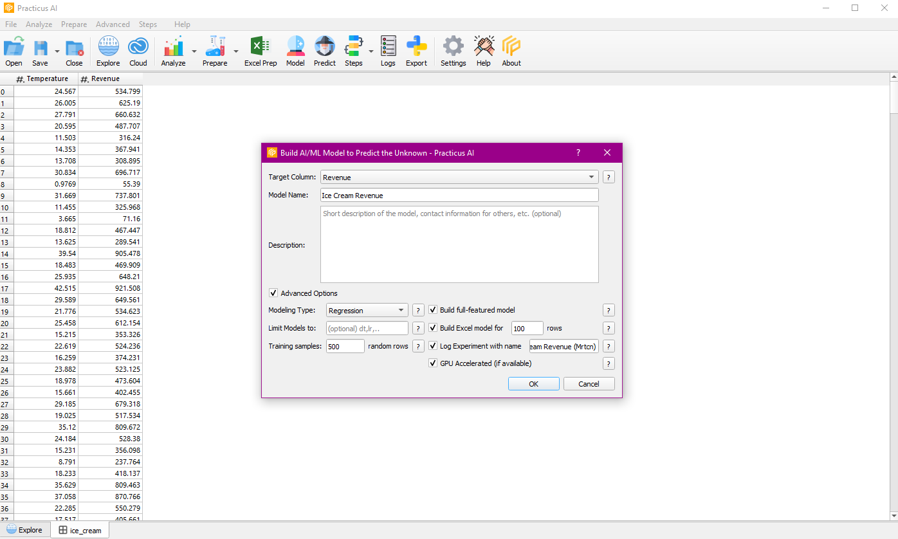
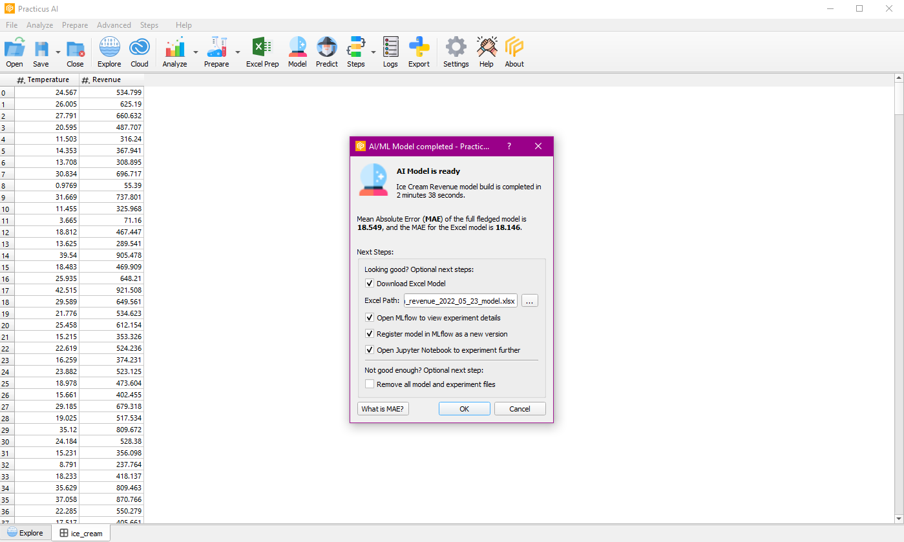
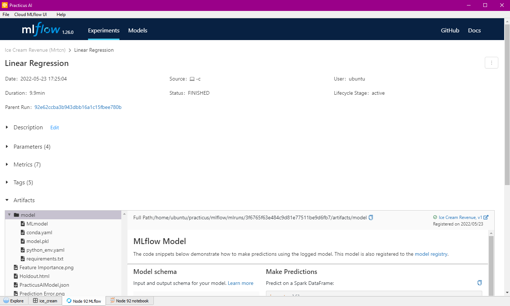
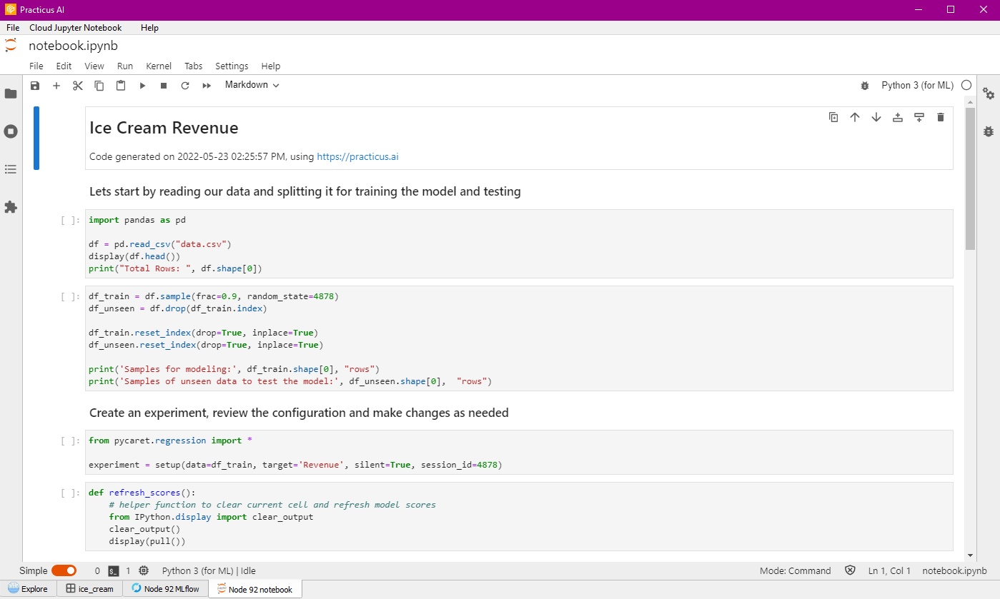

Build AI models on past data with one-click using Automated Machine Learning (AutoML) and then make predictions 
on unseen data. If you are a data scientist, or working with one, export to Jupyter code and share your experimentation 
details in a central database (MLflow). Your team will save significant amount of time by avoiding to start coding from 
scratch and by collaborating better

## Create a Model
You need to have a cloud node ready for the model creation process and start the model creation process with our data on the cloud node.

We create a model of regression type by selecting the target column revenue using the ice cream data.
You can also limit the model with the advanced options section and select build excel for model.

When the model creation process is finished, some options appear.

You can load the model in Excel, register it in MLflow, see the details of the experiment with MLflow, you can see the code with Jupyter Notebook.

