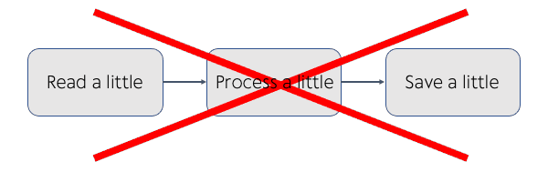
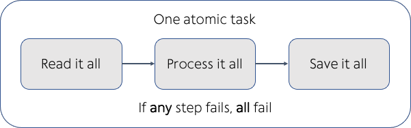
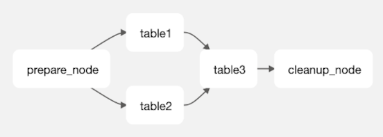

Modern data pipelines often need to implement 2 key concepts: [Atomicity](#atomicity) and [Idempotency](#idempotency) to provide **consistent** and **reliable** solutions. In this section we will explain what these concepts are and how they are implemented in Practicus AI.    

## Atomicity
Traditional ETL pipelines often processed data in **small batches** in order to fit in the limited memory of the available hardware. This sometimes created major issues and race conditions, such as a data pipeline running half-way through and failing, leaving the final destination having only half of the data.

Sample Non-Atomic Pipeline:

Sample Atomic Pipeline:

## Idempotency
[Idempotence](https://en.wikipedia.org/wiki/Idempotence) is the concept of allowing a task to run multiple times, producing the same result. For instance, you could press the on button of an idempotent machine multiple times, and it would not change the result.

In the below pipeline, if a task had to run multiple times (often due to a failure) and gives the same result, we can say it implements idempotency principle. This wasn't the case in many traditional ETL pipelines.  

## Practicus AI approach

The **default** Practicus AI data processing approach is to break down **any data pipeline** into atomic and idempotent tasks that include 4 key activities.
#### Default anatomy of a Practicus AI data pipeline task
1) Read data from **any** data source (mandatory, do it once)

2) Apply data transformation steps (optional, can be done many times)

3) Join to **any** data by reading it **directly** from its data source (optional, can do many times)

4) Save final data to **any** destination (mandatory, do it once)

#### Default anatomy of a Practicus AI data pipeline

Practicus AI creates a modern [DAG](https://en.wikipedia.org/wiki/Directed_acyclic_graph) (directed acyclic graph) which defines the **order**, **parallelism** and **dependency** of as many atomic and idempotent tasks as you need. 

Let's take a look at the example below:

1) Load table1, make some changes and export to table1_new. Keep this worksheet open in the app.

2) Do the same for table_2

3) Load table_3 and join to table_1 and table_2. Since data in these tables are exported, table_3 will use data from table1_new and table2_new to join.

4) Load table4, do not make any changes

5) In table3, join again, this time to table4. Since no changes are made and exported, the original data source of table4 will be used

6) Export table3 data pipeline code to go to production. 

Your exported Airflow DAG will look like the below:

- The code that loads table1 and table2, processes the steps, and exports to table1_new and table2_new will work in parallel.
- If any of these tasks fail, it will retry (default 3 times)
- If, for some reason, these tasks run successfully again, the resulting tableX_new will not be different (idempotent) 
- When **both** of these tasks are completed, table3 code will run: loads table3, executes all steps including joining to table1_new, table2_new and table4 in the requested order
- Once **all** of the steps and joins for table3 are completed, it will export to final_data (atomicity) 
- Please note that in a traditional pipeline the table1 task could pass in-memory processed data to table3, eliminating the need to export to an intermediary location (table1_new) first. 
- In comparison, Practicus AI generated pipelines require your changes to be exported first. This is due to scalability requirements of modern big data systems.     
- If you close a worksheet in the app **before** exporting the deployment code, the exported code will **not** include the task of that table in the Airflow DAG. 
- I.e. In the above example, if you close table1 before exporting the deployment code, the DAG would become simpler table2 -> table3.  In this case, we assume the task needed to create table1_new will be part of another data pipeline. The new DAG and code for table3 will simply expect table1_new is available and up to date.    
- Please note all of the above are simply convenience defaults. You can always make changes to your DAG, moving tasks back and forth after code is exported.
