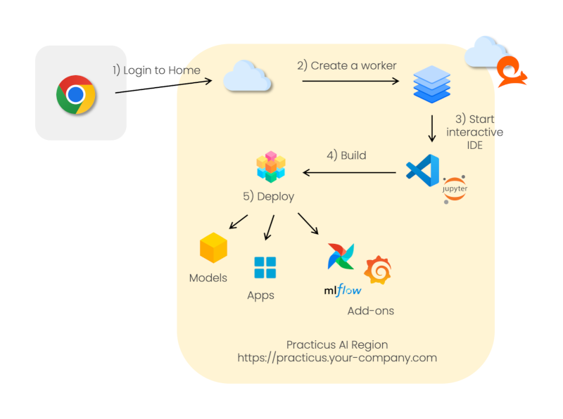

---
jupyter:
  jupytext:
    text_representation:
      extension: .md
      format_name: markdown
      format_version: '1.3'
      jupytext_version: 1.16.4
  kernelspec:
    display_name: Practicus Core
    language: python
    name: practicus
---

# Introduction

Getting started with Practicus AI is straightforward.

## Common Usage Patterns

The following steps outline a typical workflow for users who write code:

1. Log in to your chosen region (e.g., `https://practicus.your-company.com`).
2. Create one or more workers with the desired features and resource capacities.
3. Start an IDE, such as JupyterLab or VS Code, within a worker.
4. Develop models, applications, and process data as usual.
5. Deploy models, applications, or use add-ons (e.g., create Airflow workflows).

---

## Practicus AI Platform Components

Below are the primary components you will interact with when using Practicus AI.

### Practicus AI Workers

Practicus AI Workers are dedicated compute environments that run ML, data processing, and other tasks.

Key characteristics include:

- **On-demand**: Request as many workers as you need, available within seconds.
- **Interactive**: Launch JupyterLab or VS Code for hands-on experimentation.
- **Batch-capable**: Run tasks or jobs in non-interactive mode as well.
- **Isolated**: Issues in other workers or systems do not affect your worker.
- **Configurable**: Each worker is defined by a container image, which can be chosen from the provided options or customized.
- **Flexible Resources**: Assign a specific amount of CPU, memory, and GPU resources.
- **Ephemeral**: Workers can be replaced easily. Since each restart resets the file system, save important files in `~/my` or `~/shared` to preserve them, or push to a source control system such as git.

### Practicus AI ModelHost

Practicus AI ModelHost deployments run classic ML and LLM models, optimized for CPUs and GPUs.

- **Shared deployments** can host thousands of models, each with up to 100 versions.
- **Isolated deployments** allow you to create a dedicated environment for a set of models.

### Practicus AI AppHost

Practicus AI AppHost deployments are used to build visual Gen AI applications or microservices focused on ML workflows.

### Practicus AI Add-ons

Practicus AI Add-ons, such as Airflow or MLflow, extend the platform’s core functionality. They integrate seamlessly, allowing you to manage and orchestrate complex workflows and track experiments.

---

## Practicus AI Regions

Practicus AI is a multi-region environment, where each **region** is a separate deployment and isolated Kubernetes namespace. Regions can differ by geography, cloud vendor, lifecycle stage, department, or security requirements.

For example, you might have:

- One region in a certain geographic location and another in a different one.
- Regions across different cloud vendors (e.g., AWS, Azure, on-premises).
- Separate regions for production, development, or testing.
- Regions dedicated to different departments or security contexts.

---

## Practicus AI Clients

Practicus AI clients enable you to connect to multiple regions seamlessly, allowing you to develop in one region and deploy in another. Common client options include:

- **Browser**: Access the platform via a standard web interface to launch JupyterLab, VS Code, and manage workloads.
- **AI Studio**: A desktop application for Windows, macOS, and Linux that connects to multiple regions for unified management.
- **SDK**: Install the SDK (`pip install practicuscore`) to interact programmatically with any Practicus AI region.
- **CLI**: With the SDK installed, use the `prtcli` command-line tool to manage tasks and resources.

---

### Example: A Multi-Region Setup

Below is an example of a deployment where a customer utilizes three regions in two geographies, accessible through various clients.

---

**Next**: [Workers](02_workers.md)
