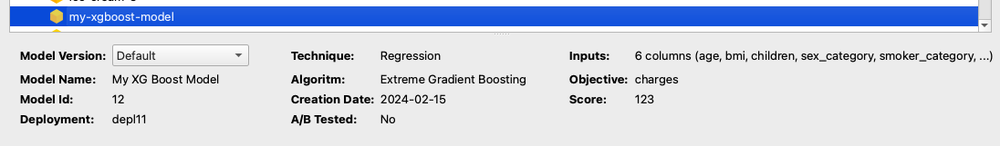
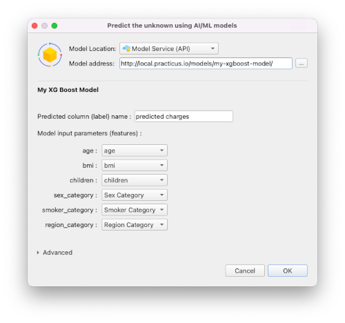
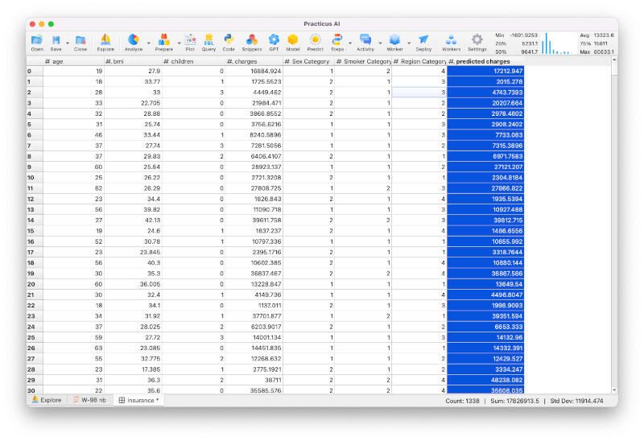

---
jupyter:
  jupytext:
    text_representation:
      extension: .md
      format_name: markdown
      format_version: '1.3'
      jupytext_version: 1.16.4
  kernelspec:
    display_name: Practicus AutoML
    language: python
    name: practicus_ml
---

### End-to-end custom XGBoost Model development and deployment

This sample notebook outlines the process of deploying a custom XGBoost model on the Practicus AI platform and making predictions from the deployed model using various methods.

#### Data Preparation

We will be using Practicus AI to prepare data, but you can also do it manually using just Pandas. The rest of the model building and deployment steps would not change. 

```python
data_set_conn = {
    "connection_type": "WORKER_FILE",
    "file_path": "/home/ubuntu/samples/insurance.csv"
}
```

```python
import practicuscore as prt

region = prt.current_region()
worker = region.get_or_create_worker()
proc = worker.load(data_set_conn) 

proc.show_head()
```

```python
proc.categorical_map(column_name='sex', column_suffix='category') 
proc.categorical_map(column_name='smoker', column_suffix='category') 
proc.categorical_map(column_name='region', column_suffix='category') 
proc.delete_columns(['region', 'smoker', 'sex']) 
```

```python
df = proc.get_df_copy()
df.head()
```

#### Building the model

Let's build a model with XGBoost

```python
X = df.drop('charges', axis=1)
y = df['charges']
```

```python
from sklearn.model_selection import train_test_split

X_train, X_test, y_train, y_test = train_test_split(X, y, test_size=0.2, random_state=42)
```

```python
import xgboost as xgb
from sklearn.pipeline import Pipeline

pipeline = Pipeline([
    ('model', xgb.XGBRegressor(objective='reg:squarederror', n_estimators=100))
])
pipeline.fit(X_train, y_train)
```

#### Saving your model

- After training your model, you can save it in `.pkl` format.
- Although not mandatory, please prefer to use **cloudpickle** so your custom code part of the model (e.g. preprocessing steps) is more portable.

```python
import cloudpickle

with open('model.pkl', 'wb') as f:
    cloudpickle.dump(pipeline, f)
```

```python
import joblib 
import pandas as pd

# Load the saved model
model = joblib.load('model.pkl')

# Making predictions
predictions = model.predict(X)

pred_df = pd.DataFrame(predictions, columns=['Predictions'])
pred_df.head()
```

#### Deploying your model as an API endpoint

```python
# Let's locate the Kubernetes model deployment to deploy our model
if len(region.model_deployment_list) == 0:
    raise SystemError("You do not have any model deployment systems. "
                      "Please contact your system admin.")
elif len(region.model_deployment_list) > 1:
    print("You have more than one model deployment systems. "
          "Will use the first one")
model_deployment = region.model_deployment_list[0]
deployment_key = model_deployment.key
prefix = 'models'
model_name = 'my-xgboost-model'
model_dir = None  # Current dir

print(f"Will deploy '{prefix}/{model_name}' to '{deployment_key}' kubernetes deployment")
```

#### Create model.py that predicts using model.pkl

[View sample model.py code](model.py)

```python
prt.models.deploy(
    deployment_key=deployment_key,
    prefix=prefix,
    model_name=model_name,
    model_dir=model_dir
)
```

#### Making predictions using the model API

```python
# *All* Practicus AI model APIs follow the below url convention
api_url = f"{region.url}/{prefix}/{model_name}/"
# Important: For effective traffic routing, always terminate the url with / at the end.
print("Model REST API Url:", api_url)
```

#### Getting a session token for the model API
- You can programmatically get a short-lived (~4 hours) model session token (recommended)
- You can also get an access token that your admin provids with a custom life span, e.g. months.

```python
# We will be using using the SDK to get a session token.
# To learn how to get a token without the SDK, please view 05_others/tokens sample notebook
token = prt.models.get_session_token(api_url)
print("API session token:", token)
```

#### Posting data

- There are multiple ways to post your data and construct the DataFrame in your model.py code.
- If you add **content-type** header, Practicus AI model hosting system will automatically convert your csv data into a Pandas DataFrame, and pass on to model.py predict() method.
- If you would like to construct the Dataframe yourself, skip passing content-type header and construct using Starlette request object [View sample code](model_custom_df.py)

```python
import requests 

headers = {
    'authorization': f'Bearer {token}',
    'content-type': 'text/csv'
}
data_csv = df.to_csv(index=False)

r = requests.post(api_url, headers=headers, data=data_csv)
if not r.ok:
    raise ConnectionError(f"{r.status_code} - {r.text}")

from io import BytesIO
pred_df = pd.read_csv(BytesIO(r.content))

print("Prediction Result:")
pred_df.head()
```

#### Compressing API traffic
- Practicus AI currently supports 'lz4' (recommended), 'zlib', 'deflate' and 'gzip' compression algorithms.
- Compressing to and from the API endpoint can increase performance for large datasets, low network bandwidth.

```python
import lz4 

headers = {
    'authorization': f'Bearer {token}',
    'content-type': 'text/csv',
    'content-encoding': 'lz4'
}
data_csv = X.to_csv(index=False)
compressed = lz4.frame.compress(data_csv.encode())
print(f"Request compressed from {len(data_csv)} bytes to {len(compressed)} bytes")

r = requests.post(api_url, headers=headers, data=compressed)
if not r.ok:
    raise ConnectionError(f"{r.status_code} - {r.text}")

decompressed = lz4.frame.decompress(r.content)
print(f"Response de-compressed from {len(r.content)} bytes to {len(decompressed)} bytes")

pred_df = pd.read_csv(BytesIO(decompressed))

print("Prediction Result:")
pred_df.head()
```

#### Detecting drift

If enabled, Practicus AI allows you to detect feature and prediction drift and visualize in an observability platform such as Grafana. 

```python
# Let's create an artificial drift for BMI feature, whcih will also affect charges
df["bmi"] = df["bmi"] * 1.2

headers = {
    'authorization': f'Bearer {token}',
    'content-type': 'text/csv'
}
data_csv = df.to_csv(index=False)

r = requests.post(api_url, headers=headers, data=data_csv)
if not r.ok:
    raise ConnectionError(f"{r.status_code} - {r.text}")

from io import BytesIO
pred_df = pd.read_csv(BytesIO(r.content))

print("Prediction Result:")
pred_df.head()
```

#### (Recommneded) Adding model metadata to your API
- You can create and upload **model.json** file that defines the input and output schema of your model and potentially other metadata too.
- This will explain how to consume your model efficiently and make it accessible to more users.
- Practicus AI uses MlFlow model input/output standard to define the schema
- You can build the model.json automatically, or let Practicus AI build it for you using the dataframe.

```python
model_config = prt.models.create_model_config(
    df=df,
    target="charges",
    model_name="My XG Boost Model",
    problem_type="Regression",
    version_name="2024-02-15",
    final_model="xgboost",
    score=123
)
model_config.save("model.json")
# You also can directly instantiate ModelConfig class to provide more metadata elements
# model_config = prt.models.ModelConfig(...)
```

#### Adding a new API version
- You can add as many model version as you need.
- Your admin can then route traffic as needed, includign for A/B testing.

```python
prt.models.deploy(
    deployment_key=deployment_key,
    prefix=prefix,
    model_name=model_name,
    model_dir=model_dir
)
```

#### Reading model metadata

You can add the query string '?get_meta=true' to any model to get the metadata.

```python
headers = {'authorization': f'Bearer {token}'}
r = requests.get(api_url + '?get_meta=true', headers=headers)

if not r.ok:
    raise ConnectionError(f"{r.status_code} - {r.text}")

import json
from pprint import pprint

model_config_dict = json.loads(r.text)
print("Model metadata:")
pprint(model_config_dict)
schema_dict = json.loads(model_config_dict["model_signature_json"])
print("Model input/output schema:")
pprint(schema_dict)
```

### (Optional) Consuming custom model APIs from Practicus AI App

Practicus AI App users can consume any REST API model. 

#### End user API view

If you add metadata to your models, App users will be able to view your model details in the UI.



#### Feature matching

If your model has an input/output schema, the App will try to match them to current dataset.



#### Viewing the prediction result



Note: Please consider adding categorical mapping to your models as a pre-processing step for improved user experince.


##### (Recommended) Clean-up
Explicitly calling kill() on your processes will free un-used resources on your worker faster.

```python
proc.kill()
```


## Supplementary Files

### model.py
```python
import os
import pandas as pd
import joblib

model_pipeline = None


async def init(model_meta=None, *args, **kwargs):
    global model_pipeline

    current_dir = os.path.dirname(__file__)
    model_file = os.path.join(current_dir, 'model.pkl')
    if not os.path.exists(model_file):
        raise FileNotFoundError(f"Could not locate model file: {model_file}")

    model_pipeline = joblib.load(model_file)


async def predict(http_request, df: pd.DataFrame | None = None, *args, **kwargs) -> pd.DataFrame:
    if df is None:
        raise ValueError("No dataframe received")

    if 'charges' in df.columns:
        # Dropping 'charges' since it is the target
        df = df.drop('charges', axis=1)

        # Making predictions
    predictions = model_pipeline.predict(df)

    # Converting predictions to a DataFrame
    predictions_df = pd.DataFrame(predictions, columns=['Predictions'])

    return predictions_df

```

### model_custom_df.py
```python
import os
import pandas as pd
import joblib

model_pipeline = None


async def init(model_meta=None, *args, **kwargs):
    global model_pipeline

    current_dir = os.path.dirname(__file__)
    model_file = os.path.join(current_dir, 'model.pkl')
    if not os.path.exists(model_file):
        raise FileNotFoundError(f"Could not locate model file: {model_file}")

    model_pipeline = joblib.load(model_file)


async def predict(http_request, *args, **kwargs) -> pd.DataFrame:
    # Add the code that creates a dataframe using Starlette Request object http_request
    # E.g. read bytes using http_request.stream(), decode and pass to Pandas.
    raise NotImplemented("DataFrame generation code not implemented")

    if 'charges' in df.columns:
        # Dropping 'charges' since it is the target
        df = df.drop('charges', axis=1)

    # Making predictions
    predictions = model_pipeline.predict(df)

    # Converting predictions to a DataFrame
    predictions_df = pd.DataFrame(predictions, columns=['Predictions'])

    return predictions_df

```
