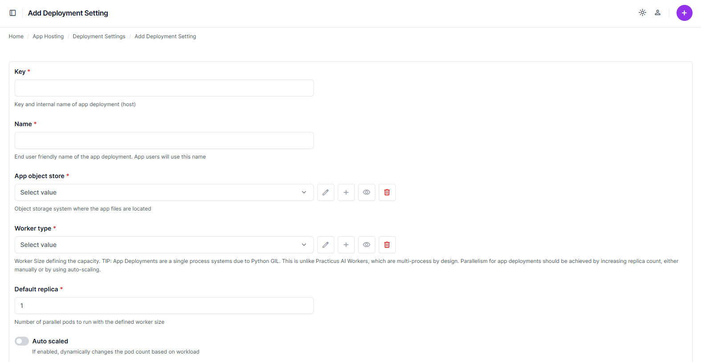
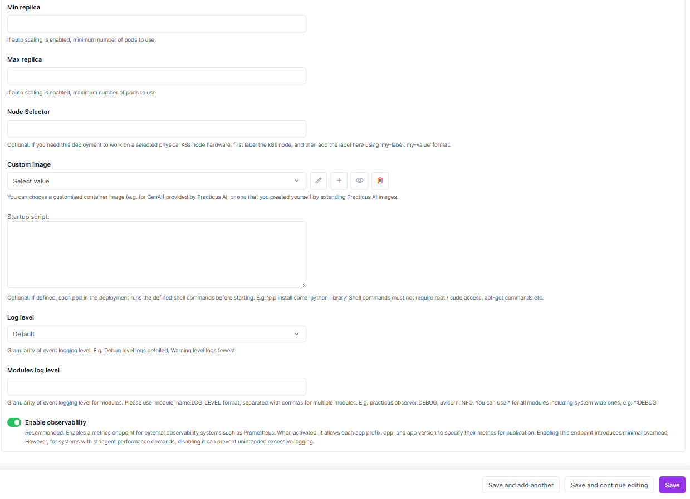
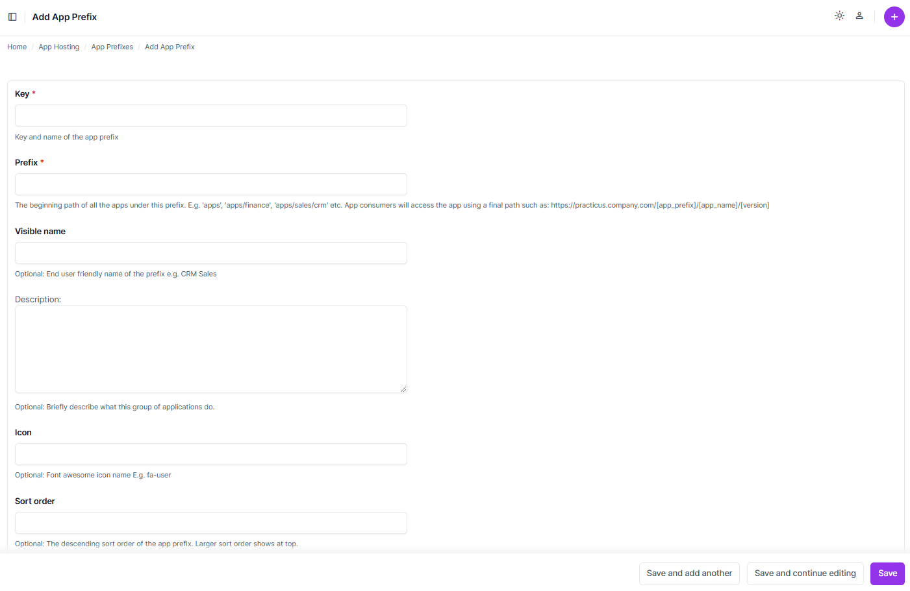

# Application (App) Deployment

## Deployment Settings

### Overview
Deployment settings in the Practicus AI platform define configurations for deploying applications. These settings include worker types, object stores, scaling parameters, and observability options.

### Adding a Deployment Setting

To add a new deployment setting, click the **Add Deployment Setting** button. The following fields are required:

- **Key**: Internal name for the deployment setting.
- **Name**: User-friendly name.
- **App Object Store**: The object store where app files are located.
- **Worker Type**: Specifies the worker size (e.g., `2X-Small (1.0GB)`).
- **Default Replica**: Number of initial replicas for deployment.
- **Auto Scaled**: Enables or disables dynamic scaling.
- **Min Replica** and **Max Replica**: Define scaling boundaries.
- **Enable Observability**: Toggles observability settings for metrics collection.
- **Log Level**: Defines the verbosity of logs (e.g., `Default`).

Click **Save** to finalize the configuration.

---

## App Prefixes

### Overview
App prefixes group applications under a shared path and configuration. These prefixes simplify app management and API accessibility.

### Adding an App Prefix

To add a new app prefix, click the **Add App Prefix** button. Configure the following fields:

- **Key**: Unique identifier for the prefix.
- **Prefix**: Path under which all apps are grouped (e.g., `apps/finance`).
- **Visible Name**: Optional user-friendly name for the prefix.
- **Description**: Brief description of the apps under the prefix.
- **Icon**: Optional Font Awesome icon for visual identification.
- **Sort Order**: Determines display order (higher values appear first).

Click **Save** to complete.

---

## Application Versions

### Overview
Application versions allow users to manage multiple iterations of the same app, ensuring flexibility and version control.

### Managing Versions

The **App Versions** page lists all application versions, including their deployment configurations. You can edit or remove versions as needed.

---

[< Previous](model-deployment) | [Next >](git-config.md)