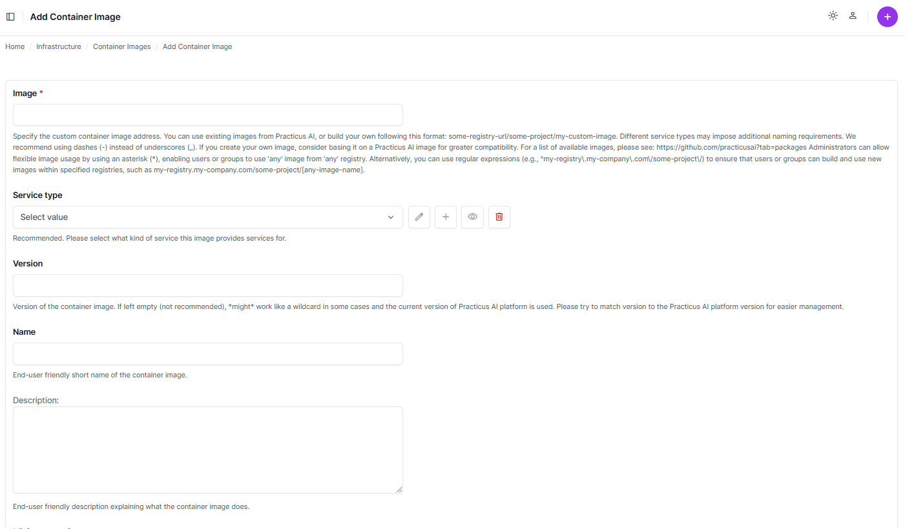

# Custom Container Images

_This section provides guidance on managing and inserting container images into the Practicus AI platform. These images can be configured for various services like Cloud Workers, App Hosting, Model Hosting, and Workspaces._

---

## Viewing Existing Container Images

- Navigate to **Infrastructure > Container Images** in the left-hand navigation menu.  
- The list displays available container images with the following details:
   - **Image:** The name of the container image.
   - **Service Type:** Specifies where the image is used (e.g., Cloud Worker, App Hosting, Model Hosting).
   - **Version:** The version of the image.
   - **Minimum and Recommended Versions:** Ensures compatibility with the Practicus AI platform.
   - **Image Pull Policy:** Specifies how the image is pulled (e.g., Always, Namespace default).
   

---

## Adding a New Container Image

- Click the **+ (Add Container Image)** button in the top-right corner.
- Fill out the required fields in the **Add Container Image** form:
   - **Image:** Provide the full image address (e.g., `registry.practicus.io/practicus/llm-cpu`).
   - **Service Type:** Select the applicable service type (e.g., Cloud Worker, App Hosting).
   - **Version:** Specify the version of the container image.
   - **Name and Description:** Provide a short name and optional description for easy identification.

---

## Additional Configuration

- Configure the following optional fields:
   - **Minimum and Recommended Versions:** Define version constraints for compatibility.
   - **Image Pull Policy:** Choose the policy for pulling the container image (e.g., Always).
   - **Private Registry Details:** Provide credentials and secrets if the image is stored in a private registry:
     - **Secret Name:** Kubernetes secret for private registry access.
     - **Username and Password:** Credentials for authentication.

- (Optional) Add a **Startup Script** to be executed when the container starts.

- Click **Save** to finalize the image insertion.

---

[< Previous](create-user-group.md) | [Next >](resources-management.md)