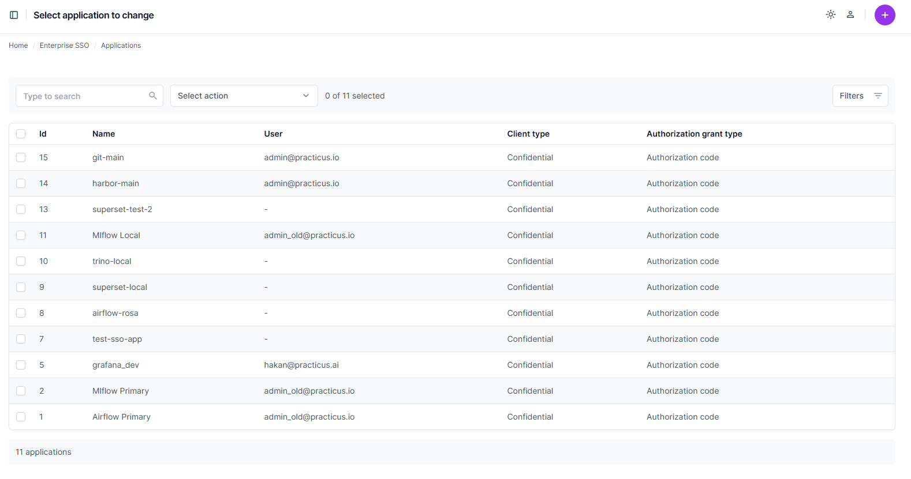
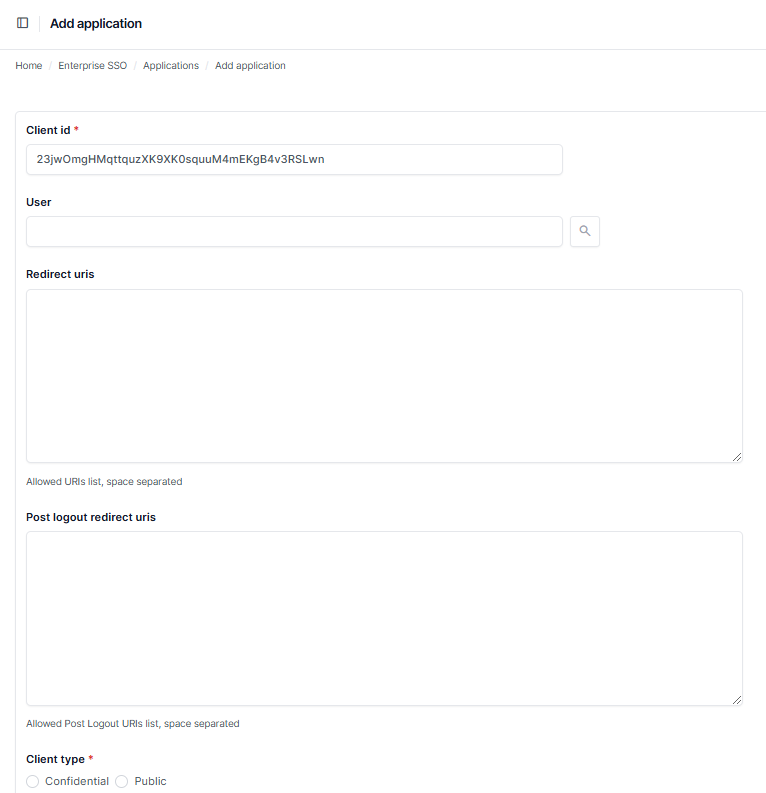
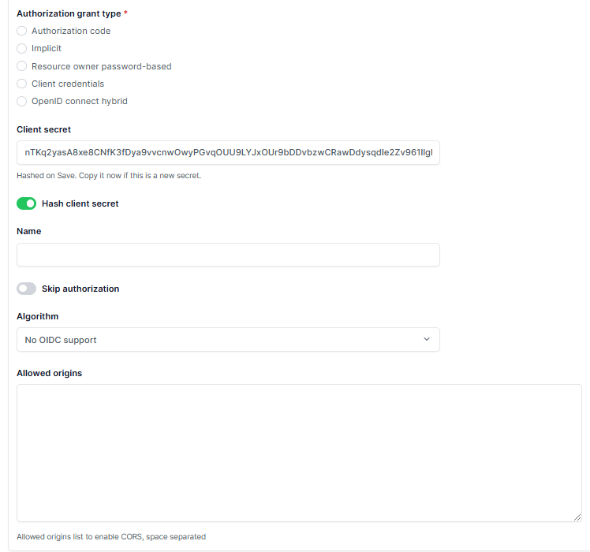

# Enterprise SSO

This section describes how to manage applications and configure Single Sign-On (SSO) settings in the Enterprise SSO module.

## Managing Applications

### Viewing Applications
To view the list of existing applications configured for Enterprise SSO:

- Navigate to **Enterprise SSO** in the sidebar menu.
- Select **Applications**.
- A table of applications is displayed with the following columns:
   - **Id**: Unique identifier of the application.
   - **Name**: Application name.
   - **User**: Associated user or administrator for the application.
   - **Client Type**: Indicates whether the client is Confidential or Public.
   - **Authorization Grant Type**: Type of OAuth 2.0 grant used by the application (e.g., Authorization Code).
   

### Adding a New Application
To add a new application:

- Click the **+** button in the top-right corner.
- Fill in the following fields:
   - **Client Id**: Automatically generated unique identifier for the client.
   - **User**: Search and assign a user to the application (optional).
   - **Redirect URIs**: Specify allowed URIs for redirecting after successful login.
   - **Post Logout Redirect URIs**: Specify allowed URIs for redirecting after logout.
   - **Client Type**: Choose between:
     - **Confidential**
     - **Public**
     

   - **Authorization Grant Type**: Select the appropriate grant type:
     - Authorization Code
     - Implicit
     - Resource Owner Password-Based
     - Client Credentials
     - OpenID Connect Hybrid
   - **Client Secret**: Automatically generated secret for confidential clients. Ensure to copy this if it is a new secret.
   - **Name**: Provide a descriptive name for the application.
   - **Skip Authorization**: Optionally enable this to bypass authorization prompts.
   - **Algorithm**: Specify OIDC support algorithm if applicable.
   - **Allowed Origins**: Add origins allowed to access the application.
   

- Click **Save** to finalize the application creation or choose other saving options:
   - **Save and add another**: Save and immediately start configuring a new application.
   - **Save and continue editing**: Save but remain on the same configuration screen.

---

[< Previous](add-on-services.md)

