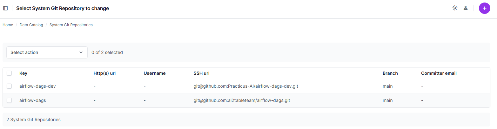
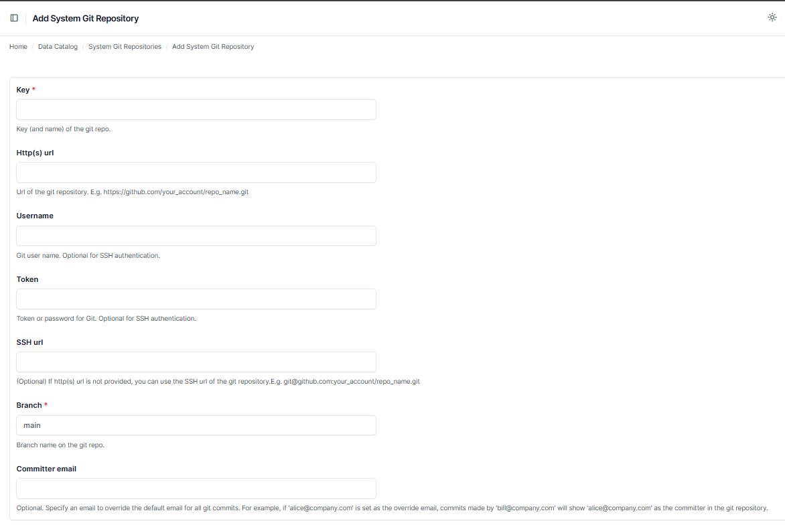

# Select System Git Repository

This document describes the settings and configuration for managing system Git repositories within Practicus AI.

---

## Overview

The **System Git Repositories** section allows you to manage Git repositories for system-level operations such as Airflow DAGs or other shared resources.

---

### System Git Repository List

The list displays all existing Git repositories, including details such as:

---

### Adding a New System Git Repository

To add a new Git repository, click the **Add System Git Repository** button and fill in the following fields:

- **Key**: (Required) Unique name for the repository.
- **Http(s) URL**: URL for the repository (e.g., `https://github.com/your_account/repo_name.git`).
- **Username**: Optional Git username for authentication.
- **Token**: Optional password or token for authentication.
- **SSH URL**: Optional SSH address for the repository (e.g., `git@github.com:your_account/repo_name.git`).
- **Branch**: (Required) Specify the branch name (e.g., `main`).
- **Committer Email**: Optional email to override the default email used in commits.

---

[< Previous](app-deployment.md) | [Next >](object-storage.md)
