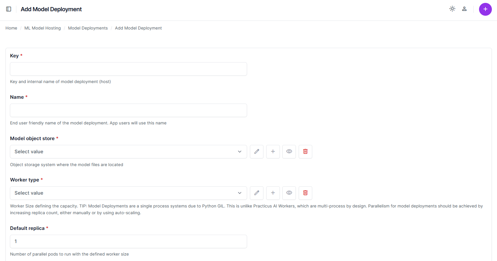
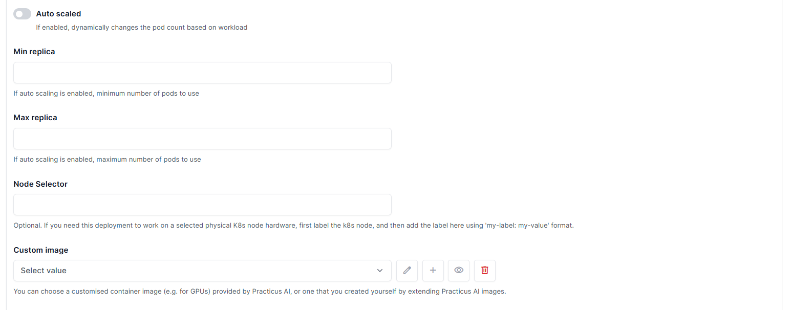
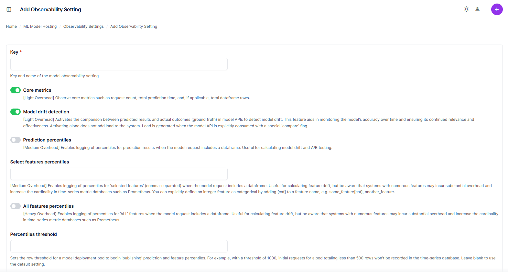
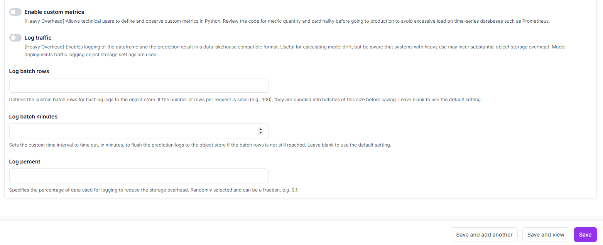

# Model Deployment Settings

## Overview
This document provides details for configuring model deployment settings within the Practicus AI platform. It focuses on essential fields and configurations required to create, modify, and manage model deployments efficiently.

---

## Adding a Model Deployment

### Key Fields
- **Key** *(Required)*: Unique identifier for the deployment.
- **Name** *(Required)*: Human-readable name for the deployment.
- **Model Object Store** *(Required)*: The storage system containing the model files.
- **Worker Type** *(Required)*: Defines the capacity (e.g., `Small`, `Large`) of the worker used for the deployment.
- **Default Replica** *(Required)*: Specifies the default number of pods to run.
- **Auto Scaled**: Enables dynamic scaling of pod counts based on workload.
  - **Min Replica**: Minimum number of pods when auto-scaling is enabled.
  - **Max Replica**: Maximum number of pods when auto-scaling is enabled.
- **Enable Observability**: Activates metrics collection for external systems like Prometheus.
- **Log Level**: Sets the granularity of logs (e.g., `DEBUG`, `INFO`).

### Advanced Options
- **Node Selector**: Assigns deployments to specific Kubernetes nodes using labels.
- **Custom Image**: Allows selecting or defining a custom container image.
- **Startup Script**: Shell commands executed before starting the API endpoint.
- **Traffic Log Object Store**: Specifies where request data and prediction logs are stored.
- **Deployment Group Accesses**: Defines groups with access permissions.
- **Deployment User Accesses**: Specifies individual user access rights.

### Steps to Add a Deployment
- Navigate to **ML Model Hosting > Model Deployments**.
- Click **Add Model Deployment**.
- Fill in the required fields under the "Add Model Deployment" form.
- Specify advanced configurations, if necessary.
- Save the deployment using one of the options:
   - **Save and add another**: Save and open a new form.
   - **Save and continue editing**: Save and remain on the current form.
   - **Save**: Save and return to the main list.
   
   

---

## Managing Deployment Settings

### Viewing Deployment Settings
- Navigate to the list of deployments in **ML Model Hosting > Model Deployments**.
- Select a deployment to view or modify its settings.

### Key Information Displayed
- **Model Object Store**
- **Worker Type**
- **Default Replica Count**
- **Observability Settings**
- **Traffic Log Object Store**

### Modifying Deployments
- Select the deployment to modify from the list.
- Update necessary fields.
- Save the changes using the appropriate option.

---

## Observability Settings
### Core Metrics
- Enables tracking of essential metrics like request count and total prediction time.

### Model Drift Detection
- Activates comparisons between predicted results and ground truth to detect model drift.

### Logging
- **Prediction Percentiles**: Logs percentiles of prediction results for analysis.
- **Custom Metrics**: Allows defining custom metrics in Python.
- **Traffic Logging**: Logs request and prediction data in a compatible format.

### Advanced Logging Options
- **Log Batch Rows**: Sets the number of rows per log batch.
- **Log Batch Minutes**: Defines time intervals for flushing logs.

---

## Model Deployment Best Practices
- Use **auto-scaling** for deployments with variable workloads.
- Enable **observability** for monitoring model performance and drift.
- Leverage **custom images** for deployments requiring specialized environments.
- Use **traffic log object store** for centralized logging and analysis.

---

[< Previous](storage.md) | [Next >](app-deployment.md)