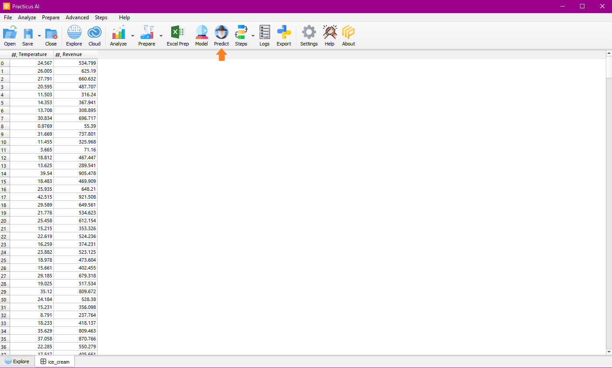
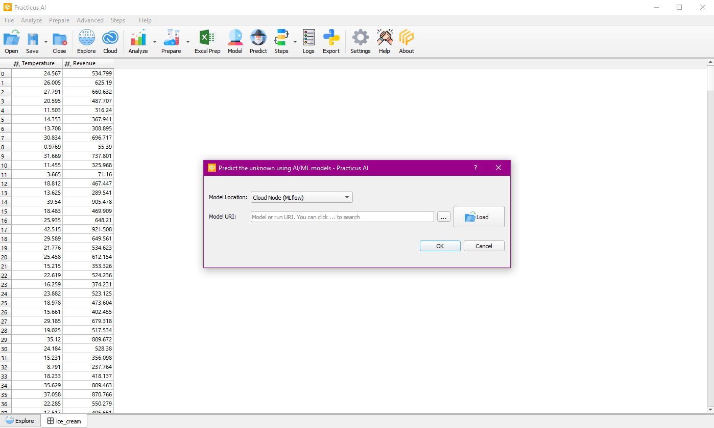
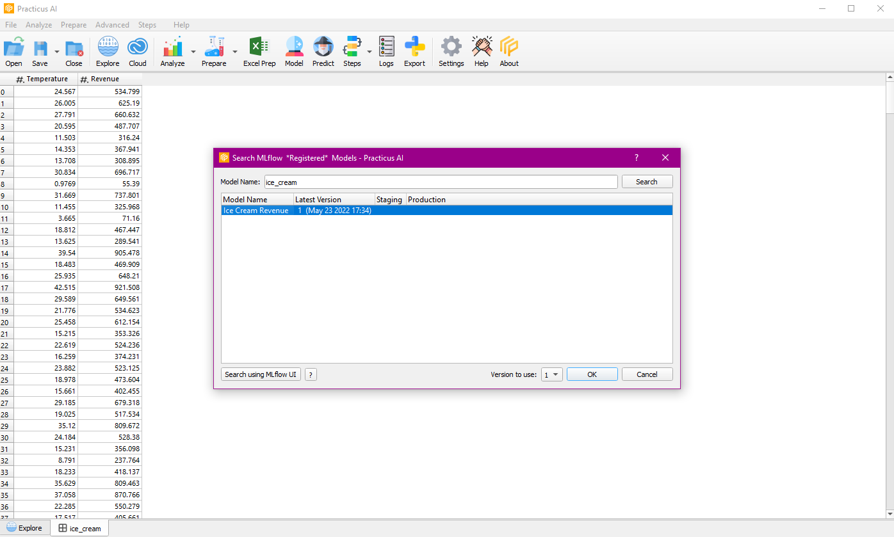
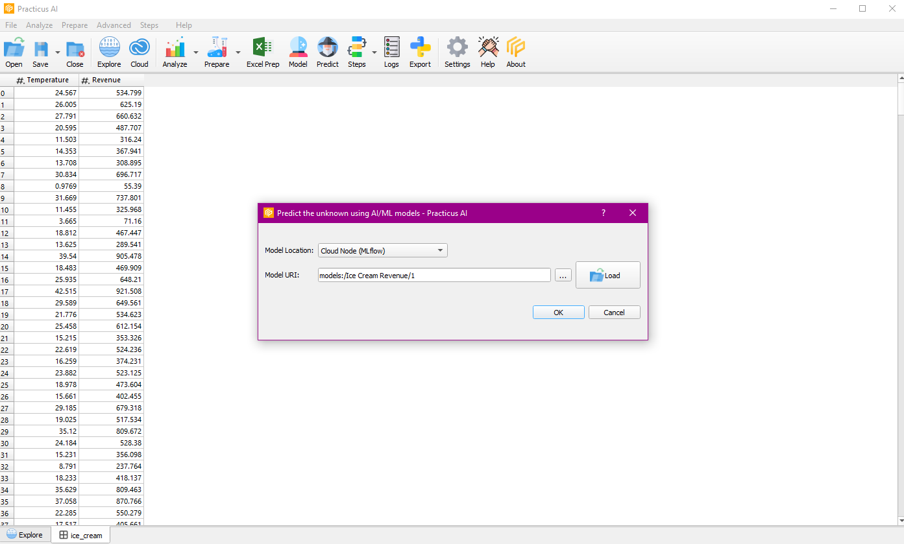
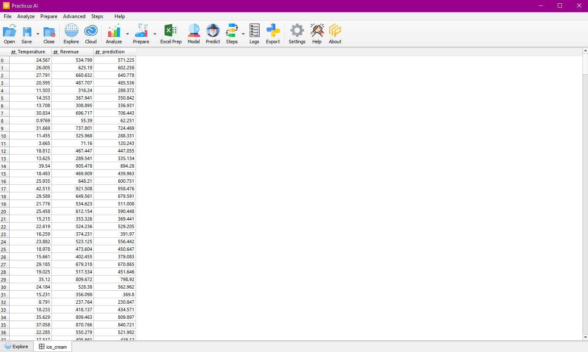

Predict the unknown with one-click. Search and use models built with any technology / platform.  
You can use model APIs hosted anywhere, or use models cold stored on your laptop, S3 or other location, 
which will become live within seconds. With short startup time and ease of use, your organization’s ML models will reach new users easier

This section of the documentation is work in progress..

## Prediction
You need to have a Cloud Worker ready for the prediction process and start the prediction process with our data on the Cloud Worker.

In the predict operation, where we will use the registered model, MLflow is selected as the model location(MLflow, Local Computer, S3).

You can search and select the ice cream model registered as Model URI.

When the prediction is completed, the prediction column is created on the data.

