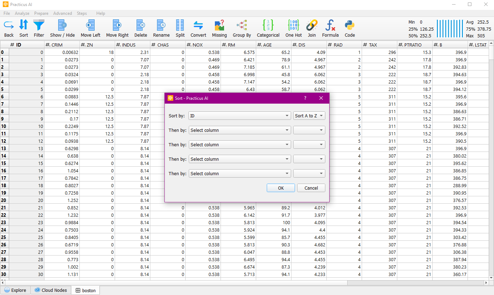
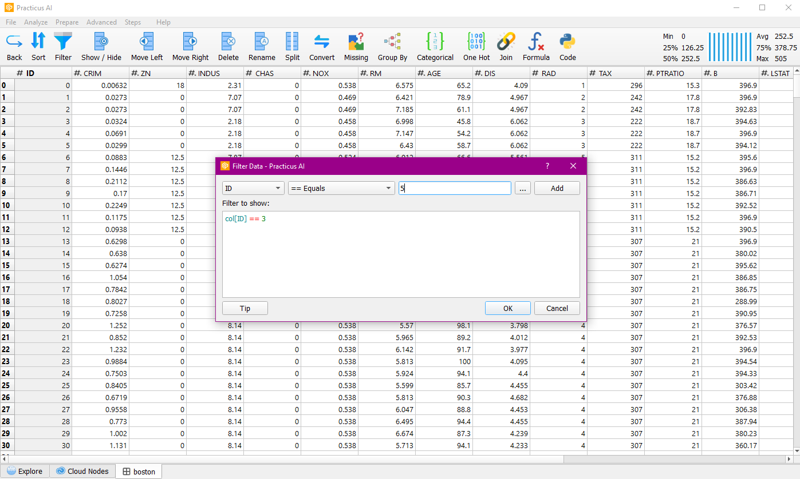
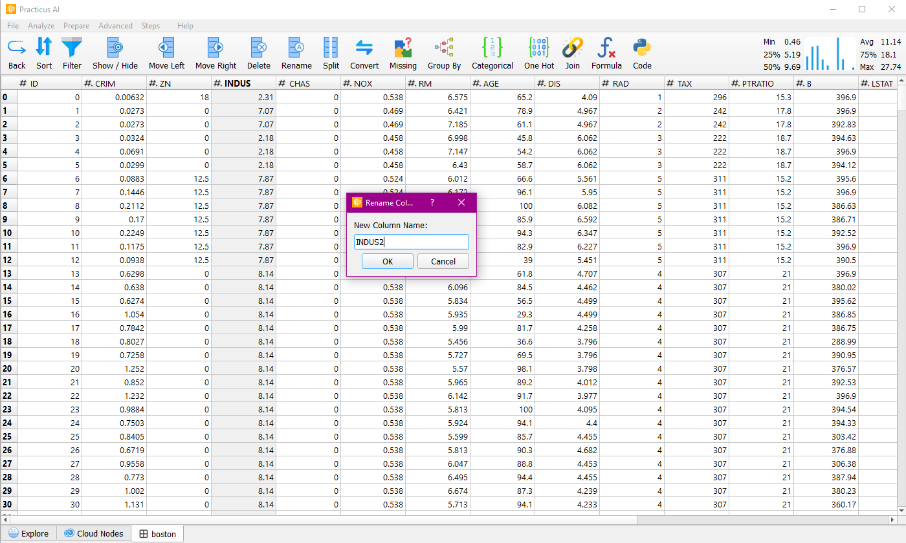
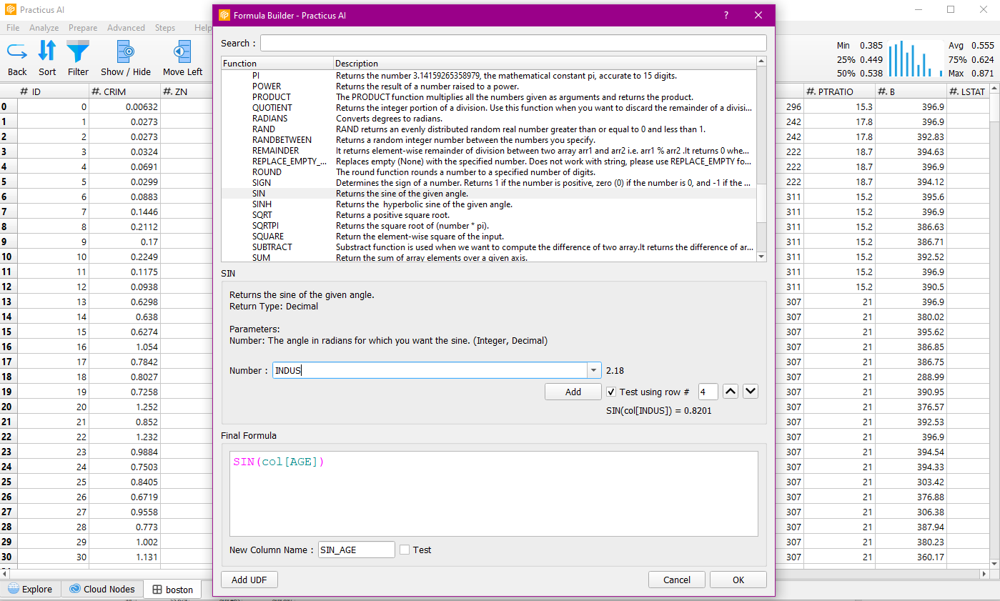
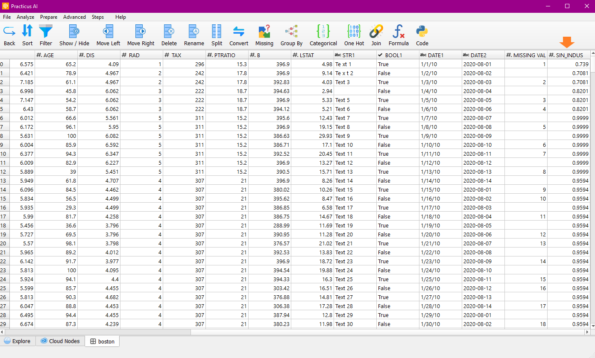
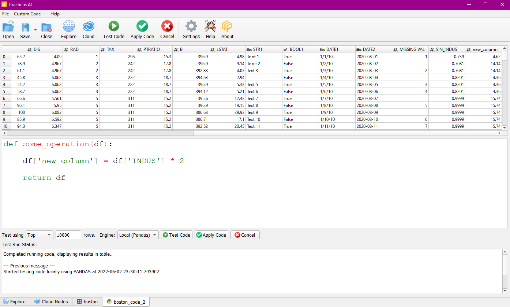

Process, clean and prepare your data without any coding. When clicking is not enough, use 200+ Excel compatible formulas. 
Add custom Python code using the built-in editor for more complex requirements. Export the final clean data to a file, 
data lake or database directly from the app. To build repeatable data pipelines, export to pure Python code and run anywhere you need.

This section of the documentation is work in progress..

## Sort

You can sort the columns you want in ascending or descending order.

## Filter

You can filter any column using logical operators.

## Rename

You can change the name of the column you choose.

## Formula

You can run and test more than one formula on the column you want.

When you want to add the formula, the new column on the worksheet will be ready.

## Code

In this section, you can run the code yourself and test the code you wrote on the worksheet. When you apply the code, the change on the worksheet is saved.

## Other Features

In addition, you can easily perform Show/Hide, Move Left , Move Right, Delete , Split, Convert, Missing, Group By, Categorical, One Hot and Join operations on data and columns.
