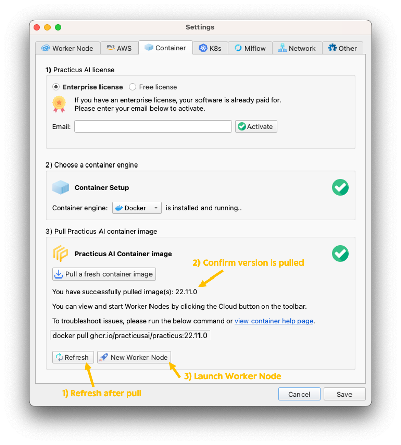

Welcome! It should take **a few minutes to set up everything** and be ready to go!

## Overview

You can see a simplified view of Practicus AI setup options below. 

- **Practicus AI App is Forever Free** and include common analytics and data preparation features. 
- **Worker Nodes with Forever Free Tier** are optional but highly recommended. They bring in [more functionality](#what-is-a-worker-node) such as AutoML. You can choose one or more Worker Node system. 


## Install Practicus AI App

Practicus AI App works on your computer and contains the core functionality of our platform. 

If you haven't already, please install **Practicus AI App** for [Windows](https://www.microsoft.com/en-us/p/practicus-ai/9p9f4hvkvcqg), [macOS](https://github.com/practicusai/app/releases/download/latest/practicus.pkg) or [Linux](#linux-installation).  

If you are a Python user and prefer to install Practicus AI App as a library, please check our [Python Setup Guide](#python-setup-guide) section below. 

If you are a programmer and only interested in installing the lightweight **Practicus AI SDK** (5MB), please only install **practicuscore** library using the [Python Setup Guide](#python-setup-guide) section below.
 

## Choose a Worker Node System

If you prefer the **quickest option**, simply go to the [Cloud Activation](#cloud-activation) section below.  

### What is a Worker Node?

Some Practicus AI features such as **AutoML**, making ** AI Predictions**, **Advanced Profiling** and **production deployment** capabilities require a larger setup, so we moved these from the app to a backend (server) system.  

You have multiple Worker Node options to choose from, and you can find a quick summary on pros and cons of each option below.

### AWS Cloud pros and cons

**Pros**

- Runs Instantly, no installation required.
- Runs 100% private and securely in your AWS account.   
- Scales-up. Has very large capacity options with up to 4TB RAM and hundreds of CPUs.
- GPU Accelerated option with up to 50,000+ CUDA cores for complex AI/ML problems.
- No need to manage software due to ephemeral nature. Start, use, and dispose when done. 
- Has Forever Free Tier for 2 vCPUs and 1GB RAM, and professional tier for larger capacity.
- For professional use, you can pay as you go hourly through [AWS marketplace](https://aws.amazon.com/marketplace/search?searchTerms=practicus+ai). 
- Offers Enterprise license option with unlimited user and capacity as well. [Compare license options](https://practicus.ai/pricing/).

**Cons**

- You need a credit card to create an AWS account. 
- Cost control can be challenging (but possible) if you have many users that overuse large cloud capacity. 
- Your data needs to enter / leave the public cloud, which might not be possible for some organizations with very strict data governance and regulation requirements.

If this is the right option for you, please visit the [cloud activation](#cloud-activation) section below to get started.

### Local container pros and cons

**Pros**

- Runs 100% private and securely on your computer. 
- Lowest cost option and has forever free tier. 
- No limitations on CPU/RAM available for the Free Tier. 
- Most new generation laptops have high compute capacity. You can easily process 50 million+ row datasets and fairly complex AutoML problems.
- You can switch back and forth to the cloud. E.g. You can use your computer for most use cases, switch to using the cloud with one click for very complex problems requiring GPUs (assuming your computer doesn't have GPUs), and then switch back to continue on your computer when done.  
- If you have a Practicus AI Enterprise license, all professional features are unlocked, and you get the same experience as the pro cloud option. 
- Fairly simple installation and ready in 5-10 minutes.

**Cons**

- Although fairly straightforward, you still have to install [Docker Desktop](https://www.docker.com/products/docker-desktop/) or [Podman Desktop](https://podman-desktop.io)
- If you need to access **~10 Million+ cloud data store rows and ~50+ times a day**, you should probably prefer a Worker Node on the cloud. Network traffic between the Practicus AI app and Worker Nodes are heavily compressed, and first time data access will feel slower with the local container.
- If you use a **cloud data lake such as S3 and need to frequently scan large tables**, a cloud Worker Node in the same cloud region will be several orders of magnitude faster. In this scenario we recommend you to use cloud and local Worker Nodes together. Practicus AI App allows you to use multiple Worker Nodes at the same time, local or on the cloud. 

If this is the right option for you, please visit the [local container](#local-container) section below to get started.

### SaaS pros and cons

Our Saas offering is in **private preview** at the moment, and we expect to make it generally available by mid-2023. 

Please [contact us](https://practicus.ai/contact/) to learn about the pros and cons of this option, and to get started in around 24 hours. 

### Kubernetes pros and cons  

Our Kubernetes offering is in **private preview** at the moment, and we expect to make it generally available by early-2023. 

Please [contact us](https://practicus.ai/contact/) to learn about the pros and cons of this option, and to get started in around 1-2 days. 
 
## Cloud Activation

This section explains setting up AWS cloud Worker Nodes. 


### Before we begin
Some of our advanced features require cloud capacity. 

Instead of asking for access to your data, **Practicus AI cloud runs 100% in your AWS account, fully isolated.** This allows us to offer **improved security and absolute privacy**.

You can activate Practicus AI on your AWS account in a few minutes, and use up to a certain cloud capacity **free of charge**.  Let's get started.

### 1) Select license

Practicus AI cloud offers 3 different licenses. 

#### Free License

We offer a **forever free cloud tier using 2 vCPUs and 1 GB RAM** on AWS with **t3.micro** cloud instances.

Please note that some AWS cloud regions charge roughly 1 cent / hour for t3.micro (see below). If you need to make sure everything your use is **absolutely free**, please make sure you pick an appropriate AWS cloud region. AWS also offer free tiers for other potential charges like S3 storage and network traffic. To keep everything free, you must experiment responsibly and make sure you do not go beyond these AWS limits. 

- Please view [AWS free tier details](https://aws.amazon.com/free/) to learn more.

#### Professional license

When you need **larger Practicus AI cloud capacity**, you can simply **pay-as-you-go (PAYG) hourly** without sharing your credit card info, or making any commitments. **AWS will charge** for the Practicus AI cloud usage **hourly**, which will show as a separate **Practicus AI line item in your monthly AWS cloud invoice**. 

Practicus AI cloud **works like electricity**, you switch it on when you need it, and only pay for the total number of hours that the lights are on. Our cloud nodes **auto shut down** after 90 minutes of inactivity by default, **preventing unexpected costs**. It works similar to this scenario: you leave your home and forget to turn the lights off. Your lights turn off automatically after 1.5 hours, since there is no motion detected in the house. 

Please visit [practicus.ai/pricing](https://practicus.ai/pricing/) for more info, and example pricing scenarios.   

#### Enterprise license

We offer a **bring-your-own-license (BYOL)** model with benefits such as **unlimited use for multiple users, with a fixed fee.**  

If you have an enterprise license, simply open Practicus AI app and go to settings (preferences in macOS), cloud tab, and enter your email to activate your license.

Please feel free to [contact us](https://practicus.ai/contact/) to learn more about our enterprise support and licensing.

Use your email to activate the enterprise license in app settings:


### 2) Ready your AWS cloud account

This is a **one-time task for all users** sharing the same AWS account. 

Please skip this step if you already have an AWS account. 

<a href="https://portal.aws.amazon.com/billing/signup">Create an Amazon Web Services (AWS) cloud account</a> for **free**. 

Please make sure you have created an **admin user** as well. You can check our [AWS account creation guide below](#aws-account-creation) for help.


### 3) Enable on AWS marketplace

This is a **one-time task for all users** sharing the same AWS Account. 

[Learn more about AWS marketplace](#aws-marketplace). 

We have multiple offerings on AWS marketplace. Please click on each in the below list to view the marketplace page explaining the offering, and then click **Continue to Subscribe** button to enable (see screenshot below). You need at least one AWS marketplace offering enabled to use Practicus AI cloud. 

Please note that it can take a few minutes for the offering to be active. Once your subscription is active, please do **not** create a new EC2 instance using AWS cloud console. The next step will take care of configuration.

#### Free / Professional pay-as-you-go (PAYG) 

- <a href="https://aws.amazon.com/marketplace/pp?sku=92p0y3k5wuzzfhi71lmcigl5q">Practicus AI</a> - Most common, offers free tier, will give you all of the functionality.
- <a href="https://aws.amazon.com/marketplace/pp?sku=84fu9xjxpikj0pw37w8zchum">Practicus AI with GPUs</a> - Accelerated computing for very large data **or** if you have limited time. Can be 500+ times faster for some operations. 

#### Enterprise License bring-your-own-license (BYOL)
- <a href="https://aws.amazon.com/marketplace/pp?sku=5imq5zmm3najdjy989wuoytjo">Practicus AI</a> - Most common enterprise offer
- <a href="https://aws.amazon.com/marketplace/pp?sku=3o0d18rnipiqy9isz9aw1fsrv" rel="noopener">Practicus AI with GPUs</a> - Accelerated computing, enterprise offer


<div style="text-align: center;">Sample view of our AWS marketplace page</div>

Please carefully review software, hardware and total cost / hour on our AWS marketplace page. Sample professional license below: 


### 4) Activate your AWS user in the app 

You should now have an AWS user **Access key ID** and **Secret access key** ready, and the AWS account for this user has at least one Practicus AI AWS marketplace offer enabled.   

Simply open the Practicus AI app, go to settings (preferences in macOS), cloud tab, click the **Activate your AWS user** button, choose a default cloud region (you can change this later) and enter your cloud credentials:


Please note that your cloud credentials are not shared with 3rd parties, including Practicus AI. The app only uses the credentials to communicate with AWS cloud.

Before you finalize the cloud settings, we will verify your configuration to check if everything is configured correctly.    


<div style="text-align: center;">Sample AWS marketplace verification result. You need at least one verified</div>

**Pro Tip:** You can save the cloud configuration info to a file and share with others, so they can open this file with Practicus AI app and automatically configure the cloud setup. Please check the [Setup for others](#setup-for-others) section below to learn more.  

### Troubleshooting

If you could not verify one of the AWS marketplace offers, please check the below as potential reasons:

- AWS marketplace activation can take a few minutes. Please make sure you stay on the AWS marketplace page, confirm the activation is completed and go back to the app settings to verify again.  
- If you use multiple AWS accounts, please make sure you  subscribe using the correct AWS account since it is very easy to mix them up. Simply log-off from your AWS account, click on one of the view buttons inside the app settings to view AWS marketplace page again, login using the correct user, click subscribe, wait for it to be completed, and finally go back to app settings and click verify again.
- In rare cases, a company admin can disable AWS marketplace usage. If this is the case, please contact your admin, or create a new AWS account. 

## Local Container

This section explains setting up a local container Worker Node.

### 1) Install a container engine

In order to run a container on your computer you need to first install a container engine.

Docker is the most popular option: [Install Docker Desktop](https://www.docker.com/products/docker-desktop/) 

Although Docker Desktop is free, there has been some licensing changes in the recent years. 

Podman is a great Docker alternative: [Install Podman Desktop](https://podman-desktop.io)

Once the installation is completed, simply run Docker or Podman Desktop and confirm the container engine is running.


**Active Docker Desktop** 


**Active Podman Desktop** 


### 2) Pull (download) Practicus AI container image

Additional Practicus AI software is bundled inside a container image. You need to pull this package on your computer before using it. 

- Open Practicus AI App settings (preferences in macOS) dialog and navigate to the Container section.
- If you have a Practicus AI Enterprise license, enter your email to activate and unlock all features. If not, you can use the free tier. Please note that Professional pay-as-you-go license option is not available for local containers. [Compare license options](https://practicus.ai/pricing/).   
- Choose a container engine, Docker or Podman, and confirm in the app the engine is running.   
- Click the **Pull (download) Practicus AI container image** button


- A command prompt window (terminal in macOS) will open to start the pull. This one-time download task can take anywhere between 5 - 20 minutes depending on your internet speed. 


- Once the container pull is completed, go back to the app and click refresh to view active Practicus AI images on your computer. Confirm you successfully pulled the container image.
- Click **New Worker Node** button to open Worker Nodes tab.
- Click Save to close settings.



- In the Worker Nodes tab, select local container as Cloud Region.
- Click **Launch New** button to start a Worker Node.


- When navigating cloud data sources in the Explore tab, you can switch between local and cloud Worker Nodes by using the drop-down list at the top right.
- Practicus AI app also attaches (mounts) **container_shared** folder, so you can easily copy files back and forth between your file system and the container. Simply open Windows Explorer (Finder in macOS), navigate to: your home folder / practicus / container_shared and copy files. Then navigate to Worker Node Files in Explore tab, and the files you copied will be visible under container_shared folder. Click Reload button at the top if you recently copied files.  


## References

### AWS Account Creation
Practicus AI cloud worker nodes can start and stop with a click using our app, and they run in your Amazon Web Services (AWS) cloud account in a fully isolated fashion. This way we can offer you 100% privacy. 

Please follow the below steps to create a **free** AWS account.

1. Please <a href="https://aws.amazon.com/">click here</a> to visit AWS home page and click _Create an AWS account_
2. Follow the steps to finish account creation. Please check the <a href="https://aws.amazon.com/premiumsupport/knowledge-center/create-and-activate-aws-account/">AWS help page</a> if you need assistance on creating an account. After this step you will have a root account.
3. Login to <a href="https://aws.amazon.com/console/">AWS management console</a> using your root account. 
4. Navigate to IAM (Identity and Access Management), click Users on the left menu and click _Add users_
5. For User name enter **admin**, click Access key and Password check boxes (see below screenshot)
6. In Set permissions section select _Attach existing policies directly_ and pick _AdministratorAccess_ (see below screenshot)
7. In the last screen carefully save your **Access Key ID**, **Secret access key** and Password (see below screenshot)
8. All done! You can continue with the next step, [Enabling on AWS marketplace](#3-enable-on-aws-marketplace) 

**Notes:**

* Although the admin AWS user will be sufficient for Practicus AI cloud nodes to run, as a security best practice we recommend you to create a least privileged AWS user for day to day usage.  Practicus AI app cloud setup can create this user for you. If you rather prefer to create one manually please make sure the user has access for EC2 and S3 operations. 
* If you plan on having multiple AWS users sharing the same AWS account, you can simply add new users to the appropriate practicus AWS IAM user group that our app creates for you. 
* If you have a local AWS profile (i.e. to be used with AWS CLI) Practicus AI setup can use this directly. 

<div style="text-align: center;">AWS account creation screenshots</div>


### AWS Marketplace

Similar to our Windows app being available on Microsoft app store, our cloud worker nodes are available on AWS marketplace. This gives our users "there's an app for that!" type experience, but for AI in the cloud. 

Any time you need to do AI in the cloud, you can just click a button in the Practicus AI app, and we will create the cloud capacity of your choice. And also shut it down with a click when you no longer need it, saving on cost.,

For our app to be able to start/stop cloud worker nodes you need to enable (subscribe to) the AWS marketplace offering of your choice. 

If you use the free tier (t3.micro) with 2 vCPUs and 1 GB RAM, there won't be any software license charges. AWS also offers t3.micro free of charge for eligible customers and regions. For larger capacity, AWS will charge you **per hour.** i.e. you start a cloud worker, use it for 2 hours and never use it again. Your cloud bill will have a line item for the 2 hours you use. Larger capacity is more expensive and the larger the capacity the [bigger discount](https://practicus.ai/payg-discount/) you will get.  

### Setup for others 

You can save cloud setup information to a file and share with others, so they can simply open the file with Practicus AI app to complete the cloud setup. 

Practicus AI uses .prt files to save worksheet data and steps. Since .prt files directly open with Practicus AI app, we use the same file extension to configure the app as well.

You can simply create a text file, give it a name such as cloud_setup.prt and add setup information like the below:

Sample **cloud_setup.prt** file:
```
[add_license]
email = user@mycompany.com

[add_cloud_config]
cloud_region = us-west-1
access_key = ...
secret_key = ...
```

**[add_license]** section can be used if you have an enterprise license. 

**[add_cloud_config]** section can be used to add an AWS cloud configuration. You can use the **cloud_region** key to set the default region (can be changed later), and it is optional. 
**access_key** (Access Key ID) and **secret_key** (Secret access key) are mandatory, and can be obtained during AWS IAM user creation. 

### Linux Installation
Since almost all Linux distros come with Python 3 installed, we do not offer a prepackaged installer. 

Please check the quick start guide [below](#macos-or-linux-quickstart) to see how you can install and run Practicus AI app on Linux. We have extensively tested on Ubuntu, if you encounter any issues please share with us using [feedback](feedback.md) section.


### Python Setup Guide
You can run **pip install practicus** (Windows/macOS: Python 3.8 – 3.10, Linux: 3.8 – 3.11) and then run **practicus** from the terminal. Or run, python -c “import practicus; practicus.run()”  (python3 for macOS or Linux).

Installing using pip will give you the exact same end-to-end GUI application experience. Similarly, if you download the packaged app you can still code freely when you want to. So, please select any method of installation as you prefer. 

As for any Python application, we strongly recommend you to use a virtual environment such as venv or conda. Please check the recommended QuickStart scripts on this page to create a virtual env, install Practicus AI and run with peace of mind and in one go.  

For server environments or API only usage, you can **pip install practicuscore** to install the core library by itself without the GUI elements. (Linux: Python 3.6 – 3.11, Windows/macOS: Python 3.8 – 3.1) 

This is a small library with fewer requirements and no version enforcement for any of its dependencies. It’s designed to run in existing virtual environments without overriding the version requirements of other libraries. Please check the documentation for more details. 

#### Windows QuickStart
```shell
:: install 
python -m venv %UserProfile%\practicus\venv
%UserProfile%\practicus\venv\Scripts\python -m pip install --upgrade practicus


:: run
%UserProfile%\practicus\venv\Scripts\activate
practicus
```

#### macOS or Linux QuickStart
```shell
# install
python3 -m venv ~/practicus/venv 
~/practicus/venv/bin/python -m pip install --upgrade practicus


# run
source ~/practicus/venv/bin/activate
practicus
```

### Starter app
Instead of running Practicus AI from the command prompt (terminal) you can create shortcuts and run with double click. The below tips assume you installed using the QuickStart tips above.

**Windows:** Navigate to ** %UserProfile%\practicus\venv\Scripts\ ** folder and locate practicus.exe, which is essentially a starter for practicus Python library. You can right-click and select pin to start. You can also create a shortcut to this .exe and change its name to Practicus AI and its icon by downloading our icon [practicus.ico](https://github.com/practicusai/app/raw/main/practicus.ico). 

**macOS:** You can download [Practicus AI Starter app](https://github.com/practicusai/app/raw/main/practicus_starter.pkg) which is a tiny (100KB) app that starts the Python virtual env in ** ~/practicus/venv ** and then starts Practicus AI GUI from practicus Python library. To keep the app in dock please drag & drop the .app file on the dock itself. Right-clicking and choosing “keep in dock” will not create a shortcut.

