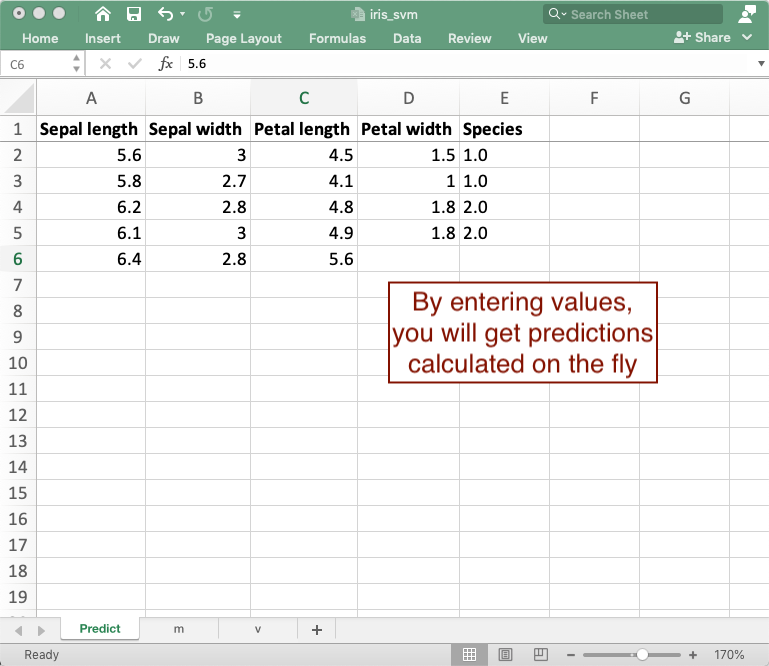
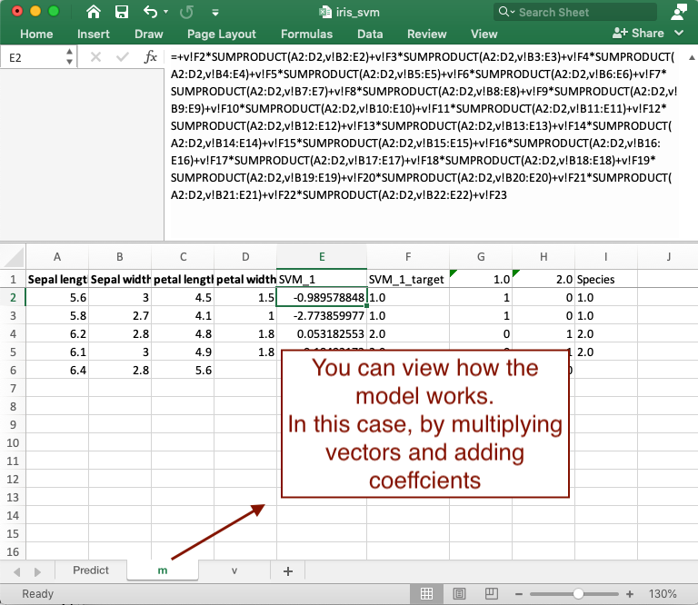
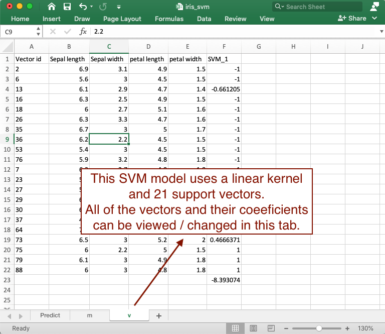

Beyond data preparation, Practicus AI can also be used to export ML models to Excel, which can be used for different purposes. Below you can find some use cases to export your models to Excel. 

- Practicus AI exported models can help with ML **deployment** and **testing** and increase your chances of getting them to production to be used by masses.   

- The exported models have **zero dependency**, meaning they only use core Excel functionality and do not depend on 3rd party libraries, products, services, REST APIs etc. You can attach the exported ML model to an email, and the recipient would be able to predict / infer offline without any issues. 

- You can use the exported Excel file to **debug** your models, since the model representation will be in a very simple form. 

- **Model Explainability** can be a key blocker for getting ML models to production. Often times, data analysts, business analysts and other business leaders will not allow moving an ML model to production, simply because they do not understand how the model works. Practicus AI exported models in Excel will be significantly easier to consume and understand.

**Basic model sharing use case**

1) Build your ML model as usual. 

```Python
# sample Support Vector Machine model
...
my_svm_model.fit(X, Y)
```


2) Export to Excel 

```Python
import practicus    
practicus.export_model(my_svm_model, output_path="iris_svm.xlsx",
      columns=iris.feature_names, target_name="Species")
```


3) Open the file in Excel, Google Sheets, LibreOffice or others to make predictions, analyze how the model works and make changes as well.











4) (**Optional**) You can use pre-processing pipelines as well. Necessary calculations prior to model prediction will also be exported to Excel as pre-processing steps.   

```python
# create a pipeline with StandardScaler and LogisticRegression
my_pipeline = make_pipeline(
   StandardScaler(),
   LogisticRegression())

# train
my_pipeline.fit(X, y)

# Export the pre-processing and model calculation to Excel
practicus.export_model(my_pipeline, output_path="model_with_pre_processing.xlsx",
                   columns=iris.feature_names, target_name="Species")
```

5) (**Optional**) You can also export models with Practicus AI using PMML. If you are using R, KNIME, Alteryx or any other ML platform, you can export your models to a .pmml file first (optionally including pre-processing steps as well) and then use the .pmml file with Practicus AI in Python to export it to Excel. The final Excel file will not have any dependencies to your ML platform. 

```python
practicus.export_model("my_model_developed_on_R.pmml", output_path="R_model.xlsx",
                   columns=['petal length', 'petal width'], target_name="Species")
```


------

## Sample notebooks

You can download sample Jupyter notebooks from the below link. 

<a href="https://practicusai.github.io/samples/" target="_blank">https://practicusai.github.io/samples</a>

------
