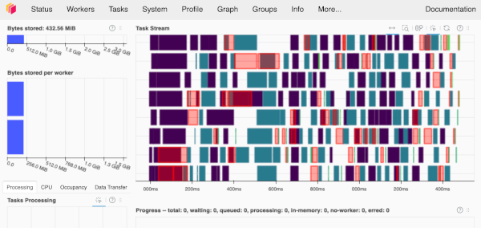

---
jupyter:
  jupytext:
    text_representation:
      extension: .md
      format_name: markdown
      format_version: '1.3'
      jupytext_version: 1.16.4
  kernelspec:
    display_name: Practicus Core
    language: python
    name: practicus
---

# Using the interactive Dask Cluster Client

- This example demonstrates how to connect to the Practicus AI Dask cluster we created, and execute simple Dask operations.
- Please run this example on the `Dask Coordinator (master)`.

```python
import practicuscore as prt 

# Let's get a Dask session
client = prt.distributed.get_client()
```

```python
# And execute some code
import dask.array as da

print("Starting calculation.")

x = da.random.random((10000, 10000), chunks=(1000, 1000))
result = (x + x.T).mean(axis=0).compute()

print("Completed calculation. Results:", result)
```

### Dask Dashboard

Practicus AI Dask offers an interactive dashboard where you can view execution details. Let's open the dashboard.

```python
dashboard_url = prt.distributed.open_dashboard()

print("Page did not open? You can open this url manually:", dashboard_url)
```

```python
# Let's execute the same code
import dask.array as da

print("Starting calculation.")

x = da.random.random((10000, 10000), chunks=(1000, 1000))
result = (x + x.T).mean(axis=0).compute()

print("Completed calculation. Results:", result)
```

Now you should see in real-time the execution details in a view similar to the below.



<!-- #region -->
### Terminating the cluster

- You can go back to the other worker where you created the cluster to run:

```python
coordinator_worker.terminate()
```
- Or, terminate "self" and children workers with the below:

```python
prt.get_local_worker().terminate()
```

<!-- #endregion -->


---

**Previous**: [Start Cluster](start-cluster.md) | **Next**: [Batch Job > Batch Job](../batch-job/batch-job.md)
