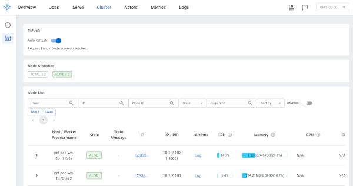

---
jupyter:
  jupytext:
    text_representation:
      extension: .md
      format_name: markdown
      format_version: '1.3'
      jupytext_version: 1.16.6
  kernelspec:
    display_name: Practicus Core
    language: python
    name: practicus
---

# Using the interactive Ray Cluster Client

- This example demonstrates how to connect to the Practicus AI Ray cluster we created, and execute simple Ray operations.
- Please run this example on the `Ray Coordinator (master)`.

```python
import practicuscore as prt 

# Let's get a Ray session.
# this is similar to running `import ray` and then `ray.init()`
ray = prt.distributed.get_client()
```

```python
@ray.remote
def square(x):
    return x * x

def calculate():
    numbers = [i for i in range(10)]
    futures = [square.remote(i) for i in numbers]
    results = ray.get(futures)
    print("Distributed square results of", numbers, "is", results)

calculate()
```

### Ray Dashboard

Practicus AI Ray offers an interactive dashboard where you can view execution details. Let's open the dashboard.

```python
dashboard_url = prt.distributed.open_dashboard()

print("Page did not open? You can open this url manually:", dashboard_url)
```

```python
@ray.remote
def square(x):
    return x * x

def calculate():
    numbers = [i for i in range(10)]
    futures = [square.remote(i) for i in numbers]
    results = ray.get(futures)
    print("Distributed square results of", numbers, "is", results)

calculate()
```

Now you should see in real-time the execution details in a view similar to the below.
You can click the Job tab for useful information.



```python
# Let's close the session
ray.shutdown()
```

<!-- #region -->
### Terminating the cluster

- You can go back to the other worker where you created the cluster to run:

```python
coordinator_worker.terminate()
```
- Or, terminate "self" and children workers with the below:

```python
prt.get_local_worker().terminate()
```

<!-- #endregion -->


---

**Previous**: [Start Cluster](start-cluster.md) | **Next**: [Batch Job > Batch Job](../batch-job/batch-job.md)
