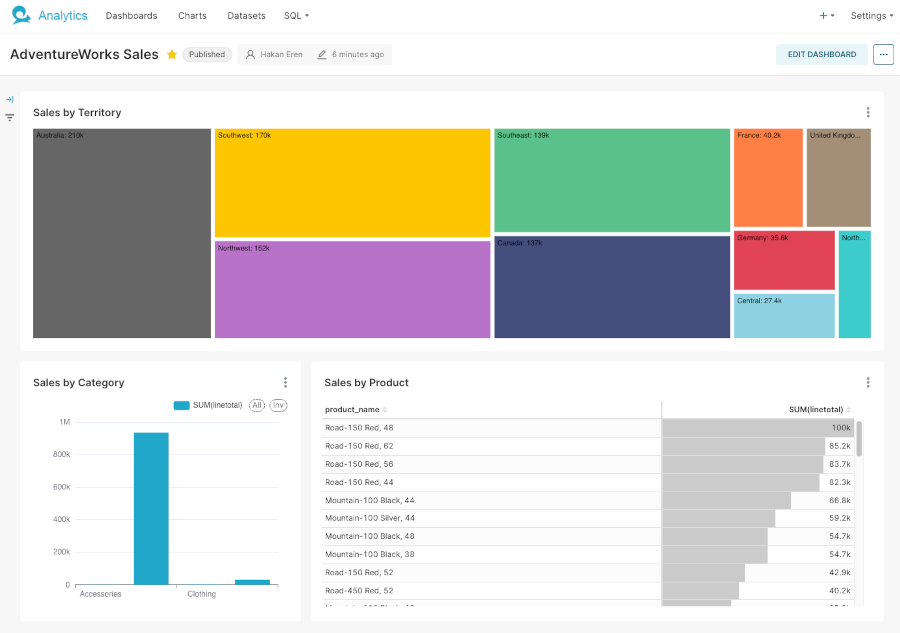

# Practicus AI Analytics Drill-Down / Drill-To-Detail

This guide shows, step by step, how to build a **Territory → Category → Product → Order Detail** drill-down experience in Superset using **AdventureWorks** via **Trino**.

We will:

1. Create **one main fact dataset** with all needed fields.
2. Build **four charts** on top of that dataset.

All references to columns are **guaranteed** to exist in the SQL we define.

## 1. Goal and Target Flow

The final user experience:

1. User clicks a **territory** → all charts filter to that territory.
2. User clicks a **category** → product list narrows to that category.
3. User clicks a **product** → order detail table filters to that product.
4. User can optionally click **Explore** from any chart for deeper drill-to-detail.

All of this is powered by a **single Superset dataset** called `sales_order_detail`.



## 2. Step 1 – Create the Main Dataset `sales_order_detail`

We’ll create a **fact dataset** joining:

- `Sales.SalesOrderDetail` (`sod`)
- `Sales.SalesOrderHeader` (`soh`)
- `Sales.SalesTerritory` (`st`)
- `Production.Product` (`p`)
- `Production.ProductSubcategory` (`ps`)
- `Production.ProductCategory` (`pc`)

This dataset will expose all columns we need:

- `territory_name`
- `category_name`
- `product_name`
- `order_id`
- `order_date`
- `linetotal`
- and more

### 2.1. Open SQL Lab and run the query

In Superset:

1. Go to **SQL Lab → SQL Editor**.
2. Select the **AdventureWorks** / Trino connection.
3. Paste and run the following SQL:

```sql
SELECT
    sod.salesorderid AS order_id,
    sod.salesorderdetailid AS order_detail_id,
    soh.orderdate AS order_date,
    soh.territoryid AS territory_id,
    st.name AS territory_name,
    soh.customerid AS customer_id,
    sod.productid AS product_id,
    p.name AS product_name,
    ps.name AS subcategory_name,
    pc.name AS category_name,
    sod.orderqty AS order_qty,
    sod.unitprice AS unit_price,
    sod.unitpricediscount AS unit_price_discount,
    sod.orderqty * sod.unitprice AS linetotal
FROM adventureworks.sales.salesorderdetail AS sod
JOIN adventureworks.sales.salesorderheader AS soh
    ON sod.salesorderid = soh.salesorderid
LEFT JOIN adventureworks.sales.salesterritory AS st
    ON soh.territoryid = st.territoryid
JOIN adventureworks.production.product AS p
    ON sod.productid = p.productid
LEFT JOIN adventureworks.production.productsubcategory AS ps
    ON p.productsubcategoryid = ps.productsubcategoryid
LEFT JOIN adventureworks.production.productcategory AS pc
    ON ps.productcategoryid = pc.productcategoryid
LIMIT 500;
````

> You can remove the `LIMIT 500` later if you want the full data.

### 2.2. Save as a Superset dataset

1. In SQL Lab, click **“Explore”** or **“Save dataset”**.
2. Name it exactly: **`sales_order_detail`**.
3. Put it under your preferred database/schema.

### 2.3. Verify the important columns

In the dataset column list, confirm that you see at least:

- `territory_name` (from `st.name AS territory_name`)
- `category_name` (from `pc.name AS category_name`)
- `product_name` (from `p.name AS product_name`)
- `order_id`
- `order_date`
- `linetotal`

✅ **Check:**
If all of the above columns exist in the `sales_order_detail` dataset, you are ready to build charts.
If not, fix the SQL before moving on.
**Great, next step.**

## 3. Step 2 – Create Chart 1: Sales by Territory

This is the **top-level entry point** for the drill-down.

### 3.1. Create the chart

1. Go to **Charts → + Chart**.
2. Dataset: **`sales_order_detail`**.
3. Visualization type: **Bar Chart** (you can also use Treemap later).

### 3.2. Configure the query

Use the columns that we know exist:

- **X-axis / Group by:** `territory_name`
- **Metric / Aggregation:** `SUM(linetotal)`

Optional:

- Sort by **descending** `SUM(linetotal)`.

### 3.3. Save and name the chart

- Name: **`Sales by Territory`**
- Save it.

✅ **Check:**
Open the chart alone. Confirm:

- One bar per `territory_name`.
- Values look reasonable.

You don’t need other charts yet—just make sure **territory_name** is there and aggregated by **SUM(linetotal)**.

**Great, next step.**

## 4. Step 3 – Create Chart 2: Sales by Category (Filtered by Territory)

Now we build the **second level**: product **category** breakdown, still using the **same dataset** `sales_order_detail`.

### 4.1. Create the chart

1. **Charts → + Chart**
2. Dataset: **`sales_order_detail`**
3. Visualization: **Bar Chart**

### 4.2. Configure the query

- **X-axis / Group by:** `category_name`
- **Metric / Aggregation:** `SUM(linetotal)`

Optional:

- Add a filter for date if needed, e.g. **`order_date`**.

### 4.3. Save and name the chart

- Name: **`Sales by Category`**
- Save it.

### 4.4. Configure it to receive filters from territory

Because both charts use **the same dataset** and the column `territory_name` is present in that dataset, cross-filters can work directly.

On the **Sales by Category** chart:

1. Open the chart configuration.
2. In **Interaction / Filters / Filter scope**:

   - Ensure it can **receive filters** on the column `territory_name`.

(Exact UI words differ, but the idea is: this chart should apply any filter on `territory_name` coming from the dashboard.)

### 4.5. Quick test (optional, you can also do this after dashboard assembly)

Later, on the dashboard, we’ll verify that clicking a bar in **Sales by Territory** filters **Sales by Category** to that territory.

For now, just confirm:

- `category_name` exists in the dataset and the chart renders correctly.

✅ **Check:**
In the **Sales by Category** chart:

- You see a bar per `category_name`.
- Values are again `SUM(linetotal)`.

**Great, next step.**

## 5. Step 4 – Create Chart 3: Sales by Product (Filtered by Territory + Category)

This is the **third level**, still using `sales_order_detail`.

### 5.1. Create the chart

1. **Charts → + Chart**
2. Dataset: **`sales_order_detail`**
3. Visualization: **Bar Chart** or **Pivot Table** (Bar is simpler for demo).

### 5.2. Configure the query

- **X-axis / Group by:** `product_name`
- **Metric / Aggregation:** `SUM(linetotal)`

### 5.3. Save and name the chart

- Name: **`Sales by Product`**
- Save it.

### 5.4. Configure filters

We want this chart to respond to:

- `territory_name` (from Chart 1)
- `category_name` (from Chart 2)

In chart configuration:

1. Go to the **filter scope / interaction** settings.
2. Ensure this chart **receives filters** on:

   - `territory_name`
   - `category_name`

Again, these columns **both exist** in `sales_order_detail` (we defined them explicitly in Step 1), so you can safely reference them.

✅ **Check:**
Run the chart standalone:

- One bar per `product_name`.
- Metric is `SUM(linetotal)`.

No cross-filter test yet, we’ll do that on the dashboard.

**Great, next step.**

## 6. Step 5 – Create Chart 4: Order Detail Table (Transaction Level)

This is the **lowest level**, showing individual order lines.

### 6.1. Create the chart

1. **Charts → + Chart**
2. Dataset: **`sales_order_detail`**
3. Visualization: **Table**

### 6.2. Choose columns

Use the columns we defined in Step 1:

- `order_id`
- `order_detail_id`
- `order_date`
- `territory_name`
- `category_name`
- `product_name`
- `order_qty`
- `unit_price`
- `linetotal`

Add or remove fields as needed, but ensure at least:

- `territory_name`, `category_name`, `product_name` (for filter propagation).
- Some numeric/value columns like `order_qty` and `linetotal`.

### 6.3. Save and name the chart

- Name: **`Order Detail`**
- Save it.

### 6.4. Configure filters

We want the table to respond to all upstream selections:

- `territory_name`
- `category_name`
- `product_name`

In chart configuration:

1. Go to **filters / filter scope / interaction**.
2. Ensure the table receives filters for **all three** columns.

Now, when filters are emitted by the other charts, this table will be reduced to the matching rows in `sales_order_detail`.

✅ **Check:**
Run the table chart standalone:

- You see multiple rows of data.
- Column names match exactly what we defined in the SQL.

**Great, next step.**

## 7. Step 6 – Build the Dashboard and Wire Drill-Down

Now we’ll assemble everything on a single dashboard and test the drill-down behavior.

### 7.1. Create the dashboard

1. Go to **Dashboards → + Dashboard**.
2. Name it: **`AdventureWorks Sales Drilldown`**.
3. Save.

### 7.2. Add the charts

Edit the dashboard and add:

1. **Row 1**

   - `Sales by Territory` (Chart 1)

2. **Row 2**

   - `Sales by Category` (Chart 2)

3. **Row 3**

   - `Sales by Product` (Chart 3)

4. **Row 4**

   - `Order Detail` (Chart 4)

Arrange them from top to bottom so the drill path is visually obvious.

### 7.3. Configure global filter behavior (if needed)

Depending on your Superset version, you might also:

- Add a **Native filter** for `order_date` (Dataset: `sales_order_detail`).
- Ensure all four charts are in the scope of that filter.

This is optional for drill-down; cross-filter is enough.

### 7.4. Test the drill path end-to-end

1. On the dashboard, click a **territory** bar in **Sales by Territory**.

   - Check that:

     - `Sales by Category` updates to show categories only in that territory.
     - `Sales by Product` is also reduced to that territory.
     - `Order Detail` shows only rows from that territory.

2. Next, click a **category** bar in **Sales by Category**.

   - Check that:

     - `Sales by Product` now shows only products in that category **within the already selected territory**.
     - `Order Detail` further narrows to that category.

3. Finally, click a **product** bar in **Sales by Product**.

   - Check that:

     - `Order Detail` shows order lines only for that product (plus existing territory and category filters).

✅ **Check:**
If, at any step, a chart doesn’t filter:

- Confirm that the column being filtered (`territory_name`, `category_name`, `product_name`) **exists in that chart’s dataset** (it does, because all charts use `sales_order_detail` from Step 1).
- Confirm that the chart is configured to **receive** filters for that column.
- Confirm the top-level chart is configured to **emit** filter events when clicked.

Once all three checks pass, you have a working drill-down.

**Great, next step.**

## 8. Step 7 – Optional: Drill-To-Detail via Explore Links

1. Open the **Order Detail** table chart.
2. In **Customize → Columns** (or column formatting), select `product_name` or `order_id`.
3. Configure it as a **link** pointing to Superset Explore with filters pre-filled, for example:

```text
.../explore/?form_data={"filters":[{"col":"product_id","op":"==","val":"{{ product_id }}"}]}
```

Now, on the dashboard:

- Click a product bar → table filters.
- Click the **link** in a row → opens a new Explore view that shows a chart focused on that product.

This gives you a **“drill-to-detail”** narrative:

- From **high-level territory** → **category** → **product** → **individual order lines** → **full ad-hoc analysis in Explore**.

## 9. Optional – Additional Separate Datasets

If you still want separate datasets like `sales_order_header`, `customer`, `product`, `product_category` for other analyses, you can create them from similar SQL by **reusing pieces of Step 1’s query**. They’re not required for the core drill-down described above, because everything is handled by the enriched `sales_order_detail` dataset.


---

**Previous**: [Analyze](../eda/analyze.md) | **Next**: [Data Processing > Pre Process Data > Preprocess](../../data-processing/pre-process-data/preprocess.md)
