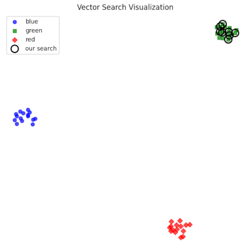

---
jupyter:
  jupytext:
    text_representation:
      extension: .md
      format_name: markdown
      format_version: '1.3'
      jupytext_version: 1.17.3
  kernelspec:
    display_name: Practicus GenAI
    language: python
    name: practicus_genai
---

# Vector Visualization with Milvus

This example shows how to:

1. Connect to a running Milvus instance.
2. Insert a handful of vectors.
3. Run a similarity search.
4. Visualize all vectors and the top-k neighbors in 2D using **t-SNE**.


## 1. Setup and connect to Milvus

Adjust `host` and `port` below if your Milvus instance is not on `localhost:19530`.

```python
milvus_host = None  # E.g. practicus-milvus.prt-ns-milvus.svc.cluster.local
milvus_uri = f"http://{milvus_host}"
milvus_port = 19530
milvus_token = None  # e.g. "root:Milvus"
```

```python
assert milvus_host, "Please enter your Milvus host."
assert milvus_token, "Please enter your Milvus token."
```

```python
from pymilvus import (
    connections,
    FieldSchema,
    CollectionSchema,
    DataType,
    Collection,
    utility,
)

import numpy as np
from sklearn.manifold import TSNE
import matplotlib.pyplot as plt

connections.connect("default", host=milvus_host, port=milvus_port, token=milvus_token)


print("Connected to Milvus.")
```

## 2. Create a collection for manual vectors
We create a small collection with:

- `id`: primary key  
- `label`: a simple tag for each cluster  
- `vector`: a 4‑dimensional float vector

```python
collection_name: str = "demo_manual_vectors_tsne"

# Drop the collection if it already exists (for repeatable demos)
if utility.has_collection(collection_name):
    utility.drop_collection(collection_name)

vector_dim: int = 4

fields: list[FieldSchema] = [
    FieldSchema(
        name="id",
        dtype=DataType.INT64,
        is_primary=True,
        auto_id=False,
    ),
    FieldSchema(
        name="label",
        dtype=DataType.VARCHAR,
        max_length=20,
    ),
    FieldSchema(
        name="vector",
        dtype=DataType.FLOAT_VECTOR,
        dim=vector_dim,
    ),
]

schema: CollectionSchema = CollectionSchema(
    fields=fields,
    description="Manual vectors demo for visualization",
)

collection: Collection = Collection(
    name=collection_name,
    schema=schema,
)

print(f"Created collection: {collection_name}")
```

## 3. Insert sample vectors

We manually construct three tight clusters in 4D space (`red`, `green`, `blue`).  
Later we will show that a query near the `green` cluster retrieves neighbors from that region and t‑SNE places them close together in 2D.

```python
rng = np.random.default_rng(seed=42)

points_per_cluster: int = 15

cluster_centers: dict[str, np.ndarray] = {
    "red": np.array([0.0, 0.0, 0.0, 0.0]),
    "green": np.array([5.0, 5.0, 5.0, 5.0]),
    "blue": np.array([-5.0, 5.0, -5.0, 5.0]),
}

all_vectors: list[list[float]] = []
all_labels: list[str] = []
all_ids: list[int] = []

current_id: int = 0

for label, center in cluster_centers.items():
    for _ in range(points_per_cluster):
        # Small Gaussian noise around each center (still 100% synthetic, not ML embeddings)
        vec: np.ndarray = center + rng.normal(loc=0.0, scale=0.8, size=vector_dim)
        all_vectors.append(vec.tolist())
        all_labels.append(label)
        all_ids.append(current_id)
        current_id += 1

# One query vector placed near the "green" cluster
query_vector: list[float] = (cluster_centers["green"] + rng.normal(loc=0.0, scale=0.5, size=vector_dim)).tolist()

insert_result = collection.insert(
    [
        all_ids,
        all_labels,
        all_vectors,
    ]
)

collection.flush()
print(f"Inserted {len(all_ids)} entities.")

```

## 4. Index, load, and run a similarity search

We build a simple IVF index and search for the nearest neighbors of our query vector, which is close to the `green` cluster.

```python
index_params: dict = {
    "metric_type": "L2",
    "index_type": "IVF_FLAT",
    "params": {"nlist": 64},
}

collection.create_index(
    field_name="vector",
    index_params=index_params,
)

collection.load()

top_k: int = 8
search_params: dict = {
    "metric_type": "L2",
    "params": {"nprobe": 8},
}

search_results = collection.search(
    data=[query_vector],
    anns_field="vector",
    param=search_params,
    limit=top_k,
    output_fields=["label"],
)

hits = search_results[0]
neighbor_ids: list[int] = [hit.id for hit in hits]

print("Top-k neighbors for the query vector:")
for rank, hit in enumerate(hits, start=1):
    print(f"{rank:2d}. id={hit.id}, label={hit.entity.get('label')}, distance={hit.distance:.4f}")

```

## 5. Visualize with t‑SNE

We project the 4D vectors down to 2D with t‑SNE and:

- Color each point by its cluster label (`red`, `green`, `blue`).
- Highlight the **top‑k neighbors** returned by Milvus with a bold outline.

This gives a compact, visually compelling picture of how vector similarity turns into neighborhood structure in the 2D plot.


```python
# Convert to numpy for t-SNE
vectors_np = np.array(all_vectors)
labels_np = np.array(all_labels)

tsne = TSNE(
    n_components=2,
    perplexity=10,
    random_state=42,
    init="random",
    learning_rate="auto",
)

vectors_2d = tsne.fit_transform(vectors_np)

# Mark neighbors
neighbor_mask = np.isin(all_ids, neighbor_ids)

plt.figure(figsize=(6, 6))

unique_labels = sorted(set(all_labels))
markers = ["o", "s", "D", "^", "v"]

# Explicit color map so names match the visual colors
color_map: dict[str, str] = {
    "red": "red",
    "green": "green",
    "blue": "blue",
}

for i, label in enumerate(unique_labels):
    label_mask = labels_np == label
    plt.scatter(
        vectors_2d[label_mask, 0],
        vectors_2d[label_mask, 1],
        marker=markers[i % len(markers)],
        alpha=0.7,
        label=label,
        color=color_map.get(label, "gray"),  # ← key line
    )

# Highlight Milvus neighbors (outline only)
plt.scatter(
    vectors_2d[neighbor_mask, 0],
    vectors_2d[neighbor_mask, 1],
    s=150,
    facecolors="none",
    edgecolors="black",
    linewidths=2,
    label="our search",
)

plt.title("Vector Search Visualization")
plt.axis("off")
plt.legend(loc="best")
plt.tight_layout()
plt.show()
```

You should get a vector search visualization view like the below, displaying our search vectors distance to the existing vectors.




## 6. Cleaning up

```python
if utility.has_collection(collection_name):
    utility.drop_collection(collection_name)
    print(f"Collection '{collection_name}' dropped.")
else:
    print(f"Collection '{collection_name}' does not exist.")

```


---

**Previous**: [API Triggers For Airflow](../../workflows/api-triggers-for-airflow.md) | **Next**: [Databases > Using Databases](../databases/using-databases.md)
