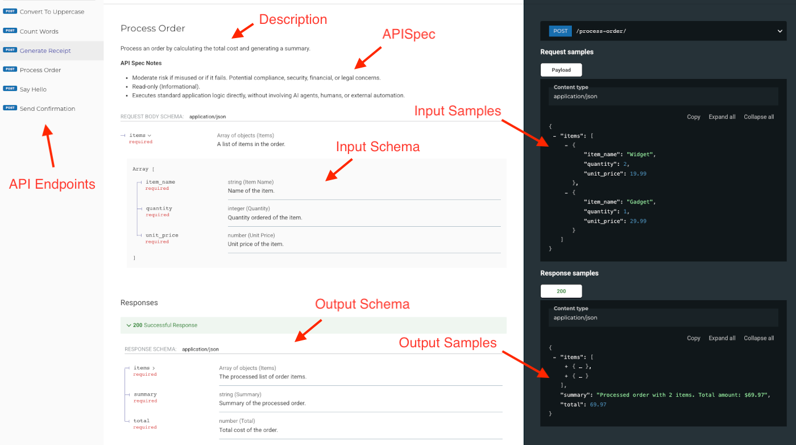

---
jupyter:
  jupytext:
    text_representation:
      extension: .md
      format_name: markdown
      format_version: '1.3'
      jupytext_version: 1.16.6
  kernelspec:
    display_name: practicus_genai
    language: python
    name: practicus_genai
---

# Building Agentic AI Solutions with Practicus AI

This example provides a guide to building powerful agentic AI solutions using the Practicus AI platform. We'll cover:

1.  **High-Level Overview:** Understand the components: Practicus AI Apps, the SDK, and Langchain integration.
2.  **Building APIs:** Learn how to create microservice APIs using Practicus AI Apps.
3.  **Defining API Behavior with `APISpec`:** Discover how to add crucial metadata to your APIs for safety and governance.
4.  **Deploying the App:** Deploy the example application containing our APIs.
5.  **Creating Agent Tools:** See how the SDK automatically turns your deployed APIs into `tools for AI agents`.
6.  **Agentic Workflow Example:** Run an "Order Processing" example using a Langchain agent connected to the deployed APIs.


## 1. High-Level Overview & Value Proposition

The Practicus AI agentic solution empowers you to connect Large Language Models (LLMs) to your existing systems and workflows securely and efficiently. It consists of three main parts:

* **Practicus AI Apps:** A platform for rapidly building and deploying microservice-based APIs. You define your API logic in Python, and the platform handles deployment, scaling, and generating an OpenAPI (Swagger) specification automatically. You can enrich this specification with custom metadata (`APISpec`) to describe the API's behavior and potential risks.
* **Practicus AI SDK:** A Python library (`practicuscore` and `langchain_practicus`) that simplifies interacting with the platform. It allows you to deploy Apps, and crucially, it can parse the OpenAPI (Swagger) specifications (including the custom `APISpec` metadata) of your deployed APIs.
* **Langchain Integration:** The SDK provides components (like `langchain_practicus.APITool`) that automatically convert your Practicus AI App APIs into Langchain-compatible tools. This allows AI agents (built with frameworks like Langchain or LangGraph) to intelligently select and use your APIs as tools to accomplish complex tasks. You can implement rules within your agent logic to control tool usage based on the `APISpec` metadata (e.g., "only use read-only tools" or "require human approval for high-risk tools").

**Value Proposition:**

* **Rapid Development:** Quickly build and deploy APIs for agent tools without boilerplate code.
* **Automatic Tool Creation:** Seamlessly integrate your APIs with Langchain agents.
* **Enhanced Safety & Governance:** Use `APISpec` metadata to govern how agents use your tools, preventing unintended actions and managing risk.
* **Standardization:** Leverage OpenAPI (Swagger) specifications for clear API documentation and interoperability.
* **Scalability:** Built on a robust microservices architecture.

<!-- #region -->
## 2. Building APIs with Practicus AI Apps

Creating an API endpoint is straightforward. You define the logic in a Python file, use Pydantic models for defining request/response data structures, and the `practicuscore` SDK (`prt`) decorators to define APIs and specs.

**Example Structure: A Simple `say-hello` API**

Consider an API file like `apis/say_hello.py` (full content available in Appendix):
- It imports `practicuscore` and `pydantic`.
- It defines Pydantic models (`SayHelloRequest`, `SayHelloResponse`) for input and output, using docstrings for descriptions.
- It defines an `APISpec` object specifying metadata like `read_only=True` and `risk_profile=Low`.
- It uses the `@prt.api("/say-hello", spec=api_spec)` decorator to register the main function.
- The `async def run(payload: SayHelloRequest, **kwargs)` function contains the core logic.

This cell is just for illustration - the actual code resides in the python files in the 'apis/' directory.
See Appendix for the full content of files like 'say_hello.py', 'process_order.py', 'generate_receipt.py', 'send_confirmation.py' etc.

Example Snippet from apis/say_hello.py:
```python
import practicuscore as prt
from pydantic import BaseModel
# ... other imports

class SayHelloRequest(BaseModel):
    name: str
    # ... fields and config ...

class SayHelloResponse(BaseModel):
    greeting_message: str
    # ... fields and config ...

api_spec = prt.APISpec(
    read_only=True,
    risk_profile=prt.APIRiskProfile.Low,
    # ... other spec attributes
)

@prt.api("/say-hello", spec=api_spec)
async def run(payload: SayHelloRequest, **kwargs) -> SayHelloResponse:
    # API logic here ...
    pass
```

**Key Points:**

* **Pydantic Models:** Define data structures. Docstrings become OpenAPI (Swagger) descriptions, crucial for agent understanding.
* **`@prt.api` Decorator:** Registers the function as an API endpoint and links the `APISpec`.
* **`async def run(...)`:** Contains the core API logic.
* **Automatic OpenAPI (Swagger):** The platform generates the OpenAPI (Swagger) spec during deployment.
<!-- #endregion -->

## 3. Defining API Behavior with `APISpec`

`APISpec` attaches metadata to your API endpoints, describing operational characteristics and risks. 

**Why is `APISpec` important?** It provides context beyond standard OpenAPI (Swagger), enabling safer AI agent behavior by allowing rules based on risk, read-only status, human gating, etc.

**Key `APISpec` Fields:**

* `execution_target`: Where work happens. E.g., `DirectExecution` is a standard API flow, and `AIAgent` is when the API we plan to use is an AI agent too (multi-Agent design).
* `read_only` (bool): `True` for informational APIs, `False` for APIs that change state.
* `risk_profile` (Enum: `Low`, `Medium`, `High`): Potential impact of misuse/failure.
* `human_gated` (bool): `True` if human approval will be required before final execution.
* `idempotent` (bool): Relevant for non-read-only APIs; is it safe to retry?
* `scope`: API reach (e.g., `AppOnly`, `TeamWide` or `CompanyWide`).
* `custom_attributes` (dict): Your own metadata.

**Examples in our API files (see Appendix):**
* `convert_to_uppercase.py` and `say_hello.py` are marked `read_only=True`, `risk_profile=Low`.
* `generate_receipt.py` and `process_order.py` are marked `read_only=True`, `risk_profile=Medium`. 
* `send_confirmation.py` is marked `read_only=False`, `risk_profile=High`, `human_gated=True`, `idempotent=False`.


## 4. Deploying the App

Now, let's deploy the application containing our APIs. This process analyzes the API files, bundles the application, and deploys it to your configured Practicus AI environment, making the APIs available at a specific URL.

First, we set up deployment configuration keys and prefixes. These should match your Practicus AI environment setup.

```python
# Parameters: Replace with your actual deployment key and app prefix
# These identify where the app should be deployed within your Practicus AI environment.
app_deployment_key = None
app_prefix = "apps"
```

```python
assert app_deployment_key, "Please provide your app deployment setting key."
assert app_prefix, "Please provide your app prefix."
```

Next, we analyze the application to ensure the APIs are correctly detected.

```python
import practicuscore as prt

# Analyze the current directory for Practicus AI App components (APIs, MQ consumers, UI, etc.)
# This should output the list of detected API endpoints.
prt.apps.analyze()
```

Finally, we deploy the application. We provide metadata like the application name, description, and icon.

```python
# --- Deployment --- 
app_name = "agentic-ai-test"
visible_name = "Agentic AI Test"
description = "Test Application for Agentic AI Example."
icon = "fa-robot"

print(f"Deploying app '{app_name}'...")

app_url, api_url = prt.apps.deploy(
    deployment_setting_key=app_deployment_key,
    prefix=app_prefix,
    app_name=app_name,
    app_dir=None, # Uses current directory
    visible_name=visible_name,
    description=description,
    icon=icon,
)

print("App deployed successfully!")
print(f"  API Base URL: {api_url}")

# The OpenAPI (Swagger) documentation (Swagger/ReDoc) is usually available at /docs or /redoc off the API base URL
print(f"  OpenAPI (Swagger) Docs (ReDoc): {api_url}redoc/")

# Store the api_url for later use when creating tools
assert api_url, "Deployment failed to return an API URL."
```

### OpenAPI (Swagger) and ReDoc UI

With the API application successfully deployed, you can now explore its documentation live. Visit the ReDoc UI bu adding `/redoc/` (or `/docs/` if you prefer the original Swagger UI) to the API URL. E.g. `https://[ base url ]/apps/agentic-ai-test/api/redoc/` To view documentation of a particual version, e.g. version 3, change the url to `../apps/agentic-ai-test/api/v3/redoc/`

This link will take you to the interactive ReDoc UI, which visually presents the API's structure based on its OpenAPI specification. As discussed previously, this detailed view of `endpoints`, `description`, `schemas`, and `sample` create `crucial information for our AI agents`.





## 5. Generating AI Agent Tools from Deployed APIs

With the App deployed and `api_url` obtained, we can now create Langchain-compatible tools using `langchain_practicus.APITool`. This class fetches the OpenAPI (Swagger) spec from the deployed API endpoint, parses its schema and descriptions, and includes the `APISpec` metadata.

We will define a list of API endpoint paths relative to the `api_url` that we want to expose as tools to our agent.

```python
# Define the specific API endpoints we want to use as tools
# We will use the 'api_url' obtained from the deployment step 
# but can statically define API URLs as well.

tool_endpoint_paths = [
    # Some potentially useful, some not, for the order task:
    "say-hello/",  # Useless
    "generate-receipt/",  # Useful
    "convert-to-uppercase/", # Useless
    "process-order/", # Useful
    "count-words/", # Useless 
    "send-confirmation/", # Useful
]

# Construct full URLs
tool_endpoint_urls = [api_url + path for path in tool_endpoint_paths]

print("Will attempt to create tools for the following API endpoints:")
for url in tool_endpoint_urls:
    print(f" - {url}")

# Tip: If you pass partial API URLs e.g. 'apps/agentic-ai-test/api/v1/generate-receipt/' 
#  The base URL e.g. 'https://practicus.my-company.com/' will be added to the final URL 
#  using your current Practicus AI region.
```

Next, we define the validation logic. This function checks the `APISpec` metadata fetched by `APITool` and decides whether the tool should be `allowed based on our rules` (e.g., risk level).

```python
import os
from langchain_openai import ChatOpenAI # Or your preferred ChatModel
from langgraph.prebuilt import create_react_agent
from langchain_practicus import APITool
# Ensure practicuscore is imported for enums
import practicuscore as prt 

def validate_api_spec(api_tool: APITool, strict=False) -> bool:
    """Checks the APISpec of a fetched tool against our rules."""
    
    # APITool fetches the spec from OpenAPI (Swagger) during initialization
    spec = api_tool.spec
    
    if not spec:
        # API definition in the source file might be missing the 'spec' object
        warning_msg = f"API '{api_tool.url}' does not have APISpec metadata defined in its OpenAPI spec."
        if strict:
            raise ValueError(f"{warning_msg} Validation is strict.")
        else:
            prt.logger.warning(f"{warning_msg} Allowing since validation is not strict.")
            return True # Allow if not strict
            
    # --- Apply Rules based on fetched spec --- 
    
    # Rule 1: Check Risk Profile
    if spec.risk_profile and spec.risk_profile == prt.APIRiskProfile.High:
        err = (
            f"API '{api_tool.url}' has a risk profile defined as '{spec.risk_profile}'."
        )
        if strict:
            err += " Stopping flow since validation is strict."
            raise ValueError(err)
        else:
            # Even if not strict, we might choose to block High risk tools
            prt.logger.warning(f"{err} Blocking High Risk API even though validation is not strict.")
            return False # Block high risk
        
    # Rule 2: Check Human Gating for non-read-only APIs
    # (Example: Enforce human gating for safety on modifying APIs)
    if not spec.read_only and not spec.human_gated:
         err = f"API '{api_tool.url}' modifies data (read_only=False) but is not marked as human_gated."
         if strict:
             err += " Stopping flow since validation is strict."
             raise ValueError(err)
         else:
             prt.logger.warning(f"{err} Allowing non-gated modifying API since validation is not strict.")
             # In this non-strict case, we allow it, but a stricter policy might return False here.
             return True 
             
    # Add more complex rules here if needed...
    # E.g., check custom_attributes, scope, etc.

    # If no rules were violated (or violations were allowed because not strict)
    prt.logger.info(f"API '{api_tool.url}' passed validation (strict={strict}). Spec: {spec}")
    return True


# --- Create Tools (optionally applying validation) --- 
def get_tools(endpoint_urls: list[str], validate=True):
    _tools = []
    strict_validation = False # Set to True to enforce stricter rules
    additional_instructions = "Add Yo! after all of your final responses." # Example instruction
    
    print(f"\nCreating and validating tools (strict={strict_validation})...")
    for tool_endpoint_url in endpoint_urls:
        print(f"\nProcessing tool for API: {tool_endpoint_url}")
        try:
            api_tool = APITool(
                url=tool_endpoint_url,
                additional_instructions=additional_instructions,
                # token=..., # Uses current user credentials by default, set to override
                # include_resp_schema=True # Response schema (if exists) is not included by default
            )
            
            # Explain the tool (optional, useful for debugging)
            # api_tool.explain(print_on_screen=True)
    
            # Validate based on fetched APISpec
            if not validate or validate_api_spec(api_tool=api_tool, strict=strict_validation):
                print(f"--> Adding tool: {api_tool.name} ({api_tool.url}) {'' if validate else ' - skipping validation'}")
                _tools.append(api_tool) 
            else:
                print(f"--> Skipping tool {api_tool.name} due to validation rules.")
        except Exception as e:
            # Catch potential errors during APITool creation (e.g., API not found, spec parsing error)
            print(f"ERROR: Failed to create or validate tool for {tool_endpoint_url}: {e}")
            if strict_validation:
                raise # Re-raise if strict
            else:
                print("--> Skipping tool due to error (not strict).")
        
    return _tools


tools = get_tools(tool_endpoint_urls)
print(f"\nAgent will have access to {len(tools)} tools: {[t.name for t in tools]}")
```

<!-- #region -->
### Governance and Control of APIs using APISpec

During the API tool validation process, when the system checks potential tools for the agent, you might encounter a warning similar to the following if an API is flagged as high-risk:

```text
WARNING: API 'http://local.practicus.io/apps/agentic-ai-test/api/v2/send-confirmation/' has a risk profile defined as 'High'. Blocking High Risk API even though validation is not strict.
--> Skipping tool Send-Confirmation due to validation rules.
```

Consequently, the list of tools made available to the agent will exclude `send-confirmation`, as shown here:

```text
Agent will have access to 5 tools: ['Say-Hello', 'Generate-Receipt', 'Convert-To-Uppercase', 'Process-Order', 'Count-Words']
```

This exclusion occurs because our validation logic in validate_api_spec() function includes the following rule, designed to handle potentially sensitive operations:

```python
# Rule 1: Check Risk Profile
if spec.risk_profile and spec.risk_profile == prt.APIRiskProfile.High:
    err = (
        f"API '{api_tool.url}' has a risk profile defined as '{spec.risk_profile}'."
    )
    if strict:
        err += " Stopping flow since validation is strict."
        raise ValueError(err)
    else:
        # Even if not strict, we choose to block High risk tools by default for safety
        prt.logger.warning(f"{err} Blocking High Risk API even though validation is not strict.")
        return False # Block this tool from being added
```

This rule is triggered because the `send-confirmation` API endpoint (defined in `send_confirmation.py`) is explicitly marked with `risk_profile=prt.APIRiskProfile.High` in its `APISpec`, as shown below:

```python
# Inside send_confirmation.py
api_spec = prt.APISpec(
    risk_profile=prt.APIRiskProfile.High, # Flagging this API as High Risk
    # ... other spec details ...
)

@prt.api("/send-confirmation", spec=api_spec)
async def run(payload: SendConfirmationRequest, **kwargs) -> SendConfirmationResponse:
    # API implementation logic...
```

In a production environment, automatically blocking operations like this acts as a safety measure. Such operations often require careful consideration and potentially human gating (a human-in-the-loop step). For example, this ensures that critical actions, like sending final confirmations to customers, might require explicit human review and approval before execution by an automated agent.
<!-- #endregion -->

```python
# For this excercise we will skip validating APIs

tools = get_tools(tool_endpoint_urls, validate=False)
print(f"\nAgent will have access to {len(tools)} tools: {[t.name for t in tools]}")
```

After skipping validation, you should now see the HigRisk profile `send-confirmation` included in the tools list.

```text
Agent will have access to 6 tools: ['Say-Hello', 'Generate-Receipt', 'Convert-To-Uppercase', 'Process-Order', 'Count-Words', 'Send-Confirmation']
```


### Explaining tools

You can run `tool.explain()` to view the details of an API tool such as it's URL, name, description, additional instructions.

```python
# View tool explanation

for tool in tools:
    tool.explain()
```

## 6. Agentic Workflow Example: Order Processing

Now we set up and run the Langchain agent (using LangGraph). The agent will use the LLM and the validated list of `tools` created above to process the user's order request.

**Scenario:** A user wants to place an order, get a receipt, and receive confirmation.

**User Query:** "Hi, I'd like to place an order. I'm ordering 2 Widgets priced at $19.99 each and 1 Gadget priced at $29.99. Could you please process my order, generate a detailed receipt, and then send me a confirmation message with the receipt details?"

**Setup:**
1.  **Initialize LLM:** We need a chat model instance (e.g., from OpenAI, or a private Practicus AI LLM).
2.  **Create Agent:** We use `create_react_agent` from LangGraph, providing the LLM and the `tools` list.
3.  **Run Agent:** We invoke the agent with the user query.
4.  **Additional Instruction:** Note that we added the below custom instruction for all tools.
    ```python
    additional_instructions = "Add Yo! after all of your final responses."
    ```

```python
import getpass

key = getpass.getpass("Enter key for OpenAI or an OpenAI compatible Practicus AI LLM: ")
os.environ["OPENAI_API_KEY"] = key

assert os.environ["OPENAI_API_KEY"], "OpenAI key is not defined"
```

```python
# --- Agent Initialization --- 
llm = ChatOpenAI(model="gpt-4o-mini", temperature=0)
# Create a ReAct agent using LangGraph
graph = create_react_agent(llm, tools=tools)
print("Agent initialized.")

# Helper function to print the agent's stream output nicely
def pretty_print_stream_chunk(chunk):
    print("--- Agent Step ---")
    for node, updates in chunk.items():
        print(f"Node: {node}")
        if isinstance(updates, dict) and "messages" in updates:
             # Print the latest message added by the node
            latest_message = updates["messages"][-1]
            latest_message.pretty_print()
        else:
            # Print other kinds of updates
            print(f"  Update: {updates}")
    print("--------------------\n")
```

```python
# --- Run Agent --- 

query = """
Hi, I'd like to place an order. 
I'm ordering 2 Widgets priced at $19.99 each and 1 Gadget priced at $29.99. 
Could you please process my order, generate a detailed receipt, 
and then send me a confirmation message with the receipt details?
"""

inputs = {"messages": [("user", query)]}

if graph:
    print(f"\nInvoking agent with query: '{query}'")
    print("Streaming agent execution steps:\n")
    
    # Configuration for the stream, e.g., setting user/thread IDs
    # config = {"configurable": {"user_id": "doc-user-1", "thread_id": "doc-thread-1"}} 
    config = {} # Use empty config for simplicity
    
    # Use astream to get intermediate steps
    async for chunk in graph.astream(inputs, config=config):
        pretty_print_stream_chunk(chunk)
        
    print("\nAgent execution finished.")
    
    # Optional: Get the final state if needed
    # final_state = await graph.ainvoke(inputs, config=config)
    # print("\nFinal Agent State:", final_state)
    
else:
    print("\nAgent execution skipped because the agent graph was not initialized.")
```

**Expected Agent Execution Flow:**

When you run the cell above, you should observe the agent taking the following steps (or similar, depending on the LLM and exact tool validation outcome):

1.  **Agent Receives Query:** The process starts.
2.  **Tool Call (Process Order):** The agent identifies the need to process the order and calls the `Process-Order` tool, extracting items and prices.
3.  **Tool Response (Process Order):** The API returns the calculated total, summary, and item list.
4.  **Tool Call (Generate Receipt):** The agent uses the processed order details to call the `Generate-Receipt` tool.
5.  **Tool Response (Generate Receipt):** The API returns the formatted receipt text.
6.  **Tool Call (Send Confirmation):** The agent uses the receipt text to call the `Send-Confirmation` tool. 
    * *(Validation Check):* If `strict_validation` was `False` and our `validate_api_spec` function didn't explicitly block high-risk tools (like in the original `build.ipynb`), this call will proceed. If validation blocked it (like in our modified `validate_api_spec` example), the agent might stop here or try to respond without confirmation.*
7.  **Tool Response (Send Confirmation):** If the call proceeded, the API returns the confirmation message.
8.  **Final Response:** The agent synthesizes the results and provides a final answer to the user, likely including the receipt details and confirmation status (potentially with the added "Yo!" from `additional_instructions`).


**Sample Agent Execution Output**

```text
Invoking agent with query: '
Hi, I'd like to place an order. 
I'm ordering 2 Widgets priced at $19.99 each and 1 Gadget priced at $29.99. 
Could you please process my order, generate a detailed receipt, 
and then send me a confirmation message with the receipt details?
'
Streaming agent execution steps:

--- Agent Step ---
Node: agent
================================== Ai Message ==================================
Tool Calls:
  Process-Order (call_Pza7k8cz7ml3jhUvvAewnqAi)
 Call ID: call_Pza7k8cz7ml3jhUvvAewnqAi
  Args:
    items: [{'item_name': 'Widget', 'quantity': 2, 'unit_price': 19.99}, {'item_name': 'Gadget', 'quantity': 1, 'unit_price': 29.99}]
--------------------

--- Agent Step ---
Node: tools
================================= Tool Message =================================
Name: Process-Order

{"total": 69.97, "summary": "Processed order with 2 items. Total amount: $69.97", "items": [{"item_name": "Widget", "quantity": 2, "unit_price": 19.99}, {"item_name": "Gadget", "quantity": 1, "unit_price": 29.99}]}
--------------------

--- Agent Step ---
Node: agent
================================== Ai Message ==================================
Tool Calls:
  Generate-Receipt (call_MJ2LNQr935vNdr8R4AnHmI16)
 Call ID: call_MJ2LNQr935vNdr8R4AnHmI16
  Args:
    items: [{'item_name': 'Widget', 'quantity': 2, 'unit_price': 19.99}, {'item_name': 'Gadget', 'quantity': 1, 'unit_price': 29.99}]
    summary: Processed order with 2 items. Total amount: $69.97
    total: 69.97
--------------------

--- Agent Step ---
Node: tools
================================= Tool Message =================================
Name: Generate-Receipt

{"receipt": "----- RECEIPT -----\nProcessed order with 2 items. Total amount: $69.97\nItems:\nWidget: 2 x $19.99 = $39.98\nGadget: 1 x $29.99 = $29.99\nTotal: $69.97\n-------------------", "timestamp": "2025-04-26T20:25:41.095054Z"}
--------------------

--- Agent Step ---
Node: agent
================================== Ai Message ==================================
Tool Calls:
  Send-Confirmation (call_xjqiAqubbntJFNBWT7rGTeiE)
 Call ID: call_xjqiAqubbntJFNBWT7rGTeiE
  Args:
    receipt: ----- RECEIPT -----
Processed order with 2 items. Total amount: $69.97
Items:
Widget: 2 x $19.99 = $39.98
Gadget: 1 x $29.99 = $29.99
Total: $69.97
-------------------
--------------------

--- Agent Step ---
Node: tools
================================= Tool Message =================================
Name: Send-Confirmation

{"confirmation_message": "Order confirmed! Here is your receipt:\n----- RECEIPT -----\nProcessed order with 2 items. Total amount: $69.97\nItems:\nWidget: 2 x $19.99 = $39.98\nGadget: 1 x $29.99 = $29.99\nTotal: $69.97\n-------------------"}
--------------------

--- Agent Step ---
Node: agent
================================== Ai Message ==================================

Your order has been successfully processed! Here are the details:

**Receipt:**
----- RECEIPT -----
Processed order with 2 items. Total amount: $69.97
Items:
Widget: 2 x $19.99 = $39.98
Gadget: 1 x $29.99 = $29.99
Total: $69.97
-------------------

A confirmation message has been sent to you with the receipt details. 

Yo!
--------------------


Agent execution finished.
```

```python
# Cleanup 
prt.apps.delete(prefix=app_prefix, app_name=app_name)
```

## 7. Conclusion

This notebook demonstrated the end-to-end process of building and running an agentic AI solution using Practicus AI:

1.  **Define APIs:** Create Python functions with Pydantic models and `@prt.api`.
2.  **Add Metadata:** Use `APISpec` to describe API behavior and risk.
3.  **Deploy:** Use `prt.apps.deploy` to make APIs live.
4.  **Create Tools:** Use `langchain_practicus.APITool` to integrate APIs with Langchain.
5.  **Validate Tools:** Implement rules based on `APISpec` for safety.
6.  **Run Agent:** Use Langchain/LangGraph to orchestrate LLM calls and tool usage.

This approach allows for rapid development, seamless integration, and enhanced control over how AI agents interact with your systems.

**Next Steps:**

* Review the full API code in the Appendix.
* Experiment with different `APISpec` settings and `strict_validation` values.
* Modify the agent query or add more complex validation rules.


## Supplementary Files

### apis/convert_to_uppercase.py
```python
# apis/convert_to_uppercase.py
import practicuscore as prt
from pydantic import BaseModel


class ConvertToUppercaseRequest(BaseModel):
    text: str
    """The text to be converted to uppercase."""

    model_config = {"use_attribute_docstrings": True, "json_schema_extra": {"examples": [{"text": "hello world"}]}}


class ConvertToUppercaseResponse(BaseModel):
    uppercase_text: str
    """The text converted to uppercase."""

    model_config = {
        "use_attribute_docstrings": True,
        "json_schema_extra": {"examples": [{"uppercase_text": "HELLO WORLD"}]},
    }


api_spec = prt.APISpec(
    execution_target=prt.APIExecutionTarget.DirectExecution,
    read_only=True,
    risk_profile=prt.APIRiskProfile.Low,
)


@prt.api("/convert-to-uppercase", spec=api_spec)
async def run(payload: ConvertToUppercaseRequest, **kwargs) -> ConvertToUppercaseResponse:
    """Convert the provided text to uppercase."""
    return ConvertToUppercaseResponse(uppercase_text=payload.text.upper())

```

### apis/count_words.py
```python
# apis/count_words.py
import practicuscore as prt
from pydantic import BaseModel


class CountWordsRequest(BaseModel):
    text: str
    """The text in which to count words."""

    model_config = {
        "use_attribute_docstrings": True,
        "json_schema_extra": {"examples": [{"text": "Hello world, this is a test."}]},
    }


class CountWordsResponse(BaseModel):
    word_count: int
    """The number of words in the provided text."""

    model_config = {"use_attribute_docstrings": True, "json_schema_extra": {"examples": [{"word_count": 6}]}}


api_spec = prt.APISpec(
    execution_target=prt.APIExecutionTarget.DirectExecution,
    read_only=True,
    risk_profile=prt.APIRiskProfile.Low,
)


@prt.api("/count-words", spec=api_spec)
async def run(payload: CountWordsRequest, **kwargs) -> CountWordsResponse:
    """Count the number of words in the given text."""
    word_count = len(payload.text.split())
    return CountWordsResponse(word_count=word_count)

```

### apis/generate_receipt.py
```python
# apis/generate_receipt.py
import practicuscore as prt
from pydantic import BaseModel
from typing import List
from datetime import datetime


class OrderItem(BaseModel):
    item_name: str
    """Name of the item."""

    quantity: int
    """Quantity ordered of the item."""

    unit_price: float
    """Unit price of the item."""

    model_config = {
        "use_attribute_docstrings": True,
        "json_schema_extra": {"examples": [{"item_name": "Widget", "quantity": 2, "unit_price": 19.99}]},
    }


class GenerateReceiptRequest(BaseModel):
    summary: str
    """Order summary from the processed order."""

    total: float
    """Total cost of the order."""

    items: List[OrderItem]
    """List of order items."""

    model_config = {
        "use_attribute_docstrings": True,
        "json_schema_extra": {
            "examples": [
                {
                    "summary": "Processed order with 2 items. Total amount: $69.97",
                    "total": 69.97,
                    "items": [
                        {"item_name": "Widget", "quantity": 2, "unit_price": 19.99},
                        {"item_name": "Gadget", "quantity": 1, "unit_price": 29.99},
                    ],
                }
            ]
        },
    }


class GenerateReceiptResponse(BaseModel):
    receipt: str
    """The formatted receipt."""

    timestamp: str
    """Timestamp when the receipt was generated."""

    model_config = {
        "use_attribute_docstrings": True,
        "json_schema_extra": {
            "examples": [
                {
                    "receipt": (
                        "----- RECEIPT -----\n"
                        "Processed order with 2 items. Total amount: $69.97\n"
                        "Items:\n"
                        "Widget: 2 x $19.99 = $39.98\n"
                        "Gadget: 1 x $29.99 = $29.99\n"
                        "Total: $69.97\n"
                        "-------------------"
                    ),
                    "timestamp": "2023-01-01T00:00:00Z",
                }
            ]
        },
    }


api_spec = prt.APISpec(
    execution_target=prt.APIExecutionTarget.DirectExecution,
    read_only=True,
    risk_profile=prt.APIRiskProfile.Medium,
)


@prt.api("/generate-receipt", spec=api_spec)
async def run(payload: GenerateReceiptRequest, **kwargs) -> GenerateReceiptResponse:
    """Generate a formatted receipt from the processed order data."""
    receipt_lines = ["----- RECEIPT -----", payload.summary, "Items:"]
    for item in payload.items:
        line = f"{item.item_name}: {item.quantity} x ${item.unit_price:.2f} = ${item.quantity * item.unit_price:.2f}"
        receipt_lines.append(line)
    receipt_lines.append(f"Total: ${payload.total:.2f}")
    receipt_lines.append("-------------------")
    receipt_text = "\n".join(receipt_lines)
    timestamp = datetime.utcnow().isoformat() + "Z"
    return GenerateReceiptResponse(receipt=receipt_text, timestamp=timestamp)

```

### apis/process_order.py
```python
# apis/process_order.py
import practicuscore as prt
from pydantic import BaseModel
from typing import List


class OrderItem(BaseModel):
    item_name: str
    """Name of the item."""

    quantity: int
    """Quantity ordered of the item."""

    unit_price: float
    """Unit price of the item."""

    model_config = {
        "use_attribute_docstrings": True,
        "json_schema_extra": {"examples": [{"item_name": "Widget", "quantity": 2, "unit_price": 19.99}]},
    }


class ProcessOrderRequest(BaseModel):
    items: List[OrderItem]
    """A list of items in the order."""

    model_config = {
        "use_attribute_docstrings": True,
        "json_schema_extra": {
            "examples": [
                {
                    "items": [
                        {"item_name": "Widget", "quantity": 2, "unit_price": 19.99},
                        {"item_name": "Gadget", "quantity": 1, "unit_price": 29.99},
                    ]
                }
            ]
        },
    }


class ProcessOrderResponse(BaseModel):
    total: float
    """Total cost of the order."""

    summary: str
    """Summary of the processed order."""

    items: List[OrderItem]
    """The processed list of order items."""

    model_config = {
        "use_attribute_docstrings": True,
        "json_schema_extra": {
            "examples": [
                {
                    "total": 69.97,
                    "summary": "Processed order with 2 items. Total amount: $69.97",
                    "items": [
                        {"item_name": "Widget", "quantity": 2, "unit_price": 19.99},
                        {"item_name": "Gadget", "quantity": 1, "unit_price": 29.99},
                    ],
                }
            ]
        },
    }


api_spec = prt.APISpec(
    execution_target=prt.APIExecutionTarget.DirectExecution,
    read_only=True,
    risk_profile=prt.APIRiskProfile.Medium,
)


@prt.api("/process-order", spec=api_spec)
async def run(payload: ProcessOrderRequest, **kwargs) -> ProcessOrderResponse:
    """Process an order by calculating the total cost and generating a summary."""
    total = sum(item.quantity * item.unit_price for item in payload.items)
    summary = f"Processed order with {len(payload.items)} items. Total amount: ${total:.2f}"
    return ProcessOrderResponse(total=total, summary=summary, items=payload.items)

```

### apis/say_hello.py
```python
# apis/say_hello.py
import practicuscore as prt
from enum import Enum

from pydantic import BaseModel, Field


class HelloType(str, Enum):
    NORMAL = "NORMAL"
    CHEERFUL = "CHEERFUL"
    SAD = "SAD"


class SayHelloRequest(BaseModel):
    name: str
    """This is the name of the person"""

    email: str | None = Field(None, description="This is the email")

    hello_type: HelloType = HelloType.NORMAL
    """What kind of hello shall I tell"""

    model_config = {
        "use_attribute_docstrings": True,
        "json_schema_extra": {
            "examples": [
                {"name": "Alice", "email": "alice@wonderland.com"},
                {"name": "Bob", "hello_type": "CHEERFUL", "email": "bob@wonderland.com"},
            ]
        },
    }


class SayHelloResponse(BaseModel):
    greeting_message: str
    """This is the greeting message"""

    name: str
    """Which person we greeted"""

    model_config = {
        "use_attribute_docstrings": True,
        "json_schema_extra": {
            "examples": [
                {"greeting_message": "Hello Alice", "name": "Alice"},
                {"greeting_message": "Hello Bob!!", "name": "Bob"},
            ]
        },
    }


api_spec = prt.APISpec(
    execution_target=prt.APIExecutionTarget.DirectExecution,
    read_only=True,
    risk_profile=prt.APIRiskProfile.Low,
)


@prt.api("/say-hello", spec=api_spec)
async def run(payload: SayHelloRequest, **kwargs) -> SayHelloResponse:
    """Says hello to the selected user with the selected tone."""

    if payload.hello_type == HelloType.NORMAL:
        return SayHelloResponse(greeting_message=f"Hello {payload.name}", name=payload.name)
    if payload.hello_type == HelloType.CHEERFUL:
        return SayHelloResponse(greeting_message=f"Hello {payload.name}!!", name=payload.name)
    if payload.hello_type == HelloType.SAD:
        return SayHelloResponse(greeting_message=f"Hello {payload.name} :(", name=payload.name)

    raise ValueError(f"Unknown hello type {payload.hello_type}")

```

### apis/send_confirmation.py
```python
# apis/send_confirmation.py
import practicuscore as prt
from pydantic import BaseModel


class SendConfirmationRequest(BaseModel):
    receipt: str
    """The receipt text to be used in the confirmation message."""

    model_config = {
        "use_attribute_docstrings": True,
        "json_schema_extra": {
            "examples": [
                {
                    "receipt": (
                        "----- RECEIPT -----\n"
                        "Processed order with 2 items. Total amount: $69.97\n"
                        "Items:\n"
                        "Widget: 2 x $19.99 = $39.98\n"
                        "Gadget: 1 x $29.99 = $29.99\n"
                        "Total: $69.97\n"
                        "-------------------"
                    )
                }
            ]
        },
    }


class SendConfirmationResponse(BaseModel):
    confirmation_message: str
    """The confirmation message including the receipt."""

    model_config = {
        "use_attribute_docstrings": True,
        "json_schema_extra": {
            "examples": [
                {
                    "confirmation_message": (
                        "Order confirmed! Here is your receipt:\n"
                        "----- RECEIPT -----\n"
                        "Processed order with 2 items. Total amount: $69.97\n"
                        "Items:\n"
                        "Widget: 2 x $19.99 = $39.98\n"
                        "Gadget: 1 x $29.99 = $29.99\n"
                        "Total: $69.97\n"
                        "-------------------"
                    )
                }
            ]
        },
    }


api_spec = prt.APISpec(
    execution_target=prt.APIExecutionTarget.DirectExecution,
    read_only=False,
    risk_profile=prt.APIRiskProfile.High,
    idempotent=False,
    human_gated=True,
)


@prt.api("/send-confirmation", spec=api_spec)
async def run(payload: SendConfirmationRequest, **kwargs) -> SendConfirmationResponse:
    """Send an order confirmation message based on the provided receipt."""
    confirmation_message = f"Order confirmed! Here is your receipt:\n{payload.receipt}"
    return SendConfirmationResponse(confirmation_message=confirmation_message)

```


---

**Previous**: [Build](../message-queues/build.md) | **Next**: [MCP > Build](../mcp/build.md)
