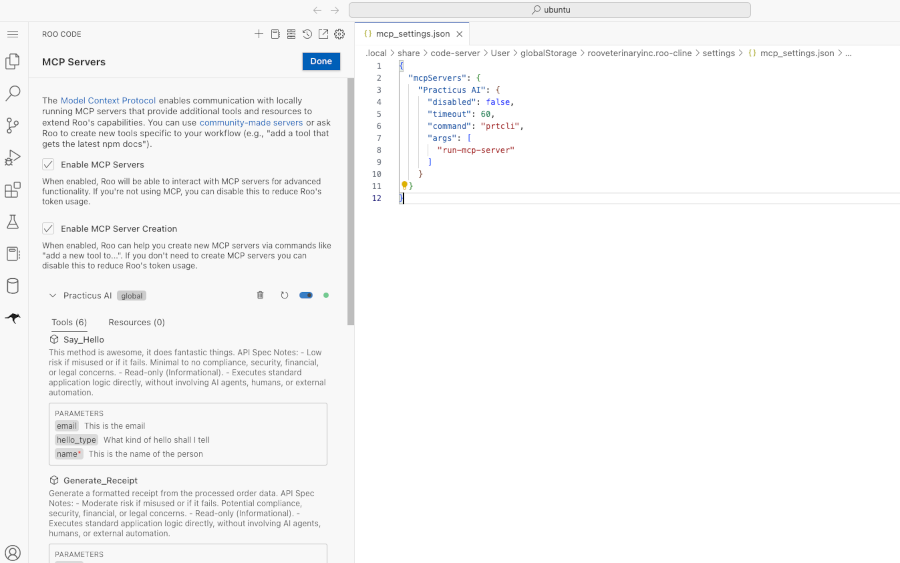
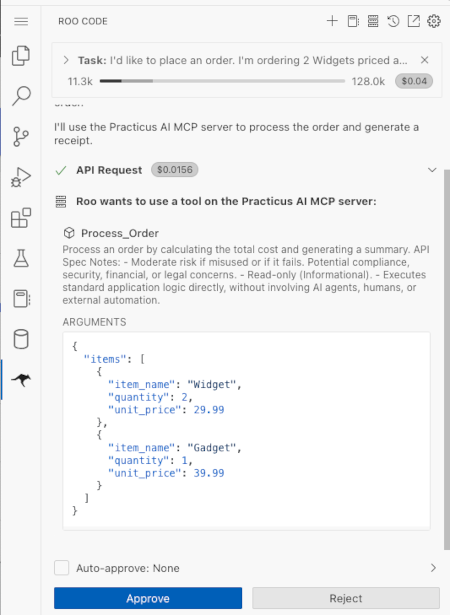
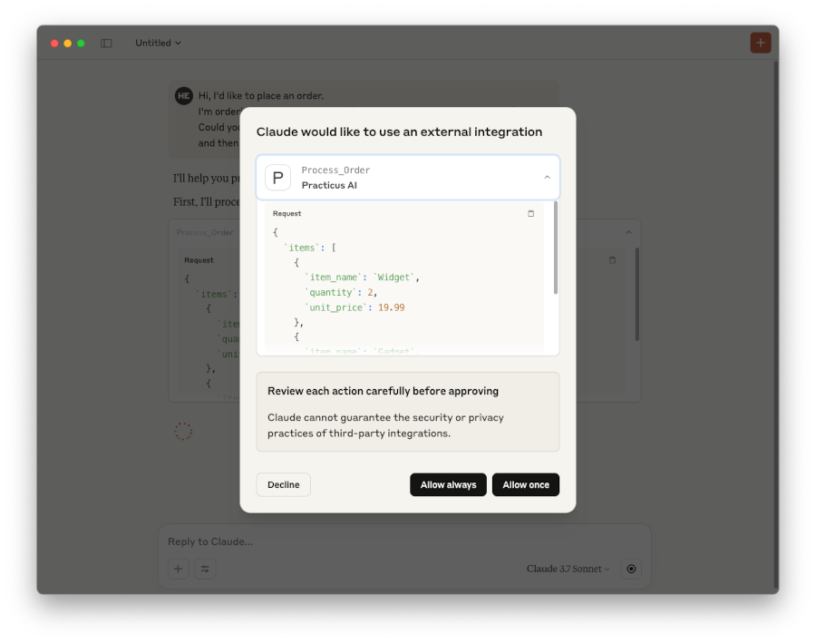

---
jupyter:
  jupytext:
    text_representation:
      extension: .md
      format_name: markdown
      format_version: '1.3'
      jupytext_version: 1.16.6
  kernelspec:
    display_name: practicus_genai
    language: python
    name: practicus_genai
---

# Building and Using MCP Servers

This example demonstrates how to leverage Practicus AI App APIs as tools for Large Language Models (LLMs) using the Model Context Protocol (MCP). This approach is similar to providing APIs as tools to frameworks like LangGraph (LangChain).

## What is MCP (Model Context Protocol)?

MCP is an open protocol designed to standardize how applications provide context (data and tools) to LLMs. MCP facilitates building complex AI agents and workflows by standardizing the integration of LLMs with necessary data and tools.

## General Architecture of MCP

MCP operates on a client-server model where a host application can interact with multiple specialized servers:

- **MCP Hosts:** Applications (e.g., desktop AI tools, IDEs) that utilize AI capabilities through MCP.
- **MCP Clients:** Programs that connect to MCP Servers to access their functionalities.
- **MCP Servers:** Lightweight applications that expose specific AI or data functionalities via the standardized MCP protocol.

To learn more, please visit the [Introduction to MCP](https://modelcontextprotocol.io/introduction) website.

<!-- #region -->
## Running an MCP Server via Practicus AI CLI (`prtcli`)

You can launch an MCP server using the Practicus AI command-line interface (`prtcli`). This server exposes defined APIs to MCP clients, enabling them to use these APIs within their AI-driven workflows.

### Command Examples

**Using Default Configuration:**

If your configuration file (`config.json`) is in the default location, simply run:

```bash
# Start MCP server using default config file location
prtcli run-mcp-server
```

**Default Configuration File Locations:**

- **macOS/Linux:** `/your/home/practicus/mcp/config.json`
- **Windows:** `\your\home\practicus\mcp\config.json`
- **Practicus AI Workers:**
    1. `/home/ubuntu/my/mcp/config.json` (Primary)
    2. `/home/ubuntu/practicus/mcp/config.json` (Secondary)

**Using Custom Configuration:**

To specify one or more custom configuration files or locations, use the `-p config-file` argument:

```bash
# Start MCP server using a specific config file
prtcli run-mcp-server -p config-file="/absolute/path/to/your/config.json"
```

You can specify multiple config files if needed (consult prtcli documentation for exact syntax)

### Sample `config.json` for API Tools

This example shows how to define Practicus AI APIs as tools within the `config.json`. Replace the example URLs with your actual API endpoints:

```json
{
  "api_tools": [
    {"url": "http://practicus.company.com/apps/agentic-ai-test/api/say-hello/"},
    {"url": "http://practicus.company.com/apps/agentic-ai-test/api/generate-receipt/"},
    ...
  ]
}
```

### Customizing API Tool Definitions

You can customize how each API tool is presented and behaves by overriding its default properties or adding instructions:

```json
{
  "api_tools": [
    {
        "url": "http://practicus.company.com/apps/agentic-ai-test/api/generate-receipt/",
        "token": "custom-api-token",
        "name": "Custom_Tool_Name",
        "req_schema": { ... },
        "include_resp_schema": true,
        "additional_instructions": "Add Yo! after each response."
    }
    ...
  ]
}
```

**Using Partial URLs:**

Similar to LangGraph integration, you can use partial app URLs. The default Practicus AI region base URL will be automatically prepended:

```json
{
  "api_tools": [
    {
        "url": "/apps/agentic-ai-test/api/generate-receipt/"
    }
    ...
  ]
}
```

Configuring your `prtcli` MCP server this way allows MCP clients (like LLM agents) to discover and invoke these APIs to fulfill user requests.
<!-- #endregion -->

## Example MCP Server Configurations (for MCP Host Applications)

This section shows how an MCP Host application (like Roo Code or Claude Desktop) might be configured to *launch* different MCP servers. 

The configuration below defines three ways to start an MCP server using `prtcli`:

- **Practicus AI (Default):** Launches `prtcli` assuming the config file is in the default location.
- **Practicus AI (Custom Config):** Launches `prtcli` specifying a custom configuration file path.
- **Practicus AI (with uv):** Launches `prtcli` using `uv` (a Python packaging tool) to run it within a specific virtual environment. This is often recommended for managing dependencies.

```json
{
    "mcpServers": {
        "Practicus AI": {
            "command": "prtcli",
            "args": [
                "run-mcp-server"
            ]
        },

        "Practicus AI custom conf": {
            "command": "prtcli",
            "args": [
                "run-mcp-server",
                "-p",
                "config-file=/absolute/path/to/config.json"
            ]
        },        

        "Practicus AI with uv": {
            "command": "uv",
            "args": [
                "run",
                "--directory",
                "/absolute/path/to/your/python/virtual/env/",
                "prtcli",
                "run-mcp-server"
            ]
        }
        
    }
}
```

*Note: This JSON structure is used within the MCP Host application's settings, not within the `prtcli`'s `config.json`.*


### Example Client Interaction Scenario

Consider a user interacting with an MCP Client (e.g., a chatbot integrated with MCP):

**User Request:**

```text
Hi, I'd like to place an order.
I need 2 Widgets at $19.99 each and 1 Gadget at $29.99.
Can you process this, generate a receipt, and confirm the details?
```

**MCP Client Action:**

The MCP Client, guided by the LLM, would likely interact with the MCP Server(s) sequentially:
1.  Potentially call a `process_order` API tool.
2.  Call the `generate_receipt` API tool (as defined in the server's config).
3.  Call a `send_confirmation` API tool (if available).
4.  Synthesize the results into a response for the user.


### Example 1: Using MCP with Practicus AI Roo Code (VS Code Extension)

This demonstrates setting up MCP servers within the Roo Code extension in VS Code on a Practicus AI Worker:

1.  Open VS Code connected to your Practicus AI Worker.
2.  Click the Roo Code icon in the left sidebar.
3.  Enter your LLM API credentials or import saved settings.
4.  Click the `MCP Servers` button in the Roo Code top menu.
5.  Click `Edit Global MCP Configuration`.
6.  Enter the MCP server definitions (similar to the 'Example MCP Server Configurations' JSON shown earlier).

 

7.  Start a chat session and ask a question that requires tool use (e.g., the order scenario). Roo Code will prompt you to allow the use of the configured MCP tools.




### Example 2: Using MCP with Claude Desktop

Claude Desktop is another application that can act as an MCP Host. When configured with MCP Servers, it will request permission to use the corresponding tools when needed to fulfill a user's request.

For configuration details, refer to the official MCP documentation: [MCP Quickstart for Users](https://modelcontextprotocol.io/quickstart/user)




### Example 3: Programmatic Integration with OpenAI's Agentic Framework

This example demonstrates how to integrate an MCP Server directly into Python code using OpenAI's `agents` library (an agentic framework). This allows programmatic control over agents that utilize MCP tools.

```python
import os
import getpass

# Securely get the OpenAI API key from the user
# This key is needed for the LLM used by the agent framework.
# You can also use an API key for an OpenAI-compatible endpoint (e.g., hosted by Practicus AI).
try:
    key = os.environ["OPENAI_API_KEY"]
    print("Using OPENAI_API_KEY from environment variables.")
except KeyError:
    key = getpass.getpass("Enter key for OpenAI or an OpenAI compatible LLM endpoint: ")
    os.environ["OPENAI_API_KEY"] = key

# Ensure the API key is set
assert os.environ.get("OPENAI_API_KEY"), "OpenAI API key is not set. Please provide it."
```

```python
from agents import Agent, Runner, gen_trace_id, trace, enable_verbose_stdout_logging
from agents.mcp import MCPServerStdio
import asyncio


# Define the asynchronous function to run the agent interaction
async def run_agent_interaction(mcp_server):
    """Configures and runs an agent that uses the provided MCP server."""
    # Define the agent
    agent = Agent(
        name="Assistant",
        instructions="You are a helpful assistant. Use the tools provided via MCP to fulfill user requests accurately.",
        # Connect the agent to the MCP server
        mcp_servers=[mcp_server],
        # model="gpt-4-turbo" # Optionally specify a model
    )

    # Define the user's message/request
    user_message = "I'd like to place an order. I'm ordering 2 Widgets priced at $29.99 each and 1 Gadget priced at $39.99. Generate a receipt."

    print(f"--- Running Agent with Input ---\n{user_message}\n------------------------------")

    # Run the agent with the user's input
    result = await Runner.run(starting_agent=agent, input=user_message)

    # Print the final output from the agent
    print("\n--- Agent Final Output ---")
    print(result.final_output)
    print("--------------------------")


# Define the main asynchronous function to set up and manage the MCP server
async def main():
    """Sets up the MCP server and initiates the agent interaction."""
    # Configuration for the MCP server to be launched via stdio
    # This uses 'prtcli' to run the server with default settings.
    server_params = {
        "command": "prtcli",
        "args": ["run-mcp-server"],
        # Add '-p config-file=...' here if using a custom config
    }

    # Use MCPServerStdio to manage the server process
    # It starts the command, communicates via stdin/stdout, and ensures cleanup.
    async with MCPServerStdio(name="Practicus AI APIs via prtcli", params=server_params) as server:
        # Generate a trace ID for observability (optional but recommended)
        trace_id = gen_trace_id()

        # Use OpenAI's tracing context manager
        with trace(workflow_name="MCP Programmatic Example", trace_id=trace_id):
            print(f"Trace available at: https://platform.openai.com/traces/trace?trace_id={trace_id}")
            # Run the core agent logic
            await run_agent_interaction(server)
```

```python
# Enable verbose logging to see detailed steps of the agent's execution
# This is helpful for debugging and understanding the agent's reasoning.
enable_verbose_stdout_logging()

# Run the main asynchronous function
# In a Jupyter notebook, 'await' can be used directly at the top level (if ipykernel supports it)
# Otherwise, use asyncio.run() in a standard Python script.
try:
    # Get the current event loop
    loop = asyncio.get_running_loop()
    # Schedule the main function to run
    await main()
except RuntimeError:  # No running event loop
    # If no loop is running (e.g., in some environments), start a new one
    asyncio.run(main())

```

### Expected Output Pattern

Running the code above should produce output similar to this (specific trace IDs and intermediate steps will vary):

```text
Creating trace MCP APIs example with id trace_805dd5cc0d2d4efc8fa8ed0b4fd5b...
Setting current trace: trace_805dd5cc0d2d4efc8fa8ed0b4fd5b...
Trace available at: https://platform.openai.com/traces/trace?trace_id=trace_805dd5cc0d2d4efc8fa8ed0b4fd5b...

... verbose explanation ...

Here's your order receipt:

----- RECEIPT -----
Processed order with 2 items. Total amount: $99.97
Items:
Widget: 2 x $29.99 = $59.98
Gadget: 1 x $39.99 = $39.99
Total: $99.97
-------------------
```

This demonstrates the agent receiving the request, identifying the need for a tool (the receipt generator exposed via MCP), calling the tool with the correct parameters, receiving the result, and presenting it to the user.


## Conclusion

In this example, we demonstrated how to leverage Practicus AI APIs as tools for LLMs using the Model Context Protocol (MCP). We covered:

1.  **Understanding MCP:** Explained the core concepts and client-server architecture of MCP.
2.  **Running MCP Servers:** Showed how to start an MCP server using the `prtcli` command-line tool, including using default and custom configurations.
3.  **Configuring API Tools:** Illustrated how to define and customize Practicus AI APIs as tools within the MCP server's `config.json` file.
4.  **Client Integration Examples:** Provided conceptual examples of how MCP host applications like Practicus AI Roo Code and Claude Desktop can be configured to launch and utilize these MCP servers.
5.  **Programmatic Integration:** Showcased a Python example using OpenAI's agentic framework (`agents` library) to programmatically start an MCP server (via `MCPServerStdio`) and interact with its tools to fulfill a user request.

By following these steps, you can effectively expose your Practicus AI application functionalities as standardized tools for various LLM agents and applications through the Model Context Protocol.


---

**Previous**: [Build](../agentic-ai/build.md) | **Next**: [Analytics > Intro](../analytics/intro.md)
