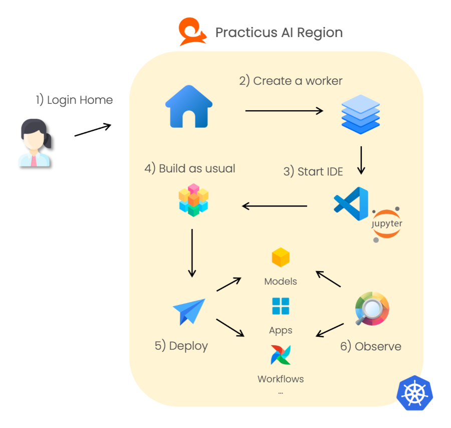
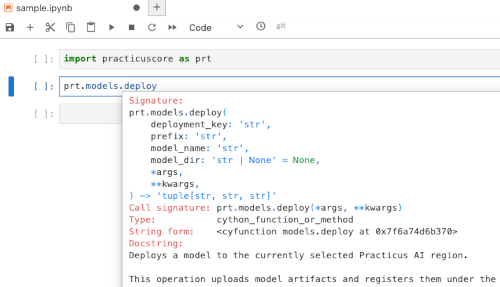
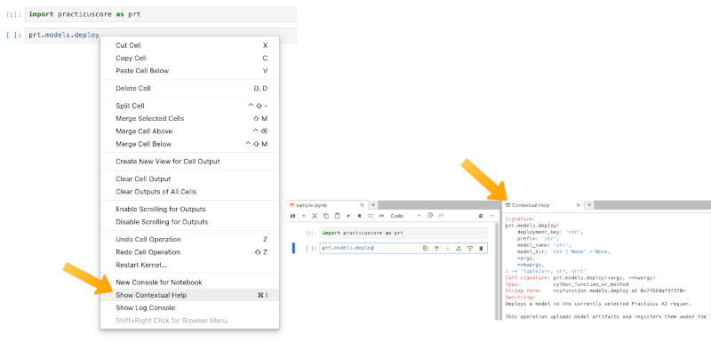
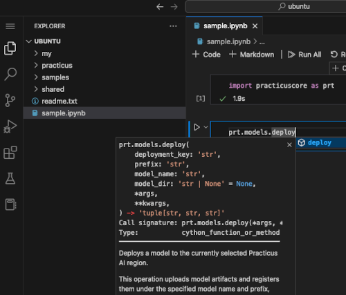
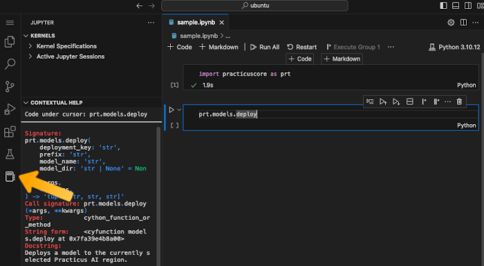
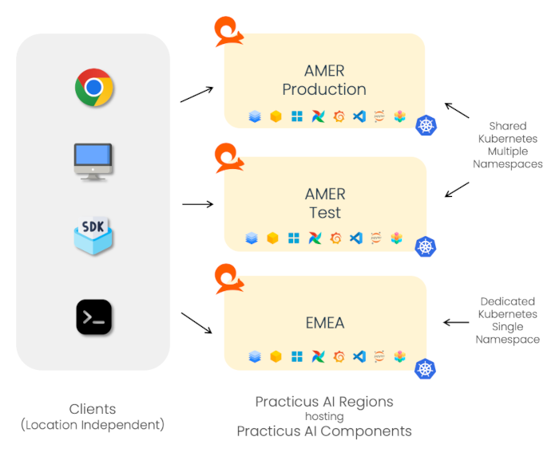

---
jupyter:
  jupytext:
    text_representation:
      extension: .md
      format_name: markdown
      format_version: '1.3'
      jupytext_version: 1.16.6
  kernelspec:
    display_name: Practicus Core
    language: python
    name: practicus
---

# Introduction

Getting started with Practicus AI is straightforward.

## Typical Practicus AI usage

The following steps outline a typical scenario for users who write code:

1. Log in to your chosen region (e.g., `https://practicus.your-company.com`).
2. Create one or more workers with the desired features and resource capacities.
3. Start an IDE, such as JupyterLab or VS Code, within a worker.
4. Develop models, applications, and process data as usual.
5. Deploy models, applications, or use add-ons (e.g., create Airflow workflows).
6. Observe metrics, logs, events, errors. Create alerts.

---

## Leveraging Documentation and Developer Tooling

**1. Access the SDK Documentation:**  
   Experienced coders understand that having immediate access to detailed SDK references accelerates the development lifecycle. You can refer to the [Practicus AI SDK Documentation](https://docs.practicus.ai/sdk/) to understand package structures, classes, methods, and parameters. This robust, searchable reference ensures you can quickly find the API calls needed to interact with Practicus AI resources programmatically.

**2. Utilize IntelliSense and Contextual Help in JupyterLab or VS Code:**  
   When working within JupyterLab or VS Code, take advantage of built-in IntelliSense (auto-completion) capabilities. As you type, your IDE will surface method signatures, docstrings, and parameter hints—especially helpful for complex ML pipelines or when invoking intricate model-serving APIs.  

### Contextual Help with Jupyter Lab

- **Contextual Tooltips:** Hover over classes and methods to see in-line docstrings and parameter descriptions. This “just-in-time” help enables you to craft pipelines, preprocess data, or orchestrate model inference steps without constantly switching between your IDE and external docs.  

- **Shift-Tab:** Inside a Jupyter notebook, pressing `Shift+Tab` while your cursor is within a function call will reveal type hints, default values, and docstrings. This immediate feedback reduces trial-and-error and makes coding more efficient and error-free.

Combining direct SDK reference materials with IntelliSense-driven guidance ensures data scientists spend more time crafting robust models and less time hunting down syntax or function definitions.

- **Contextual Help Tab:** You can also right-click on a cell, select "Show Contextual Help" to leave the help tab always open.

### Contextual Help with VS Code

- **Ctrl+Space for Inline Help:** In VS Code, pressing `Ctrl+Space` triggers IntelliSense to display inline suggestions, completion items, and parameter hints. This built-in guidance makes it easy to discover available functions, understand their expected parameters, and review docstrings—all without leaving your editor window.

- **Jupyter Panel:** You can also keep the Jupyter panel open in VS Code for continuous, context-sensitive help as you work. This panel remains visible as you code, providing an always-on reference for classes, methods, and type hints.

  
---

## Practicus AI Platform Components

Below are the primary components you will interact with when using Practicus AI.

### Practicus AI Workers

Practicus AI Workers are dedicated compute environments that run ML, data processing, and other tasks.

Key characteristics include:

- **On-demand**: Request as many workers as you need, available within seconds.
- **Interactive**: Launch JupyterLab or VS Code for hands-on experimentation.
- **Batch-capable**: Run tasks or jobs in non-interactive mode as well.
- **Isolated**: Issues in other workers or systems do not affect your worker.
- **Configurable**: Each worker is defined by a container image, which can be chosen from the provided options or customized.
- **Flexible Resources**: Assign a specific amount of CPU, memory, and GPU resources.
- **Ephemeral**: Workers can be replaced easily. Since each restart resets the file system, save important files in `~/my` or `~/shared` to preserve them, or push to a source control system such as git.

### Practicus AI ModelHost

Practicus AI ModelHost deployments run classic ML and LLM models, optimized for CPUs and GPUs.

- **Shared deployments** can host thousands of models, each with up to 100 versions.
- **Isolated deployments** allow you to create a dedicated environment for a set of models.

### Practicus AI AppHost

Practicus AI AppHost deployments are used to build visual Gen AI applications or microservices focused on ML workflows.

### Practicus AI Add-ons

Practicus AI Add-ons, such as Airflow or MLflow, extend the platform’s core functionality. They integrate seamlessly, allowing you to manage and orchestrate complex workflows and track experiments.

---

## Practicus AI Regions

Practicus AI is a multi-region environment, where each **region** is a separate deployment and isolated Kubernetes namespace. Regions can differ by geography, cloud vendor, lifecycle stage, department, or security requirements.

For example, you might have:

- One region in a certain geographic location and another in a different one.
- Regions across different cloud vendors (e.g., AWS, Azure, on-premises).
- Separate regions for production, development, or testing.
- Regions dedicated to different departments or security contexts.

---

## Practicus AI Clients

Practicus AI clients enable you to connect to multiple regions seamlessly, allowing you to develop in one region and deploy in another. Common client options include:

- **Browser**: Access the platform via a standard web interface to launch JupyterLab, VS Code, and manage workloads.
- **AI Studio**: A desktop application for Windows, macOS, and Linux that connects to multiple regions for unified management.
- **SDK**: Install the SDK (`pip install practicuscore`) to interact programmatically with any Practicus AI region.
- **CLI**: With the SDK installed, use the `prtcli` command-line tool to manage tasks and resources.

---

### Example: A Multi-Region Setup

Below is an example of a deployment where a customer utilizes three regions in two geographies, accessible through various clients.

---

**Next**: [Workers](workers.md)
