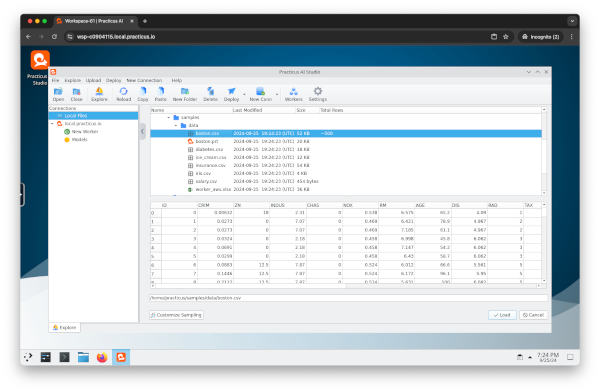

---
jupyter:
  jupytext:
    text_representation:
      extension: .md
      format_name: markdown
      format_version: '1.3'
      jupytext_version: 1.17.3
  kernelspec:
    display_name: Python 3 (ipykernel)
    language: python
    name: python3
---

# Practicus AI Workspaces

Practicus AI Workspaces provide a **web-based remote desktop environment with Practicus AI Studio** and numerous pre-installed tools including an open-source Office suite.



You can create, use, and then terminate these Workspaces from Practicus AI Home page, or programmatically through a few simple commands. This ensures a clean, reproducible environment that you can spin up on-demand.


#### Simple Workspace Usage

```python
import practicuscore as prt

# Obtain the current region
region = prt.current_region()

# Create a new workspace
workspace = region.create_workspace()
```

```python
# View workspace details
workspace
```

```python
# Both workers and workspaces are managed similarly, differentiated by their 'service_type' attribute.
region.worker_list.to_pandas()

# You can select an existing workspace like this:
# workspace = region.worker_list[0]
```

```python
# Retrieve workspace login credentials
username, token = workspace.get_workspace_credentials()

print("Opening Workspace in your browser")
print(f"Please log in with username: {username} and password: {token}")

login_url = workspace.open_workspace()

# If you only need the URL, without opening a browser:
# login_url = workspace.open_workspace(get_url_only=True)
```

```python
# Terminate the workspace when you're finished
workspace.terminate()
```


---

**Previous**: [Workers](workers.md) | **Next**: [Add-Ons](add-ons.md)
