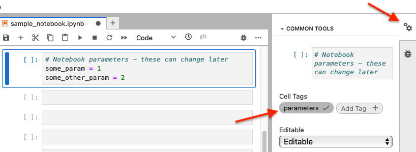
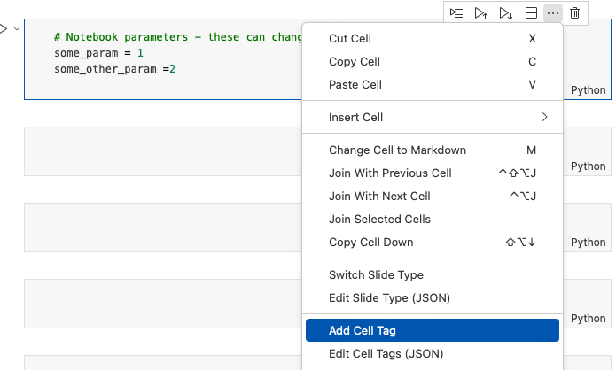

---
jupyter:
  jupytext:
    text_representation:
      extension: .md
      format_name: markdown
      format_version: '1.3'
      jupytext_version: 1.16.4
  kernelspec:
    display_name: Practicus Core
    language: python
    name: practicus
---

<!-- #region -->
# Automating Notebook Execution

Practicus AI allows you to execute notebooks in an automated fashion, which can be particularly useful for `testing` and  `automated workflows`.

## Executing Notebooks from Practicus AI

### 1) Create a Notebook File
Begin by creating a file named **`sample_notebook.ipynb`**.

### 2) Add a Parameters Cell (Optional)
Add a cell with the following code to define parameters that can be updated dynamically later:
```python
# Notebook parameters - can be dynamically updated later
some_param = 1
some_other_param = 2
```

**For Jupyter:**
1. Select the newly added cell.
2. In the top-right section of JupyterLab, open the property inspector.
3. Click on **`Add Tag`** and enter `parameters`, then click **`+`**.
4. The cell now has the `parameters` tag.



**For VS Code:**
1. Select the cell you just created.
2. Click the `...` in the cell's upper-right corner.
3. Add a cell tag named `parameters`.
4. The cell is now tagged.



### 3) Add Your Code as Usual
Continue writing code in the notebook as you normally would. For example, add the following code to print messages and validate your parameters:

```python
print("Starting to run sample notebook")

if some_param <= 0:
    raise ValueError("some_param must be > 0")
else:
    print("some_param value is acceptable:", some_param)

print("Finished running sample notebook")
```

### 4) Execute the Notebook
Once you’ve set up the notebook and its parameters, you can execute it using Practicus AI’s automated run capabilities.
<!-- #endregion -->

```python
import practicuscore as prt

# This will run just fine, 
# and save the resulting output to sample_notebook_output.ipynb
prt.notebooks.execute_notebook("sample_notebook")
```

```python
# The below *will FAIL* since some_param cannot be 0
prt.notebooks.execute_notebook(
    "sample_notebook",
    parameters={
        "some_param": 0 
    }
)
```

## Advanced features

```python
# Advanced Notebook automation parameters
default_output_folder="~/tests"  # If none, writes notebook output to same folder as notebook
default_failed_output_folder="~/tests_failed"  # If not none, collects failed notebook results 

# By calling configure you can save notebook results to central location
# Please note that you can do this to a shared/ folder daily where all of our members have access to
prt.notebooks.configure(
    default_output_folder=default_output_folder,
    default_failed_output_folder=default_failed_output_folder,
    add_time_stamp_to_output=True,
)

# This will work
prt.notebooks.execute_notebook("sample_notebook")

# This will fail but does not stop the execution of the notebook
prt.notebooks.execute_notebook(
    "sample_notebook",
    parameters={
        "some_param": 0 
    }
)

# Calling validate_history() will raise an exception IF any of the previous notebooks failed
# This is useful to have a primary "orchestration" notebook that executes other child notebooks,
# And then finally fails itself if there was a mistake. 
# You can then report the result, essentially creating a final report. 
prt.notebooks.validate_history()

# You can view the passed and failed execution results in 
# ~/tests and ~/tests_failed with a time stamp (optional)
```

 ### Executing notebooks from terminal
 
You can run the below command to execute a notebook from the terminal or an .sh script.

```shell
prtcli execute-notebook -p notebook=my-notebook.ipynb 
```  


---

**Previous**: [Automated Code Quality](../improve-code-quality/automated-code-quality.md) | **Next**: [Work With Connections](../work-with-connections.md)
