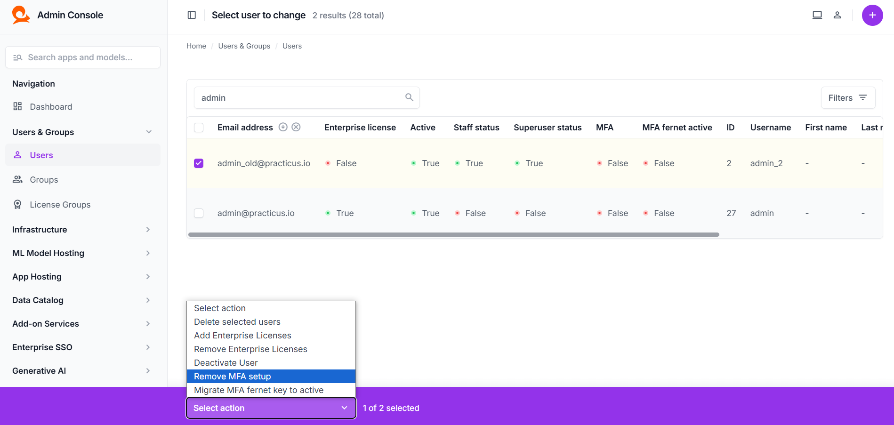

# MFA (Multi-Factor Authentication)

This document explains how to enable, configure, and manage Multi-Factor Authentication (MFA) in the Practicus AI platform. It also covers the relevant settings in the `values.yaml` file and how to handle potential issues that might arise.

---

## Overview

MFA adds an extra layer of security by requiring users to present a secondary authentication factor (for example, a TOTP code generated by Google Authenticator or Authy) in addition to their regular credentials. This significantly reduces the risk of unauthorized access, even if passwords are compromised.

---

## Configuring MFA in `values.yaml`

The main MFA-related settings are defined under `userLogin.mfa` in your `values.yaml` file:

```yaml
userLogin:
  mfa:
    enabled: true
    mandatory: false
    mandatoryForSysAdmins: false

  rememberMe:
    enabled: true
    days: 30
    disabledForSysAdmins: false
```

- **enabled**  
  - If `true`, MFA functionality is available in the system.  
  - If `false`, MFA is disabled.

- **mandatory**  
  - If `true`, all users are required to enroll in MFA. Any user without MFA setup will be prompted to configure it before they can log in.  
  - If `false`, MFA enrollment remains optional.

- **mandatoryForSysAdmins**  
  - If `true`, system administrators (admin/staff) must use MFA.  
  - If `false`, administrators are treated like regular users for MFA requirements (either optional or mandatory, based on the global setting).

### Remember Me

Below the MFA configuration, you’ll find `rememberMe` settings, which control how long users can stay logged in without re-entering their credentials:

- **enabled**: If set to `true`, users can select a “Remember Me” option at login.  
- **days**: The number of days users can remain logged in before the system asks for re-authentication.  
- **disabledForSysAdmins**: If `true`, system administrators will not be able to use the “Remember Me” feature.

---

## Users and MFA Status

Under **Users & Groups** > **Users**, you can see a list of all users. Commonly, there are columns like **MFA** and **MFA fernet active**:

- **MFA**: Indicates whether the user has MFA configured (`True`) or not (`False`).  
- **MFA fernet active**: Shows whether the user’s MFA data is encrypted with the current active key (`True`) or not (`False`).

From this page, you can also perform bulk actions using the **Select action** menu at the top or bottom. These actions include:

- **Remove MFA setup**: Resets the selected user’s MFA configuration. The user will have to set it up again when they log in next time.  
- **Migrate MFA fernet key to active**: If the system was previously using a rolling key for encryption, this action re-encrypts the user’s MFA data using the current active key.



---

## secretStore and Fernet Keys

In the same `values.yaml`, you will find `secretStore` settings:

```yaml
secretStore:
  activeKey: ""
  rollingKey: ""
```

- **activeKey**: The encryption key used for all MFA data stored in the system.  
- **rollingKey**: A key used for migration (for decrypting data that was encrypted with a previous key).  

Add this key to either `activeKey` or `rollingKey` in your `values.yaml`. After updating, any new MFA data is encrypted with the **activeKey**, and existing data can be migrated from the **rollingKey** using the **Migrate MFA fernet key to active** action in the Users section.

---

## Troubleshooting

### Nobody Can Log In (Including Admins)

If MFA is mandatory and an administrator loses access to their MFA device, it can lock everyone out. In this situation, you can manually reset the MFA secret for the relevant user in your database to allow a password-only login again:

1. **Connect to the Database**  
   - Use the credentials specified for Practicus AI’s database (e.g., PostgreSQL).

2. **Remove or Clear the MFA Secret**  

3. **Sign In as Admin and Reconfigure MFA**  
   - After resetting the MFA secret, the admin user can log in without MFA.  
   - Review or update your MFA settings in `values.yaml` or via the MFA settings page to prevent similar lockouts.

> **Important:** Always create a backup before making direct changes to the database.  


---

**Previous**: [AI Assistants](ai-assistants.md) | **Next**: [Network Security](network-security.md)
