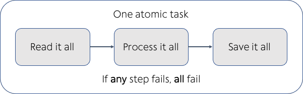

---
jupyter:
  jupytext:
    text_representation:
      extension: .md
      format_name: markdown
      format_version: '1.3'
      jupytext_version: 1.16.4
  kernelspec:
    display_name: Practicus Core
    language: python
    name: practicus
---

<!-- #region -->
# Introduction to Practicus AI Workflows and Tasks

In Practicus AI, a **workflow** is essentially a structured sequence of tasks—units of work that run independently on isolated Practicus AI Workers (Kubernetes pods). By designing workflows as collections of tasks, you gain flexibility, scalability, and maintainability. Each task executes in its own fresh environment, ensuring that resource usage is optimized and preventing interference between tasks.

Key points to remember:

- **Tasks** are the fundamental building blocks of workflows. They encapsulate any operation, such as running a Python script or executing a shell command.
- **Isolation**: Every task runs inside its own Worker, a dedicated pod with specified CPU, memory, and optional GPU resources. This ensures consistent performance, security, and an easy path to debug or scale individual components.
- **Workflows** bring these tasks together, defining their order, parallelism, and dependencies. Using orchestrators like Airflow, you can schedule, monitor, and manage these tasks collectively.

With this approach, Practicus AI ensures that both simple jobs and complex enterprise-level workflows benefit from automated resource management, improved reliability, and streamlined development-to-production workflows.

Modern data pipelines often need to implement two key concepts: [Atomicity](#atomicity) and [Idempotency](#idempotency). Practicus AI naturally supports these concepts by breaking complex workflows into atomic and idempotent tasks, ultimately improving the consistency and reliability of your pipelines.

---

## Modern Data Pipelines: Atomicity and Idempotency

### Atomicity
In traditional ETL scenarios, pipelines would process data in small batches due to hardware constraints, potentially leaving destinations partially updated if a failure occurred mid-process. Atomicity ensures that changes are applied fully or not at all, preventing partial and inconsistent updates.

**Non-Atomic Pipeline Example (not recommended):**


Here, a failure in the middle of the process leaves the target data source in an `inconsistent state`.

**Atomic Pipeline Example (recommended):**



An atomic pipeline ensures that a task’s output is only considered complete and available once the entire operation finishes successfully. If the task fails, no partial data is committed, and the system `remains consistent`.

### Idempotency
[Idempotence](https://en.wikipedia.org/wiki/Idempotence) means that running a task multiple times yields the same final state. For example, pressing an “on” button repeatedly on an idempotent device doesn’t change its state after the first press—it stays “on.”

**Idempotency Example:**


When tasks are idempotent, `retries or repeated executions due to transient failures do not corrupt or alter the final outcome unexpectedly`. This is especially valuable in large-scale data processing, where intermittent failures are common.

---

## Practicus AI’s Approach

Practicus AI makes it straightforward to create workflows that are both atomic and idempotent by default. 

### Default Anatomy of a Practicus AI Data Pipeline

Practicus AI workflows are represented as a [DAG](https://en.wikipedia.org/wiki/Directed_acyclic_graph), describing the order, parallelism, and dependencies of tasks. Consider an example workflow:

1. Load and transform table1, then export as table1_new.
2. Load and transform table2, then export as table2_new.
3. Load table3 and join it with table1_new and table2_new outputs.
4. Load table4 (no changes needed).
5. In table3’s task, now also join table4.
6. Export the final processed data to final_table.

Because each task exports its results upon completion, `every subsequent join relies on stable, already-written data`, promoting both `atomicity` and `idempotency`. Parallel tasks (like table1 and table2) `can run simultaneously`, and if either needs to be re-run, the final state remains `consistent` and `predictable`.


**Sample Airflow DAG:**

- Process table1 and table 2 in parallel, and independent of each other.
- Upon completion, if both are successful, process to create the final table.

```python
dag_flow = "[process_table_1, process_table_2] >> process_final_table"
```

---

### Flexibility and Customization

While the default approach encourages atomicity and idempotency, you retain full control. You can modify DAGs, customize tasks, and change how data is read, transformed, and saved. For example, if you prefer to capture or skip certain logs, or run tasks in different regions for geo-distributed workflows, you can update worker configurations and DAG definitions accordingly.

In short, Practicus AI’s model of defining workflows as collections of independent, atomic, and idempotent tasks ensures that your data pipelines are robust, resilient to failures, and easy to understand and maintain. This sets a solid foundation for building more advanced workflows with orchestration tools like Airflow, enabling you to confidently move from simple scripts to enterprise-grade automation.

<!-- #endregion -->


---

**Previous**: [Build And Deploy](../modeling/sample-modeling/build-and-deploy.md) | **Next**: [Task Basics](tasks/task-basics.md)
