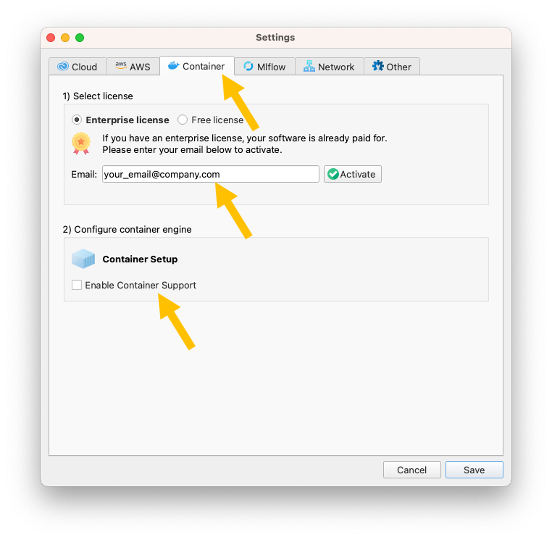
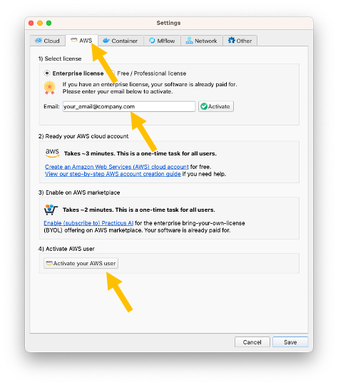
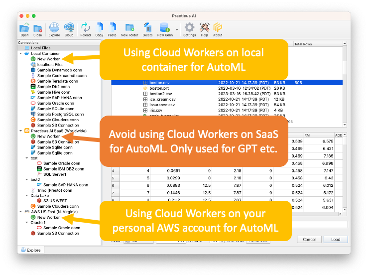

Practicus AI App is **forever free** without any limitations. For **advanced features** such as **AutoML**, you can use **Cloud Workers**.

Cloud Workers also offer a **free tier**, but with some limitations. Your Enterprise license will **unlock all advanced features**.   

## Activating your Enterprise License 

1) [Install the Practicus AI App](https://practicus.ai/get-started/)

2) Open App settings 

3) Pick one or more Cloud Worker (backend system) options. 

[View detailed comparison](https://practicus.ai/cloud/#compare)

**Container Quick Overview**

- Runs on your laptop
- **Pros**: Free
- **Cons**: You need to download Docker Desktop (free)
  
**AWS Marketplace Quick Overview** 
 
- Runs on your AWS account
- **Pros**: No need to download extra software 
- **Cons**: You pay for AWS cloud usage  

**Software as a Service**

- This option is not included in your trial. 
- Please [click here to start Practicus AI SaaS trial](https://practicus.ai/cloud/#saas) 

**Enterprise Kubernetes**

- This option is not included in your trial. 
- Please [contact us get Enterprise Cloud](https://practicus.ai/contact/) 

[View detailed comparison](https://practicus.ai/cloud/#compare)

4.a) Container Option: 

- Open Container tab in settings
- Enter your email and click **Activate**
- You will receive your license code as email. Please check your spam folder if you did not receive
- Click **Enable Container Support** and follow the steps to pull (download) Practicus AI container on your laptop

[View local container setup guide](setup-guide.md#local-container) 

4.b) AWS Marketplace Option: 

- Open AWS tab in settings
- Enter your email and click **Activate**. You can skip this step if you already activated for containers. Simply close and re-open App settings.
- You will receive your license code as email. Please check your spam folder if you did not receive
- Click **Activate your AWS user** button and follow the steps

[View AWS cloud marketplace setup guide](setup-guide.md#aws-marketplace) 

## Optional - Using your limited SaaS account

Since we are allocating our online resources to production workloads, your SaaS account is limited to online features such as **GPT**, but **not** Cloud Workers. 

For features such as AutoML, please use Cloud Workers on local containers or AWS marketplace.

### Sample Data Exploration view, utilizing cost-effective options 

### Using GPT and other "online only" features with your limited SaaS

When you use the App + local container or AWS marketplace option, the App intelligently decides when an "online only" feature such as GPT is required to use the SaaS. 

By combining local container or AWS marketplace with the limited SaaS, you will be able to trial all features with **no limitations**, and in a **cost-effective** way. 

### Unlimited SaaS option

If you prefer to use our SaaS unlimited, please [click here to start Practicus AI SaaS trial](https://practicus.ai/cloud/#saas) 

### Logging in to your limited SaaS account

1) [Install the Practicus AI App](https://practicus.ai/get-started/)

2) Open App settings 

3) Login to service

- Click **Login** button  

- Enter your email and password and click **OK**
- You should have received your password in email, please check your spam folder if you haven't
- To reset your password, click **Forgot Password**

If you need any, help please [view the detailed setup guide](setup-guide.md) or [contact support](https://helpdesk.practicus.io/).

Thank you!